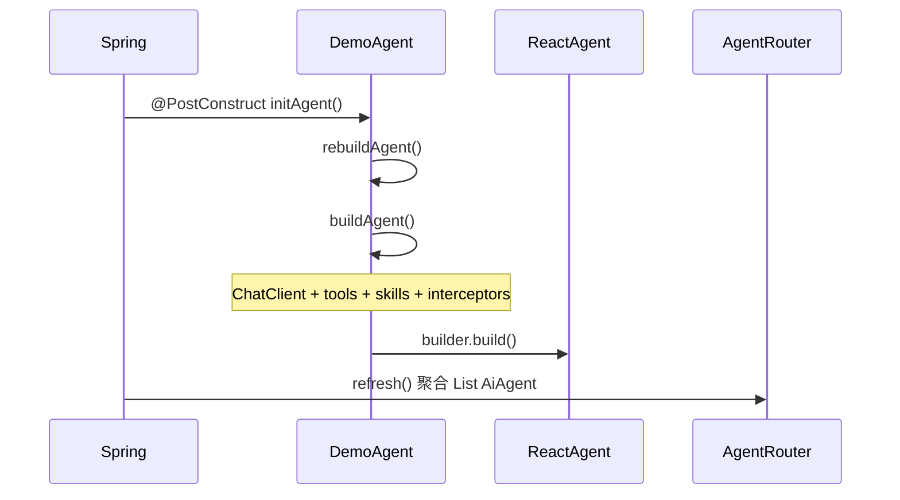

# Agent 开发

本文说明如何继承平台基类 `AiAgent`、实现插件 Agent，并完成部署与热重载。

## 1. 核心契约

`AiAgent` 位于 `io.github.jerryt92.j2agent.service.llm.agent.inf.AiAgent`，基于 **Spring AI Alibaba `ReactAgent`** 封装对话、记忆、工具、Skill、RAG 等能力。

### 1.1 必须实现的抽象方法

| 方法 | 说明 |
|------|------|
| `getAgentId()` | 全局唯一标识；与 WebSocket `agent-id`、DB/Redis 中 `agent_id` 一致 |
| `getAgentName()` | 智能体展示名称（`GET /agents` 列表） |
| `getAgentDescription()` | 智能体描述文案 |
| `loadSystemPrompt()` | 系统提示词；可从 classpath 读取或直接返回字符串 |

### 1.2 可选 override

| 方法 | 默认 | 说明 |
|------|------|------|
| `getSort()` | `100` | 业务排序权重；`GET /agents` 按升序排列，相同时按 `agentId` 字典序 |
| `getLogo()` | `🤖` | 列表与聊天页 emoji logo；子类可 override |
| `getThinkingOverride()` | `USE_PROVIDER_DEFAULT` | Agent 级深度思考默认策略；见 [可选能力.md](可选能力.md) |
| `isQaTemplateEnabled()` | `false` | 是否启用热门问题模板 |
| `buildTools()` | 空数组 | 挂载 `@Tool` 工具 Bean |
| `buildDocumentRetriever()` | `null` | RAG 检索器 |
| `buildToolCallbacks()` | 由 `buildTools()` 转换本地 `@Tool` | 可 override；MCP 由 `buildAgent()` 内 private 逻辑追加，不受 override 影响 |
| `buildInterceptors()` | 工具 UI + Skill UI 拦截器 | 可扩展；工具异常兜底始终保留 |

### 1.3 可选特性接口

| 接口 | 说明 |
|------|------|
| `ExternalSkills` | 加载平台 `plugins/skills` 外部技能；须 Agent 类显式 `implements`；由 `AgentClassLoaderSkillRegistry` 检测，见 [Skill.md](Skill.md) |
| `McpFeature` | 合并平台 MCP 工具；须 Agent 类显式 `implements`；由 `AiAgent.buildAgent()` 检测并追加，见 [MCP.md](MCP.md) |

实现 `ExternalSkills` 时的默认方法：

| 方法 | 默认 | 说明 |
|------|------|------|
| `useAllExternalSkills()` | `true` | 加载平台外部目录下全部技能；为 `true` 时 `useExternalSkills()` 不生效 |
| `useExternalSkills()` | 空集合 | 仅当 `useAllExternalSkills()` 为 `false` 时，按目录名加载指定外部技能 |

实现 `McpFeature` 时的默认方法：

| 方法 | 默认 | 说明 |
|------|------|------|
| `useAllMcpServers()` | `true` | 合并当前已连接的全部 MCP Server 工具；为 `true` 时 `useMcpServers()` 不生效 |
| `useMcpServers()` | 空集合 | 仅当 `useAllMcpServers()` 为 `false` 时，按 server 名称加载指定 MCP 工具 |

### 1.4 特性接口对比（ExternalSkills / McpFeature）

两类可选特性均采用**显式 `implements` + 默认全量 + 可按名筛选**的声明式模式：

| 维度 | `ExternalSkills` | `McpFeature` |
|------|------------------|--------------|
| 作用 | 加载平台共享 Skill 文档 | 合并平台 MCP Server 工具 |
| 默认行为 | 加载 `plugins/skills/` 下全部技能 | 合并当前已连接的全部 MCP Server 工具 |
| 按名筛选 | `useAllExternalSkills()=false` + `useExternalSkills()` | `useAllMcpServers()=false` + `useMcpServers()` |
| 名称对应 | `plugins/skills/` 一级子目录名 | `mcp-config-json` → `mcpServers` 的键名 |
| 检测位置 | `AgentClassLoaderSkillRegistry` | `AiAgent.buildToolCallbacks()` |
| 未实现时 | 不加载外部技能（内部 `skills/` 仍默认加载） | 不合并任何 MCP 工具 |

业务示例：`qa-assistant` 的 `AssistantReactAgent` 已实现 `McpFeature`。

## 2. 最小示例

```java
package io.github.jerryt92.j2agent.demo;

import io.github.jerryt92.j2agent.service.llm.agent.inf.AiAgent;
import org.springframework.stereotype.Component;

import java.io.InputStream;
import java.nio.charset.StandardCharsets;

@Component
public class DemoAgent extends AiAgent {

    @Override
    public String getAgentId() {
        return "demo_agent";
    }

    @Override
    public String getAgentName() {
        return "演示 Agent";
    }

    @Override
    public String getAgentDescription() {
        return "最小接入示例，用于验证插件加载与对话链路。";
    }

    @Override
    public String loadSystemPrompt() {
        try (InputStream in = getClass().getClassLoader()
                .getResourceAsStream("system-prompt.md")) {
            if (in != null) {
                return new String(in.readAllBytes(), StandardCharsets.UTF_8);
            }
        } catch (Exception ignored) {
            // fallback
        }
        return "你是演示助手，回答应简洁准确。";
    }
}
```

`src/main/resources/system-prompt.md`（可选）：

```markdown
你是演示助手。
- 回答使用中文。
- 不确定时明确说明，不要编造。
```

## 3. 生命周期



1. **Bean 实例化**：`AgentPluginRegistry` 在 `ApplicationReadyEvent` 后先实例化插件内依赖 Bean，再实例化 `AiAgent`（保证工具类等已就绪）。
2. **`@PostConstruct`**：调用 `rebuildAgent()` → `buildAgent()` 组装底层 `ReactAgent`。
3. **路由注册**：`AgentRouter.refresh()` 将所有 `AiAgent` Bean 按 `getAgentId()` 放入 Map；重复 id 抛 `IllegalStateException`。
4. **MCP 变更**：监听 `McpToolCallbacksRefreshedEvent`，全部 Agent 执行 `rebuildAgent()`；已实现 `McpFeature` 的 Agent 会在重建时重新拉取最新 MCP 工具快照。

对话入口：`ChatService` → `agentRouter.route(agentId)` → `AiAgent.stream(AgentRunContext)`。

## 4. 插件约束

### 4.1 包与类加载

| 约束 | 说明 |
|------|------|
| 包名 | 无固定包名要求；推荐 **`io.github.jerryt92.j2agent.*`** |
| 组件扫描 | `AgentPluginRegistry` 扫描 JAR 内**全部**带 Spring 注解的类（`@Component` 等） |
| 平台类 | `io.github.jerryt92.j2agent.*` 由 `PluginAgentClassLoader` **委托父 ClassLoader** 加载 |
| 禁止重复打包 | 插件 JAR **不得**包含平台类，否则可能类加载冲突 |
| 依赖 Bean | 工具、Retriever 等同 JAR 类须带 Spring 注解，由同一 JAR 扫描注册 |

### 4.2 agentId 唯一性

- 插件 Agent 之间、插件与内置 Agent 之间 **`getAgentId()` 不可重复**。
- 启动与 `POST /agents/reload` 均会校验；冲突时整次 reload 失败。

### 4.3 历史别名（可选）

若需兼容旧客户端字符串，在平台侧 `AgentRouter#route` 增加映射（如已有 `assistant` → `chat_assistant`）。新 Agent 建议使用稳定的新 id，避免依赖别名。

## 5. 部署与热重载

### 5.0 工程模型：一 Agent 一独立工程

| 坐标 | 是否必须继承 | 说明 |
|------|-------------|------|
| `j2agent-plugins-agents`（`agents/pom.xml`） | **否** | 本仓库示例 Agent 聚合，便于一键 `mvn package`；**外部工程勿继承** |

原则：每个 Agent 是**独立 Maven 工程**（单独 `pom.xml`、可单独 `mvn package`）；放入本仓库 `agents/` 仅为示例集中管理，**不改变**「一 Agent 一工程」模型。**复制 [`0_example-agent`](../../j2agent-plugins-agents/agents/0_example-agent/)** 即可开始开发。

本仓库布局：

```text
j2agent-plugins-agents/
  agents/
    pom.xml                             # 示例聚合（可选，勿对外继承）
    0_example-agent/                    # ★ 最小模板，复制此目录
    qa-assistant/                       # 业务示例 Agent
```

工程骨架见 [快速入门](README.md#2-最小工程骨架)；打包配置见 [0_example-agent README](../agents/0_example-agent/README.md)。

### 5.1 打包

**方式 A：单 Agent 独立打包**（推荐 CI 按 Agent 拆分）：

```bash
cd j2agent-plugins-agents/agents/qa-assistant && mvn -q clean package
```

**方式 B：本仓库一键编译全部示例**：

```bash
cd j2agent-plugins-agents/agents && mvn clean package
```

`mvn package` 后在 **`target/`** 同时生成解压目录与 tar.gz（内容一致）。目录结构：

```text
target/
  <artifactId>-<version>.jar        # 瘦 JAR（仅 class）
  <artifactId>-<version>/             # 解压目录（扁平）
    <artifactId>-<version>.jar
    resources/                        # 与 src/main/resources 一致
  <artifactId>-<version>.tar.gz       # 便于分发（内容与上者相同）
```

`loadSystemPrompt()`、`qa-template.json`、Skill 正文均从 **`resources/`** 目录加载（不在 JAR 内）。修改 Skill 或提示词文件后，执行 **`POST /agents/reload`** 即可生效，无需重打 JAR。

### 5.2 配置

```yaml
j2agent:
  plugin:
    path: ${user.home}/j2agent/volumes/j2agent/plugins
```

### 5.3 部署步骤

```bash
PLUGIN_PATH="${user.home}/j2agent/volumes/j2agent/plugins/agents"   # plugin.path 为 plugins 根目录；Agent 解压到 agents/ 下

# 方式 A：直接使用 target 下解压目录
cp -a target/example-agent-1.0.0-SNAPSHOT/. \
  "$PLUGIN_PATH/example-agent-1.0.0-SNAPSHOT/"

# 方式 B：分发 tar.gz（先建目标目录再解压，避免多一层嵌套）
mkdir -p "$PLUGIN_PATH/example-agent-1.0.0-SNAPSHOT"
tar -xzf target/example-agent-1.0.0-SNAPSHOT.tar.gz \
  -C "$PLUGIN_PATH/example-agent-1.0.0-SNAPSHOT"
```

每个 Agent 在 `plugin.path` 下占**一级子目录**（多 Agent = 多个子目录并存；每目录内须有一个 `.jar` 与 `resources/`）。tar.gz 仅便于分发，内容与 `target/<artifactId>-<version>/` 相同。

```text
plugins/                               # j2agent.plugin.path 指向此目录
  agents/
    qa-assistant-1.0.0-SNAPSHOT/
      qa-assistant-1.0.0-SNAPSHOT.jar
      resources/...
    example-agent-1.0.0-SNAPSHOT/
      ...
  skills/
    data-chart/
      SKILL.md
```

**兼容旧方式**：仍可将单个 JAR 直接放在 `plugin.path` 根目录（资源须在 JAR 内，不推荐新 Agent 使用）。

### 5.4 管理 API（需 ADMIN 角色）

| 接口 | 说明 |
|------|------|
| `GET /v1/rest/j2agent/plugins/agents` | 返回插件 JAR 路径列表（含子目录相对路径，如 `qa-assistant-1.0.0-SNAPSHOT/qa-assistant-1.0.0-SNAPSHOT.jar`）、已加载 `agentId` |
| `POST /v1/rest/j2agent/agents/reload` | 重新扫描目录并注册 Agent |

典型日志关键字：

- `Loading plugin bundle: ...`
- `Registered dynamic plugin bean definition`
- `Loaded plugin agent: demo_agent`

### 5.5 验证

见 [快速入门验证清单](README.md#验证清单)。

## 6. 平台代码索引

| 主题 | 路径 |
|------|------|
| Agent 基类 | [`AiAgent.java`](../../j2agent/j2agent-server/src/main/java/io/github/jerryt92/j2agent/service/llm/agent/inf/AiAgent.java) |
| 插件注册 | [`AgentPluginRegistry.java`](../../j2agent/j2agent-server/src/main/java/io/github/jerryt92/j2agent/service/llm/agent/core/AgentPluginRegistry.java) |
| 插件 bundle 发现 | [`AgentPluginBundle.java`](../../j2agent/j2agent-server/src/main/java/io/github/jerryt92/j2agent/service/llm/agent/core/AgentPluginBundle.java) |
| 类加载器 | [`PluginAgentClassLoader.java`](../../j2agent/j2agent-server/src/main/java/io/github/jerryt92/j2agent/service/llm/agent/core/PluginAgentClassLoader.java) |
| 路由 | [`AgentRouter.java`](../../j2agent/j2agent-server/src/main/java/io/github/jerryt92/j2agent/service/llm/agent/core/AgentRouter.java) |
| MCP 特性接口 | [`McpFeature.java`](../../j2agent/j2agent-server/src/main/java/io/github/jerryt92/j2agent/service/llm/agent/inf/feature/McpFeature.java) |
| MCP 重建监听 | [`McpToolCallbacksRefreshedListener.java`](../../j2agent/j2agent-server/src/main/java/io/github/jerryt92/j2agent/service/llm/agent/McpToolCallbacksRefreshedListener.java) |
| 对话编排 | [`ChatService.java`](../../j2agent/j2agent-server/src/main/java/io/github/jerryt92/j2agent/service/llm/ChatService.java) |

## 7. 相关文档

- [快速入门](README.md) — 工程骨架与验证清单
- [工具.md](工具.md) — 挂载 Tool
- [Skill.md](Skill.md) — 挂载 Skill
- [MCP.md](MCP.md) — 挂载 MCP
- [可选能力.md](可选能力.md) — RAG、热门问题、深度思考
