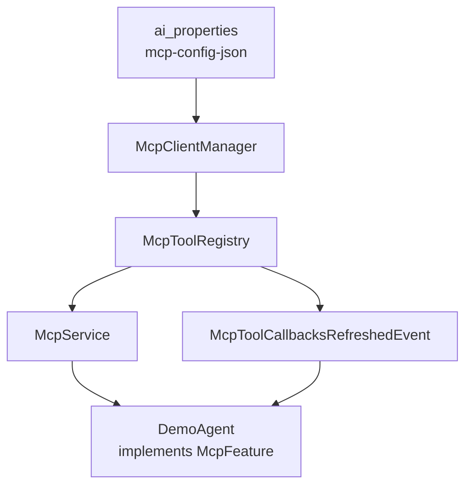

# MCP 接入

本文说明如何在平台中配置 **MCP（Model Context Protocol）Server**，并在插件 Agent 中合并 MCP 工具。

**重要**：基类 `AiAgent` **不会**为所有 Agent 自动挂载 MCP。需要 MCP 的 Agent 应显式 **`implements McpFeature`**，基类会在 `buildToolCallbacks()` 中通过 `McpService` 自动合并工具。

## 1. 架构概览



1. MCP Server 连接信息持久化在 DB。
2. `McpClientManager` 建立 stdio / SSE / streamable HTTP 连接。
3. `McpToolRegistry` 生成 `SyncMcpToolCallbackProvider`。
4. 实现 `McpFeature` 的 Agent 在 `buildToolCallbacks()` 中自动合并 MCP 与本地 `@Tool`。
5. 配置或连接变更时发布事件，触发全部 Agent `rebuildAgent()`。

## 2. 配置存储

| 项 | 值 |
|----|-----|
| 存储表 | `ai_properties` |
| 属性名 | `mcp-config-json` |
| 管理 API | `GET/PUT /v1/rest/j2agent/mcp/config`（ADMIN） |
| 状态 API | `GET /v1/rest/j2agent/mcp/status`（ADMIN） |

## 3. JSON 结构

根对象含 **`mcpServers`**，键为 server 名称（自定义），值为连接参数：

```json
{
  "mcpServers": {
    "filesystem-local": {
      "command": "npx",
      "args": ["-y", "@modelcontextprotocol/server-filesystem", "/tmp"],
      "env": {}
    },
    "remote-sse": {
      "type": "sse",
      "url": "http://localhost:8080",
      "sseEndpoint": "/sse",
      "headers": {
        "Authorization": "Bearer YOUR_TOKEN"
      }
    },
    "remote-streamable": {
      "type": "streamable_http",
      "url": "https://mcp.example.com",
      "endpoint": "/mcp",
      "headers": {}
    }
  }
}
```

### 3.1 传输类型

| `type` | 说明 | 主要字段 |
|--------|------|----------|
| （省略） | **stdio** 子进程 | `command`、`args`、`env` |
| `sse` | Server-Sent Events | `url`、`sseEndpoint`（默认 `/sse`）、`headers` |
| `streamable_http` | Streamable HTTP | `url`、`endpoint`（默认 `/mcp`）、`headers` |

保存配置后平台会自动 `reloadAll()` 并重连。

## 4. Agent 侧接入

### 4.1 推荐：声明式 `McpFeature`

```java
package io.github.jerryt92.j2agent.demo;

import io.github.jerryt92.j2agent.service.llm.agent.inf.AiAgent;
import io.github.jerryt92.j2agent.service.llm.agent.inf.feature.McpFeature;
import lombok.RequiredArgsConstructor;
import org.springframework.stereotype.Component;

@Component
@RequiredArgsConstructor
public class DemoAgent extends AiAgent implements McpFeature {

    private final DemoTools demoTools;

    @Override
    protected Object[] buildTools() {
        return new Object[] { demoTools };
    }
}
```

默认 `useAllMcpServers()` 为 `true`，合并当前已连接的全部 MCP Server 工具。

若只需部分 MCP Server，override 筛选方法：

```java
import java.util.Set;

@Component
public class DemoAgent extends AiAgent implements McpFeature {

    @Override
    public boolean useAllMcpServers() {
        return false;
    }

    @Override
    public Set<String> useMcpServers() {
        return Set.of("filesystem-local", "remote-sse");
    }
}
```

server 名称与 `mcp-config-json` → `mcpServers` 的键名一致。

### 4.2 行为说明

| 条件 | 合并结果 |
|------|----------|
| 未 `implements McpFeature` | 不合并 MCP（仅本地 `buildTools()`） |
| 默认（`useAllMcpServers()=true`） | 合并**当前已连接**的全部 MCP Server 工具 |
| `useAllMcpServers()=false` | 仅合并 `useMcpServers()` 中指定且**在线**的 server 工具 |
| 指定 server 离线或不存在 | 跳过该 server 并打 `warn` 日志，其余正常合并 |

与 `ExternalSkills` 的对称关系见 [Agent开发.md §1.4](Agent开发.md#14-特性接口对比externalskills--mcpfeature)。

### 4.3 接入示例

任意插件 Agent 实现 `McpFeature` 即可合并 MCP 工具；若只需部分 Server，关闭全量并声明名称：

```java
@Component
public class YourAgent extends AiAgent implements McpFeature {

    @Override
    protected Object[] buildTools() {
        return new Object[] { mathTool };
    }

    @Override
    public boolean useAllMcpServers() {
        return false;
    }

    @Override
    public Set<String> useMcpServers() {
        return Set.of("your-mcp-server-key"); // 对应 mcp-config-json → mcpServers 的键名
    }
}
```

本地 `@Tool` 由 `buildTools()` 注册，MCP 由基类 `buildToolCallbacks()` 自动合并。

### 4.4 高级：手动 override `buildToolCallbacks()`

子类完全覆盖 `buildToolCallbacks()` 且不调用 `super` 时，不会自动合并 MCP。此时可手动注入 `McpService` 并调用 `getToolCallbacksForAgent(this)` 或 `getToolCallbackProvider()`。一般场景请优先使用 `McpFeature`。

**设计说明**：

- MCP Server 在运行时**全局注册**，但是否暴露给模型由 Agent 是否 `implements McpFeature`（及筛选方法）决定。
- 不需要 MCP 的 Agent 不要实现 `McpFeature`，避免模型调用无关外部工具。
- 合并后 MCP 配置变更会通过 `McpToolCallbacksRefreshedListener` 触发 `rebuildAgent()`，无需重启服务。

## 5. 刷新链路

```
PUT /mcp/config 或 McpService.reload()
  → McpClientManager.reloadAll()
  → McpToolRegistry.refreshToolCallbacks()
  → McpToolCallbacksRefreshedEvent
  → AiAgentReloadService.reloadAll()
  → 每个 AiAgent.rebuildAgent()
```

## 6. 排错

| 步骤 | 操作 |
|------|------|
| 查看连接状态 | `GET /v1/rest/j2agent/mcp/status` — 各 server `online`/`offline` 及工具列表 |
| 查看配置 | `GET /v1/rest/j2agent/mcp/config` |
| 查看日志 | 关键字 `MCP server connected` / `MCP server connect failed` |
| 模型调不到 MCP 工具 | 确认 Agent `implements McpFeature`；`GET /mcp/status` 对应 server 为 `online` |
| 按名筛选后无工具 | `useAllMcpServers()` 须为 `false`；`useMcpServers()` 名称与 `mcpServers` 键一致且 server 在线 |
| 配置了筛选仍注入全部 | 确认已 override `useAllMcpServers()` 返回 `false`（仅写 `useMcpServers()` 不会生效）；查看日志 `MCP merge for agent` / `MCP tools merged` 中的 `selectedServers` |
| 工具名冲突 | MCP 工具名与本地 `@Tool` 重名会导致模型混淆，调整 MCP server 或本地工具名 |

**错误语义**：MCP 工具调用失败通常为可恢复错误（`eventType=TOOL` + `phase=ERROR`，状态回到 `THINKING`），**不会**触发整轮 `FAILED`。

## 7. 平台代码索引

| 主题 | 路径 |
|------|------|
| MCP 特性接口 | `.../service/llm/agent/inf/feature/McpFeature.java` |
| MCP 服务入口 | `.../service/llm/mcp/McpService.java` |
| 连接管理 | `.../service/llm/mcp/McpClientManager.java` |
| 工具回调注册 | `.../service/llm/mcp/McpToolRegistry.java` |
| Agent 基类合并逻辑 | `.../service/llm/agent/inf/AiAgent.java` — `buildToolCallbacks()` |
| Agent 重建监听 | `.../service/llm/agent/McpToolCallbacksRefreshedListener.java` |
| 管理接口 | `.../controller/McpController.java` |

## 8. 相关文档

- [工具.md](工具.md) — 本地 Tool 与 MCP 合并
- [Agent开发.md](Agent开发.md) — Agent 生命周期
