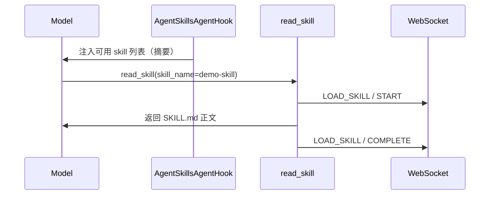

# Skill 开发

本文说明如何为插件 Agent 挂载 **Skill（技能）**——基于 Alibaba Agent Framework 的渐进式披露机制，模型通过 `read_skill` 按需加载 Markdown 正文。

## 1. Skill 与 Tool 的区别

| 维度 | Tool | Skill |
|------|------|-------|
| 内容形态 | 可执行函数（入参 → 出参） | Markdown 文档（流程、领域知识） |
| 加载方式 | 模型直接 `call` | 模型先看到技能列表，再 `read_skill` 读正文 |
| 上下文占用 | 仅 tool schema | 按需加载，减少 system prompt 体积 |
| UI 状态 | `CALLING_TOOL` | `LOAD_SKILL` |
| 开发者动作 | `@Tool` + `buildTools()`；MCP 需 `implements McpFeature` | 内部 `skills/` 默认加载；外部需 `implements ExternalSkills` |

两者可并存：Skill 描述「怎么做」，Tool 负责「执行」。

## 2. 启用方式

### 2.1 内部技能（默认）

将技能放在 Agent 工程 **`src/main/resources/skills/<目录>/SKILL.md`** 下即可；`mvn package` 后进入 **`target/<artifact>-<version>/resources/skills/`**，由 Agent ClassLoader 自动扫描并**全部暴露**给模型，**无需**在代码中声明。

只要 Agent 的 `resources/skills/` 下存在至少一个有效技能目录，基类 `buildAgent()` 就会挂载 `AgentSkillsAgentHook` 并注册 `read_skill` 工具。

### 2.2 外部技能（可选）

需要平台共享技能时，Agent 类须显式 **`implements ExternalSkills`**。平台外部技能位于 `<plugin.path>/skills/`（`plugin.path` 为 `.../plugins` 根目录）。

**默认行为**（已实现 `ExternalSkills` 时）：`useAllExternalSkills()` 返回 **`true`**，自动加载该目录下**全部**技能，`useExternalSkills()` **不生效**。

若只需加载部分外部技能，将 `useAllExternalSkills()` 设为 `false`，再 override `useExternalSkills()` 指定目录名：

```java
import io.github.jerryt92.j2agent.service.llm.agent.inf.AiAgent;
import io.github.jerryt92.j2agent.service.llm.agent.inf.feature.ExternalSkills;

@Component
public class DemoAgent extends AiAgent implements ExternalSkills {

    @Override
    public boolean useAllExternalSkills() {
        return false;
    }

    @Override
    public Set<String> useExternalSkills() {
        return Set.of("shared-demo-skill");
    }
}
```

未 `implements ExternalSkills` 的 Agent **不会**加载任何平台外部技能，仅使用内部 `resources/skills/`。

## 3. 资源布局

### 3.1 Agent 内部

文件放在 **`src/main/resources/skills/`** 下；`mvn package` 后进入 **`target/<artifact>-<version>/resources/skills/`**（由 Agent 的 ClassLoader 加载，见 [Agent开发.md](Agent开发.md) §5）：

```
src/main/resources/skills/
  demo-skill/
    SKILL.md              # 必需：技能主文档
    附属说明.md            # 可选：补充 .md
```

| 路径 | 说明 |
|------|------|
| `skills/<目录>/SKILL.md` | 技能根文档；目录名可与 frontmatter `name` 不同 |
| `skills/<目录>/*.md` | 附属文档，通过 `read_skill` 的 `relative_path` 加载 |

### 3.2 平台外部（可选）

```
/opt/j2agent/volume/plugins/skills/
  shared-demo-skill/
    SKILL.md
```

默认情况下（`useAllExternalSkills()` 为 `true`）该目录下全部子目录均会加载；按名加载时 `useExternalSkills()` 中的名称对应一级子目录名。模型侧 `read_skill` 的 `skill_name` 使用 SKILL.md frontmatter 中的 **`name`** 字段。

资源由 `AgentClassLoaderSkillRegistry` 读取；来自 JAR 内时会解压到临时目录，来自外部 `resources/` 或平台 `plugins/skills` 目录时直接扫描文件系统。

## 4. SKILL.md 格式

支持 **YAML frontmatter**（Alibaba `SkillScanner` 标准）。`read_skill` 默认返回**去掉 frontmatter 后的正文**。

```markdown
---
name: demo-skill
description: 演示技能，说明如何处理演示类问题。
---

# 演示技能

当用户询问「演示流程」时，按以下步骤回答：

1. 确认用户目标
2. 列出必要前置条件
3. 给出分步操作说明

## 注意事项

- 不要编造不存在的功能
- 涉及权限操作时提醒用户确认
```

附属文档示例 `skills/demo-skill/FAQ.md`：

```markdown
# 常见问题

## 如何重置演示环境？

联系管理员执行环境重置脚本。
```

## 5. 运行时行为



- **`AgentSkillsAgentHook`**：向模型上下文注入已注册 skill 的元数据列表。
- **`AgentReadSkillTool`**：统一 `read_skill` 实现。
  - 省略 `relative_path`：读取 `SKILL.md`（无 frontmatter）
  - 指定 `relative_path`：读取技能目录下其它 `.md`（不允许 `..`）
- **`AgentUiSkillLoadToolInterceptor`**：驱动 UI `LOAD_SKILL` 状态与审计入库。

`read_skill` 参数约定（模型侧）：

| 参数 | 说明 |
|------|------|
| `skill_name` / `skillName` | 必填，须匹配技能 frontmatter `name`（非目录名） |
| `relative_path` / `relativePath` | 可选，如 `FAQ.md` |

## 6. 完整 Agent 片段

内部技能无需声明。加载平台全部外部技能：

```java
@Component
public class DemoAgent extends AiAgent implements ExternalSkills {
    // useAllExternalSkills() 默认 true，无需 override
}
```

若只需部分外部技能：

```java
@Component
public class DemoAgent extends AiAgent implements ExternalSkills {

    @Override
    public boolean useAllExternalSkills() {
        return false;
    }

    @Override
    public Set<String> useExternalSkills() {
        return Set.of("shared-demo-skill");
    }
}
```

## 7. 常见问题

| 现象 | 排查 |
|------|------|
| 模型从不调用 `read_skill` | 检查 system prompt 是否引导使用技能；skill `description` 是否清晰 |
| `read_skill` 报 skill 不存在 | 使用 frontmatter `name` 而非目录名；JAR/resources 内缺少 `SKILL.md` |
| 外部技能未出现 | 确认 Agent 已 `implements ExternalSkills`；按名加载时 `useAllExternalSkills()` 须为 `false`；目录名与 `plugins/skills` 一致且含有效 `SKILL.md` |
| 附属 .md 读不到 | `relative_path` 路径须在技能目录内，且以 `.md` 结尾 |
| UI 无 LOAD_SKILL | 确认继承 `AiAgent` 且未移除 `AgentUiSkillLoadToolInterceptor` |

## 8. 平台代码索引

| 主题 | 路径 |
|------|------|
| `ExternalSkills` | `.../service/llm/agent/inf/feature/ExternalSkills.java` |
| `McpFeature`（对称特性） | `.../service/llm/agent/inf/feature/McpFeature.java` — 见 [MCP.md](MCP.md) |
| Skill 注册表 | `.../service/llm/skill/AgentClassLoaderSkillRegistry.java` |
| Skills Hook | `.../service/llm/skill/AgentSkillsAgentHook.java` |
| read_skill 实现 | `.../service/llm/skill/AgentReadSkillTool.java` |
| Skill UI 拦截器 | `.../service/llm/skill/AgentUiSkillLoadToolInterceptor.java` |

## 9. 相关文档

- [工具.md](工具.md) — Tool 开发与 UI 事件
- [Agent开发.md](Agent开发.md) — Agent 基类与特性接口对比
- [MCP.md](MCP.md) — `McpFeature` 声明式 MCP 接入
- [Spring AI Alibaba Skills 教程](https://java2ai.com/docs/frameworks/agent-framework/tutorials/skills) — 上游框架说明
