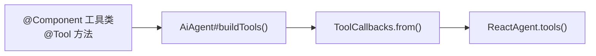

# 工具（Tool）开发

本文说明插件 Agent 如何注册 **Spring AI `@Tool`** 工具，以及工具调用链路的处理机制。

平台**没有**独立的 Tool Registry API；工具通过 **`buildTools()` → `buildToolCallbacks()`** 挂载到底层 `ReactAgent`。

平台还会在 `AiAgent` 基类中统一追加部分平台级工具，例如 `ask_question`。这类工具不需要业务 Agent 在 `buildTools()` 中重复声明。

## 1. 注册机制



1. 定义 **`@Component`** 工具类，方法标注 **`@Tool`** / **`@ToolParam`**（Spring AI 注解）。
2. Agent 子类 **override `buildTools()`**，返回要暴露的工具 Bean 数组。
3. 基类默认 **`buildToolCallbacks()`** 调用 `ToolCallbacks.from(tools)` 转为 `ToolCallback[]`。
4. 基类根据 `enableAskQuestion()` 默认追加平台级 `ask_question` 工具。
5. 若需合并 MCP 工具，Agent 类 **`implements McpFeature`**，基类自动在 `buildToolCallbacks()` 中合并（见 [MCP.md](MCP.md)）。

## 2. 插件自定义工具

### 2.1 工具类

```java
package com.nms.prodplugin.ai.center.demo;

import org.springframework.ai.tool.annotation.Tool;
import org.springframework.ai.tool.annotation.ToolParam;
import org.springframework.stereotype.Component;

@Component
public class DemoTools {

    @Tool(name = "echo", description = "回显输入文本，用于验证工具调用链路。")
    public String echo(
            @ToolParam(description = "要回显的文本") String text) {
        if (text == null || text.isBlank()) {
            return "（空输入）";
        }
        return text.trim();
    }
}
```

### 2.2 Agent 挂载

```java
package com.nms.prodplugin.ai.center.demo;

import io.github.jerryt92.j2agent.service.llm.agent.inf.AiAgent;
import lombok.RequiredArgsConstructor;
import org.springframework.stereotype.Component;

@Component
@RequiredArgsConstructor
public class DemoAgent extends AiAgent {

    private final DemoTools demoTools;

    @Override
    protected Object[] buildTools() {
        return new Object[] { demoTools };
    }

    // getAgentId()、loadSystemPrompt() 等见 Agent开发.md
}
```

### 2.3 编写建议

| 项 | 建议 |
|----|------|
| `name` | 英文 snake_case，全局唯一（同一 Agent 内不与 MCP 工具名冲突） |
| `description` | 写清用途与限制，模型据此决定是否调用 |
| `@ToolParam` | 每个参数都要有 description |
| 返回值 | 优先返回字符串；异常时返回可读错误信息，避免抛未捕获异常 |
| 副作用 | 写操作类工具应幂等或明确提示用户 |

## 3. UI 事件与错误处理（自动）

继承 `AiAgent` 后，默认拦截器链会自动处理工具调用，**开发者无需额外注册**：

| 拦截器 | 作用 |
|--------|------|
| `AgentToolErrorReturnInterceptor` | 未知工具名或调用异常时，向模型返回安全错误文本，**不中断整轮对话** |
| `AgentUiToolEventInterceptor` | 通用工具调用 → WebSocket `CALLING_TOOL` 状态与 `eventType=TOOL` 事件 |
| `AgentUiSkillLoadToolInterceptor` | `read_skill` → `LOAD_SKILL` 状态（见 [Skill.md](Skill.md)） |

**注意**：即使 override `buildInterceptors()`，`AgentToolErrorReturnInterceptor` 仍会通过 `buildEffectiveInterceptors()` 强制保留。

## 4. 平台级 `ask_question`

`ask_question` 是平台级澄清工具，用于 Agent 在用户意图、关键参数、业务选项、执行范围或继续执行方式不确定时向用户提问。Agent 应在本轮必要判断完成、确认仍需用户补充且即将结束时调用；调用后立即结束本轮对话。默认所有继承 `AiAgent` 的 Agent 都会启用。

### 4.1 Agent 侧使用规则

- Agent 不需要在 `buildTools()` 中手动返回 `AskQuestionTool`。
- `ask_question` 的工具说明约束调用时机：仅在本轮即将结束且仍需用户补充时调用；调用后立即结束本轮对话。
- `optionsJson` 必须是 JSON 字符串数组，只放真实业务候选答案；不要生成“自定义”“其他”“以上都不是”“手动输入”等兜底选项。
- 前端固定提供“自定义回答”入口；用户提交后会作为新的用户消息继续，内容仅为答案文本。

### 4.2 关闭能力

特殊 Agent 若不希望暴露该能力，可覆盖：

```java
@Override
protected boolean enableAskQuestion() {
    return false;
}
```

关闭后，基类不会注入 `ask_question` 工具。

### 4.3 运行时行为

- `ask_question` 调用成功后正常返回“立即结束本轮对话”的工具结果；模型应立即结束输出，等待用户新消息继续。
- 后端通过 `MESSAGE/PATCH` 将 `pendingQuestion` 合并到当前 assistant 气泡；历史落库也保留该字段。
- 前端在气泡内展示提问卡片，而不是弹窗。
- 如果卡片已出现但模型仍在输出，用户可以先点击或填写答案；前端会等当前 turn 结束后自动发送答案。

## 5. Tool 与 MCP 的关系

- `@Tool` 工具经 `buildTools()` 注册。
- MCP 工具经 `McpService` 提供；实现 **`McpFeature`** 后由基类自动合并，也可手动 override `buildToolCallbacks()`。
- 两者对模型而言均为可调用工具；命名冲突会导致模型混淆，请避免。

## 6. 平台代码索引

| 主题 | 路径 |
|------|------|
| `buildTools` / `buildToolCallbacks` | `.../service/llm/agent/inf/AiAgent.java` |
| `ask_question` 平台工具 | `.../tools/AskQuestionTool.java` |
| 提问 PATCH 注册表 | `.../service/question/TurnAskQuestionRegistry.java` |
| `McpFeature` | `.../service/llm/agent/inf/feature/McpFeature.java` |
| 工具 UI 拦截器 | `.../service/llm/tool/AgentUiToolEventInterceptor.java` |
| 工具错误兜底 | `.../service/llm/tool/AgentToolErrorReturnInterceptor.java` |

## 7. 相关文档

- [Agent开发.md](Agent开发.md) — Agent 基类与插件约束
- [Agent-UI 交互机制](../../平台/agent-ui交互机制/README.md) — `ask_question` 气泡卡片与 WebSocket 协议
- [MCP.md](MCP.md) — 合并 MCP 工具回调
- [Skill.md](Skill.md) — Skill 与 Tool 的区别
