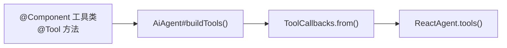

# 工具（Tool）开发

本文说明插件 Agent 如何注册 **Spring AI `@Tool`** 工具，以及工具调用链路的处理机制。

平台**没有**独立的 Tool Registry API；工具通过 **`buildTools()` → `buildToolCallbacks()`** 挂载到底层 `ReactAgent`。

## 1. 注册机制



1. 定义 **`@Component`** 工具类，方法标注 **`@Tool`** / **`@ToolParam`**（Spring AI 注解）。
2. Agent 子类 **override `buildTools()`**，返回要暴露的工具 Bean 数组。
3. 基类默认 **`buildToolCallbacks()`** 调用 `ToolCallbacks.from(tools)` 转为 `ToolCallback[]`。
4. 若需合并 MCP 工具，Agent 类 **`implements McpFeature`**，基类自动在 `buildToolCallbacks()` 中合并（见 [MCP.md](MCP.md)）。

## 2. 插件自定义工具

### 2.1 工具类

```java
package io.github.jerryt92.j2agent.demo;

import org.springframework.ai.tool.annotation.Tool;
import org.springframework.ai.tool.annotation.ToolParam;
import org.springframework.stereotype.Component;

@Component
public class DemoTools {

    @Tool(name = "echo", description = "回显输入文本，用于验证工具调用链路。")
    public String echo(
            @ToolParam(description = "要回显的文本") String text) {
        if (text == null || text.isBlank()) {
            return "（空输入）";
        }
        return text.trim();
    }
}
```

### 2.2 Agent 挂载

```java
package io.github.jerryt92.j2agent.demo;

import io.github.jerryt92.j2agent.service.llm.agent.inf.AiAgent;
import lombok.RequiredArgsConstructor;
import org.springframework.stereotype.Component;

@Component
@RequiredArgsConstructor
public class DemoAgent extends AiAgent {

    private final DemoTools demoTools;

    @Override
    protected Object[] buildTools() {
        return new Object[] { demoTools };
    }

    // getAgentId()、loadSystemPrompt() 等见 Agent开发.md
}
```

### 2.3 编写建议

| 项 | 建议 |
|----|------|
| `name` | 英文 snake_case，全局唯一（同一 Agent 内不与 MCP 工具名冲突） |
| `description` | 写清用途与限制，模型据此决定是否调用 |
| `@ToolParam` | 每个参数都要有 description |
| 返回值 | 优先返回字符串；异常时返回可读错误信息，避免抛未捕获异常 |
| 副作用 | 写操作类工具应幂等或明确提示用户 |

平台也可直接注入已有的通用工具 Bean（如 `TimeTool`、`WebTool`、`MathTool`）并在 `buildTools()` 中一并返回。

## 3. UI 事件与错误处理（自动）

继承 `AiAgent` 后，默认拦截器链会自动处理工具调用，**开发者无需额外注册**：

| 拦截器 | 作用 |
|--------|------|
| `AgentToolErrorReturnInterceptor` | 未知工具名或调用异常时，向模型返回安全错误文本，**不中断整轮对话** |
| `AgentUiToolEventInterceptor` | 通用工具调用 → WebSocket `CALLING_TOOL` 状态与 `eventType=TOOL` 事件 |
| `AgentUiSkillLoadToolInterceptor` | `read_skill` → `LOAD_SKILL` 状态（见 [Skill.md](Skill.md)） |

**注意**：即使 override `buildInterceptors()`，`AgentToolErrorReturnInterceptor` 仍会通过 `buildEffectiveInterceptors()` 强制保留。

## 4. Tool 与 MCP 的关系

- `@Tool` 工具经 `buildTools()` 注册。
- MCP 工具经 `McpService` 提供；实现 **`McpFeature`** 后由基类自动合并，也可手动 override `buildToolCallbacks()`。
- 两者对模型而言均为可调用工具；命名冲突会导致模型混淆，请避免。

## 5. 平台代码索引

| 主题 | 路径 |
|------|------|
| `buildTools` / `buildToolCallbacks` | `.../service/llm/agent/inf/AiAgent.java` |
| `McpFeature` | `.../service/llm/agent/inf/feature/McpFeature.java` |
| 工具 UI 拦截器 | `.../service/llm/tool/AgentUiToolEventInterceptor.java` |
| 工具错误兜底 | `.../service/llm/tool/AgentToolErrorReturnInterceptor.java` |

## 6. 相关文档

- [Agent开发.md](Agent开发.md) — Agent 基类与插件约束
- [MCP.md](MCP.md) — 合并 MCP 工具回调
- [Skill.md](Skill.md) — Skill 与 Tool 的区别
