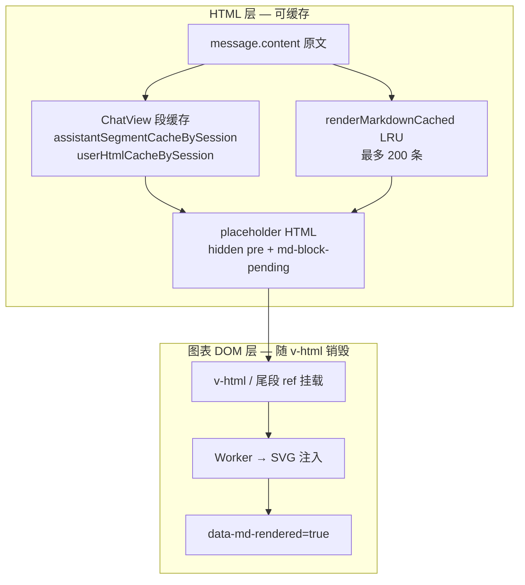
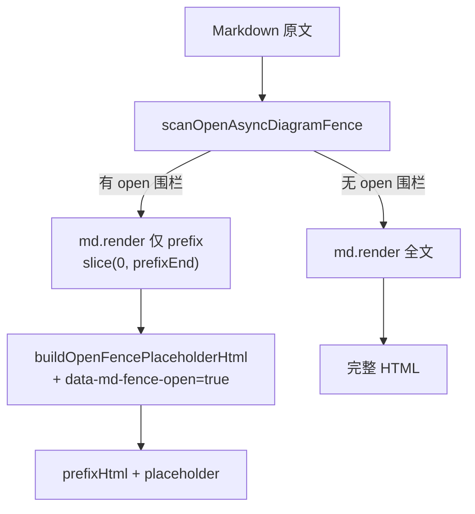
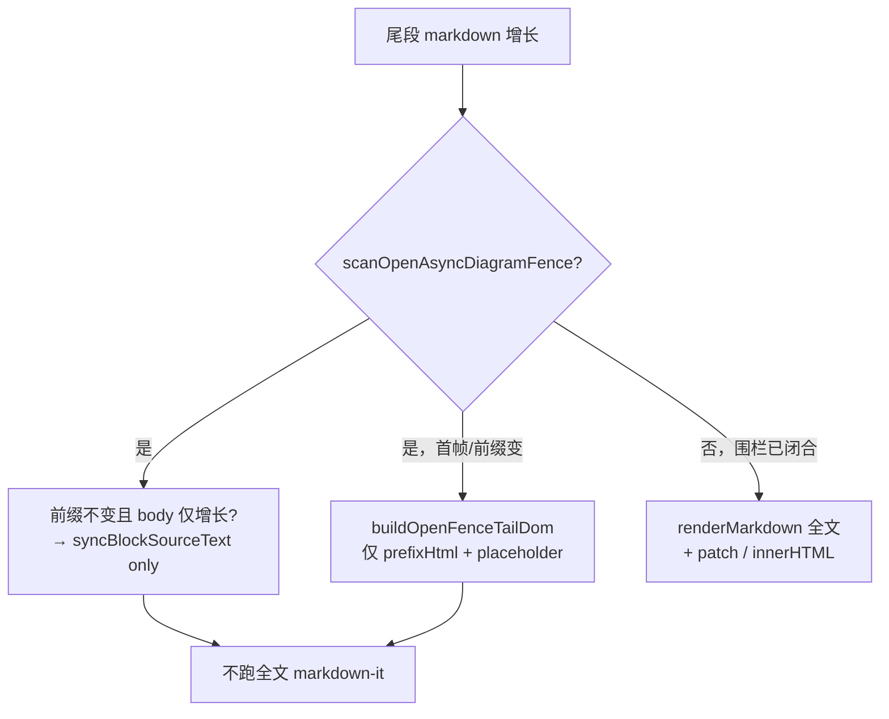
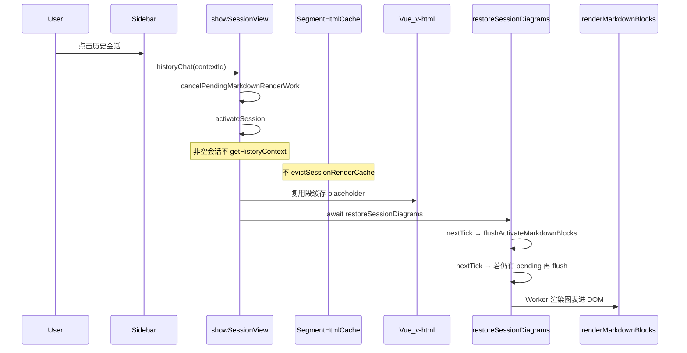

# 围栏与会话切换架构（当前实现）

本文描述聊天气泡中 **未闭合 async 围栏**、**流式尾段**、**多会话切换** 的现行实现与不变量。与 Worker 调度、视口优化等通用机制配合阅读：

- [渲染机制与Worker隔离.md](渲染机制与Worker隔离.md) — 端到端链路
- [图表渲染性能优化.md](图表渲染性能优化.md) — 性能分层与参数速查

---

## 1. 核心原则

| 原则 | 含义 |
|------|------|
| **围栏 body 不进 markdown-it** | 未闭合 `mermaid` / `plantuml` / `vega-lite` / `html` 围栏的 JSON/源码体永不参与 `md.render()` |
| **HTML 与图表 DOM 分离** | 内存里缓存的是 placeholder HTML；SVG/`data-md-rendered` 只存在于当前挂载的 DOM |
| **切会话只 flush 图表** | routine 切换会话时复用 HTML 占位缓存，仅对 DOM 中 pending 块跑 `renderMarkdownBlocks` |
| **未就绪块不算 pending** | 围栏未闭合、流式尾段推迟、源码不可解析的块不进入调度队列，避免空转死循环 |
| **切换即作废异步批次** | `cancelPendingMarkdownRenderWork` 递增 `markdownRenderGeneration`，在途 Worker 批次立即退出 |

当前渲染器版本：`MARKDOWN_RENDERER_REVISION = '31'`（[`markdownRenderer.ts`](../../../j2agent-ui/src/utils/markdownRenderer.ts)）。

---

## 2. 双层状态模型



### ChatView 段缓存

文件：[`ChatView.vue`](../../../j2agent-ui/src/pages/chat/components/ChatView.vue)。

| 缓存 | 键 | 命中条件 | 存什么 |
|------|-----|----------|--------|
| `assistantSegmentCacheBySession` | `sessionKey` → `messageIndex` | `content` + `MARKDOWN_RENDERER_REVISION` 均相同 | 各 segment 的 `{ text, html, complete }` |
| `userHtmlCacheBySession` | 同上 | 同上 | 用户气泡整段 HTML |

**失效策略（当前）：**

| 场景 | 行为 |
|------|------|
| 单条消息 `content` 变化 | 该 messageIndex cache miss，仅重算该条 |
| `MARKDOWN_RENDERER_REVISION` 升级 | 全部 miss，按 revision 自然失效 |
| **routine 侧边栏切会话** | **不** bulk evict，**不**重复 `getHistoryContext` |
| 删除会话 `removeSession` | `evictSessionRenderCache(sessionKey)` 清空该会话缓存 |
| 首次打开空会话 | `messageContext.length === 0` 时拉 `getHistoryContext` |

切走会话时 DOM 销毁，但 **段 HTML 缓存保留**。切回时用缓存 placeholder 重建 v-html，再 flush 图表即可。

---

## 3. 未闭合围栏：围栏感知 Markdown

入口：`renderMarkdown` / `renderMarkdownCached` → 内部 `renderMarkdownWithOpenFenceSupport`。



### 扫描 API

| 函数 | 作用 |
|------|------|
| `scanOpenAsyncDiagramFence(text)` | 定位最后一个未闭合的 async 围栏，返回 `{ lang, bodyStart, prefixEnd }` |
| `hasOpenAsyncDiagramFence(text)` | 是否存在 open 围栏 |
| `extractOpenAsyncFenceBody(text)` | 围栏体内源码（不含 opening ``` 行） |

支持语言：`mermaid`、`puml`/`plantuml`、`vega-lite`/`vegalite`、`html`。

### 占位 DOM 标记

未闭合围栏的 placeholder 带：

```html
<div class="md-diagram md-diagram-vegalite"
     data-md-render="vegalite"
     data-md-revision="28"
     data-md-fence-open="true">
  <pre class="md-diagram-source" hidden>{…body…}</pre>
  <div class="md-diagram-body md-block-pending">生成中…</div>
</div>
```

围栏闭合后正常 `md.render`，**不带** `data-md-fence-open`。

---

## 4. 流式尾段就地更新

函数：`scheduleUpdateStreamTailSegmentInPlace` → `updateStreamTailSegmentInPlace`（[`markdownRenderer.ts`](../../../j2agent-ui/src/utils/markdownRenderer.ts)）。

合并策略：**rAF + 最小间隔 80ms**（`STREAM_TAIL_MIN_INTERVAL_MS`）。



要点：

- open 围栏路径 **永不** 对「前缀 + 巨大 body」调用 `renderMarkdown(全文)`。
- `buildOpenFenceTailDom` 手工拼接 prefix DOM + placeholder，保留 pending 节点与流光动画。
- 尾段 **禁止** 走 `renderMarkdownCached` LRU（避免数百份近全文快照 OOM）。

容器标记：`[data-md-stream-tail]`（[`ChatView.vue`](../../../j2agent-ui/src/pages/chat/components/ChatView.vue) 模板）。

---

## 5. 图表块就绪判定与调度

### `isAsyncDiagramBlockReady(block, options)`

决定是否允许 Worker 渲染该块：

| 条件 | 结果 |
|------|------|
| `data-md-fence-open="true"` | **不就绪** |
| `deferDiagrams && closest('[data-md-stream-tail]')` | **不就绪**（流式尾段内推迟） |
| `vegalite` 且 `tryParseVegaLiteSpec(source) === null` | **不就绪** |
| `mermaid` / `plantuml` / `html` 源码为空 | **不就绪** |
| 其余 | **就绪** |

`tryParseVegaLiteSpec` 定义于 [`diagramSourceNormalize.ts`](../../../j2agent-ui/src/utils/diagramSourceNormalize.ts)，非抛错版 `parseVegaLiteSpec`。

### `isBlockPendingRender(block, options)`

是否纳入 `renderMarkdownBlocks` 调度队列：

- 常规：无 `data-md-rendered="true"` → pending。
- **关键**：`isAsyncBlock && !isAsyncDiagramBlockReady` → **不算 pending**（故意等待，避免调度器对「生成中」块空转）。

`hasPendingMarkdownBlocks(root, options)` 与 `executeRenderMarkdownBlocks` 均按此过滤。

### 流式 `deferDiagrams`

```ts
renderMarkdownBlocks(scopeRoot, {
  deferDiagrams: isBusyByState.value,  // 当前活跃会话 busy
  scrollRoot,
  prefetchRootMargin: buildMarkdownPrefetchRootMargin(scrollRoot)
})
```

- `deferDiagrams: true` 时，**仅**跳过仍在 `[data-md-stream-tail]` 内、围栏未闭合的块。
- 同一条消息里 **已闭合** 的图表块在流式过程中也会立即渲染。

---

## 6. 会话切换流程



### `showSessionView`

1. `cancelPendingMarkdownRenderWork` — 清尾段 rAF/队列，**generation++**。
2. `activateSession` — 切换 `activeSessionKey`（watch 内再次 cancel、重置流式 split 缓存）。
3. 仅当 `!loadedFromServer && messageContext.length === 0` 时 `getHistoryContext`。
4. `scrollToBottom()` → `await restoreSessionDiagrams()`。

### `restoreSessionDiagrams`

```ts
await nextTick()
flushActivateMarkdownBlocks()
await nextTick()
if (hasPendingMarkdownBlocks(scopeRoot, renderOptions)) {
  flushActivateMarkdownBlocks()  // DOM/v-html 竞态兜底
}
```

`onActivated`（keep-alive 回页）同样经 `showSessionView` 走此路径。

### `activeSessionKey` watch

同步执行：`cancelPendingMarkdownRenderWork`、`resetActiveStreamSplitCache`、`resetActiveStreamRenderedCache`、清空 debounce。**不** bulk evict、**不** flush（由 `showSessionView` 末尾统一 restore）。

---

## 7. 取消与 generation 令牌

`cancelPendingMarkdownRenderWork(scope?)`（切会话、keep-alive 切走、`activeSessionKey` 变化）：

1. `markdownRenderGeneration++`
2. 清空 `renderMarkdownBlocksChain`、尾段 rAF/节流、diagram retry 定时器
3. 对 `scope` 内 `data-md-rendering="true"` 块 `abortBlockRender`

在途批次检测点：

- `executeRenderMarkdownBlocks` 入口与每 block 前
- `renderWithViewportScheduling` 的 `startBlock` / `scheduleDrain`
- `renderBlock` 在 `await` Worker 返回后

**局限**：已在执行的同步 `md.render()` 无法 mid-flight 取消；open-fence 路径从机制上避免尾段/sync 场景的全文 parse。

---

## 8. 图表渲染触发时机（汇总）

| 时机 | 调用 |
|------|------|
| 流式围栏闭合（完成段 +1） | `flushActivateMarkdownBlocks`（nextTick） |
| 流式结束 `isBusy → false` | `flushActivateMarkdownBlocks` + 尾段 final in-place |
| 历史消息入列（length 变化且非 busy） | `flushActivateMarkdownBlocks` |
| **侧边栏 / keep-alive 切会话** | **`showSessionView` → `restoreSessionDiagrams`** |
| 聊天页 idle | `preloadDiagramRuntimes` → Worker warmup |
| 流式中普通增量 | `activateMarkdownBlocks` debounce 100ms（闭合段计数未变时） |

---

## 9. 关键代码索引

| 主题 | 路径 |
|------|------|
| open-fence parse、尾段 in-place、pending 判定、generation | `src/utils/markdownRenderer.ts` |
| Vega 非抛错解析 | `src/utils/diagramSourceNormalize.ts` → `tryParseVegaLiteSpec` |
| 段缓存、showSessionView、restoreSessionDiagrams | `src/pages/chat/components/ChatView.vue` |
| Worker 渲染 | `src/utils/diagramRenderWorkerClient.ts`、`src/workers/diagramRender.worker.ts` |

### 主要常量

| 常量 | 值 | 含义 |
|------|-----|------|
| `MARKDOWN_RENDERER_REVISION` | `'31'` | HTML/块 revision，与 Vue `:key` 同步 |
| `STREAM_TAIL_MIN_INTERVAL_MS` | `80` | 尾段 markdown-it 最小间隔 |
| `MARKDOWN_HTML_CACHE_MAX_ENTRIES` | `200` | 全局 HTML LRU 上限 |
| `MARKDOWN_BLOCKS_DEBOUNCE_MS` | `100` | 流式中图表 scan debounce |
| `MARKDOWN_FENCE_OPEN_ATTR` | `data-md-fence-open` | 未闭合围栏标记 |

---

## 10. 排查速查

| 现象 | 优先检查 |
|------|----------|
| 流式大 Vega 主线程卡 | 尾段是否仍走 `renderMarkdown(全文)`；Network/Performance 里 markdown-it Long Task |
| 切会话后永久「生成中」 | `restoreSessionDiagrams` 是否执行；块是否误带 `data-md-fence-open`；`isBlockPendingRender` 是否误判 false |
| 切会话卡死 | 是否误调 `evictSessionRenderCache` + 全量 `getHistoryContext` 导致 computed 内同步 parse 风暴 |
| 调度 CPU 100% | open 块是否被算作 pending 导致 `scheduleDrain` 空转（应已排除） |
| 图表不更新 | `cancel` 后 generation 是否一致；DOM 是否 `isConnected` |
| revision 升级后旧图样式异常 | 块 `data-md-revision` 是否落后于 `MARKDOWN_RENDERER_REVISION`，应触发 `resetStaleDiagramBlock` |
