# 图表渲染性能优化

本文专门说明聊天气泡中 **Mermaid / PlantUML / Vega-Lite / HTML 预览** 的性能优化机制：解决了什么问题、每层优化如何协作、关键参数是多少。配合流程图阅读，便于排查卡顿、OOM、图表重复渲染或流式「抽搐」。

> 完整渲染链路与模块索引见 [渲染机制与Worker隔离.md](渲染机制与Worker隔离.md)；围栏语法与 xychart 修正见 [图表渲染.md](图表渲染.md)。

---

## 1. 要解决的性能问题

| 症状 | 根因（优化前常见情况） |
|------|------------------------|
| 长回答页面崩溃 / 内存暴涨 | 流式尾段每 token 缓存近全文 HTML；Mermaid/Vega 在主线程堆分配大对象 |
| 主线程长时间卡顿 | 多个图表块同时 `mermaid.render` / `vega-embed`，与 markdown-it 抢 CPU |
| 图表闪动、重复渲染 | 流式尾段整段 `v-html` 替换，pending 占位被销毁后重建 |
| 未写完围栏就解析失败 | 流式中途对半成品 Mermaid 源码调用渲染引擎 |
| 滚动长对话时首屏卡死 | 视口外大量图表与视口内同时渲染 |
| 拖拽窗口宽度时页面卡死/崩溃 | resize 触发全页同步 refit + ResizeObserver 反馈环 |
| 图表长时间「生成中」或刷新后才出现 | Worker 结果写入 detached DOM；abort 后无重试；Worker 提前 terminate |
| 每个 token 全量 regex / markdown-it | 对整条 `message.content` 重复切分与解析 |

优化目标可以概括为：**主线程只做轻量 DOM 与 markdown-it；重计算进 Worker；稳定内容只算一次；不稳定内容节流合并；看不见的先不做。**

---

## 2. 优化分层总览

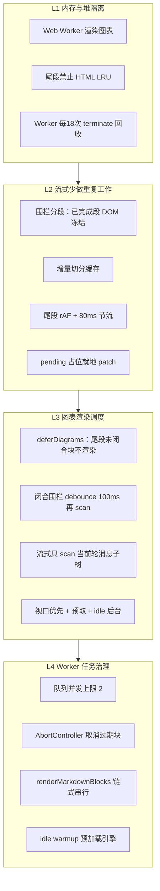

---

## 3. 优化前后对比（流式长回答）

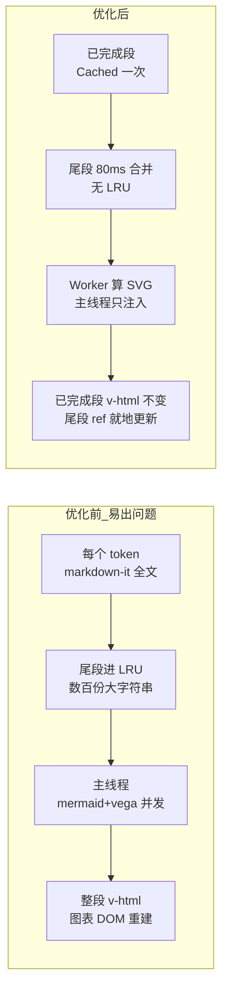

---

## 4. L1：内存与堆隔离

### 4.1 Web Worker 承担重计算

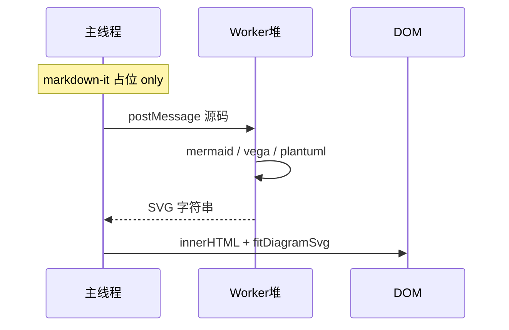

| 项目 | 说明 |
|------|------|
| Worker 算什么 | Mermaid `render`、PlantUML `renderToString`、Vega `View.toSVG()` |
| 主线程算什么 | markdown-it、DOM 注入、xychart 标签换行、SVG 缩放 fit |
| 代码 | `diagramRender.worker.ts` + `diagramRenderWorkerClient.ts` |
| Fallback | Worker 失败时才 lazy `import('mermaid')` 等于主线程（不影响正常路径） |

**效果**：mermaid（含 d3/dagre）、vega、plantuml 的大对象分配发生在 **Worker 隔离堆**，主线程 GC 压力显著下降，降低长对话 OOM 概率。

### 4.2 尾段禁止 HTML LRU

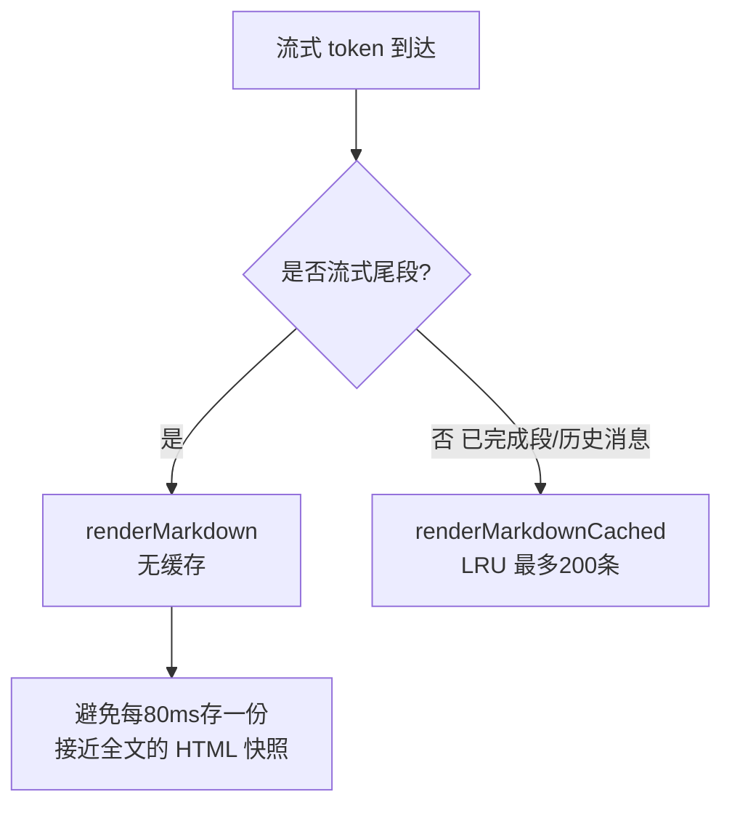

| 常量 | 值 | 文件 |
|------|-----|------|
| `MARKDOWN_HTML_CACHE_MAX_ENTRIES` | 200 | `markdownRenderer.ts` |
| `STREAM_TAIL_MIN_INTERVAL_MS` | 80 | `markdownRenderer.ts` |

### 4.3 Worker 定期回收

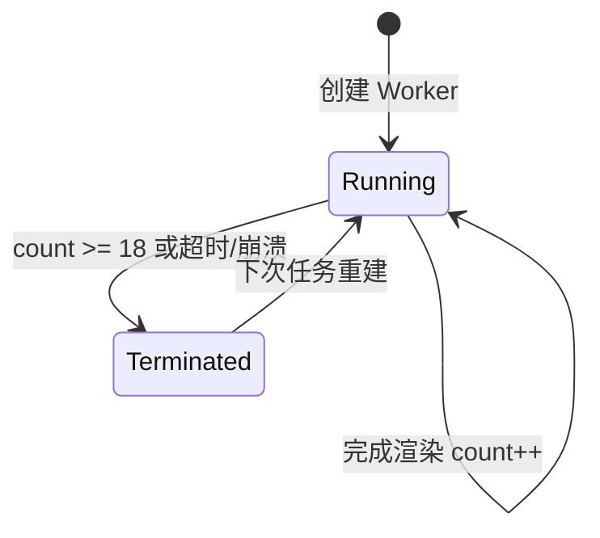

| 常量 | 值 |
|------|-----|
| `WORKER_RECYCLE_AFTER` | 18 |
| `WORKER_REQUEST_TIMEOUT_MS` | 120000 |

**效果**：释放 Worker 堆内 mermaid/vega 碎片内存，避免 Worker 长时间运行后堆膨胀。

---

## 5. L2：流式阶段少做重复工作

### 5.1 围栏分段 — 冻结已完成 DOM

一条 assistant 消息按 **已闭合围栏** 切成多段；只有最后一段是「流式尾段」。

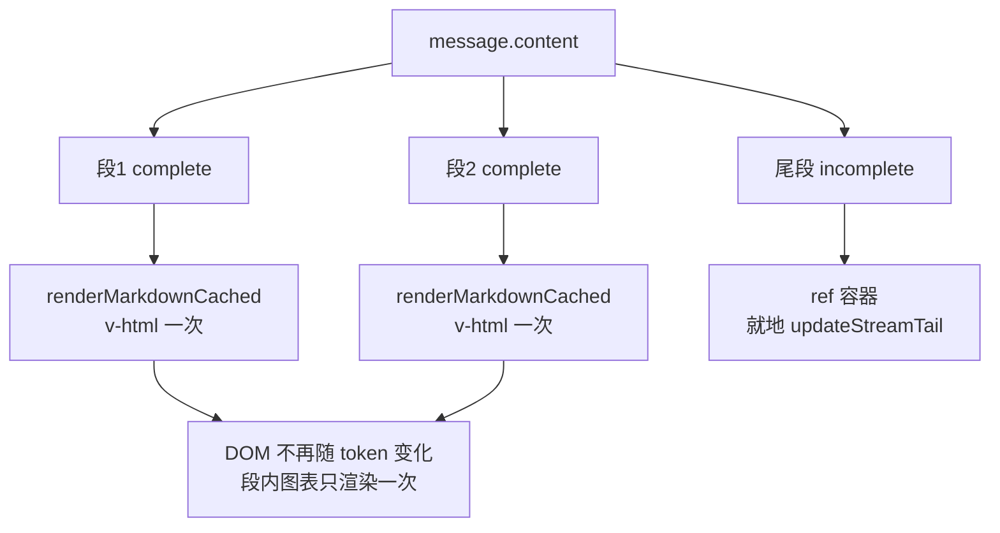

**效果**：围栏一旦闭合，该段 HTML 与 DOM 固定；`renderMarkdownBlocks` 渲染出的图表不会被后续 token 销毁重建，消除「抽搐」。

### 5.2 增量切分缓存

纯追加 token 且 delta 内无新围栏行时，**只延长尾段字符串**，不重新跑全文 `FENCE_BLOCK_RE`。

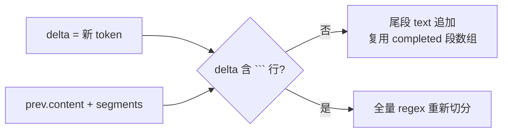

相关缓存：

| 缓存 | 作用 |
|------|------|
| `activeStreamSplitCache` | 切分结果增量更新 |
| `activeStreamRenderedCache` | 已渲染段对象复用，避免 Vue 每 token 新建数组 |
| `stableAssistantSegmentCache` | 历史 assistant 消息按 index 缓存 |

### 5.3 尾段节流 + 就地 patch

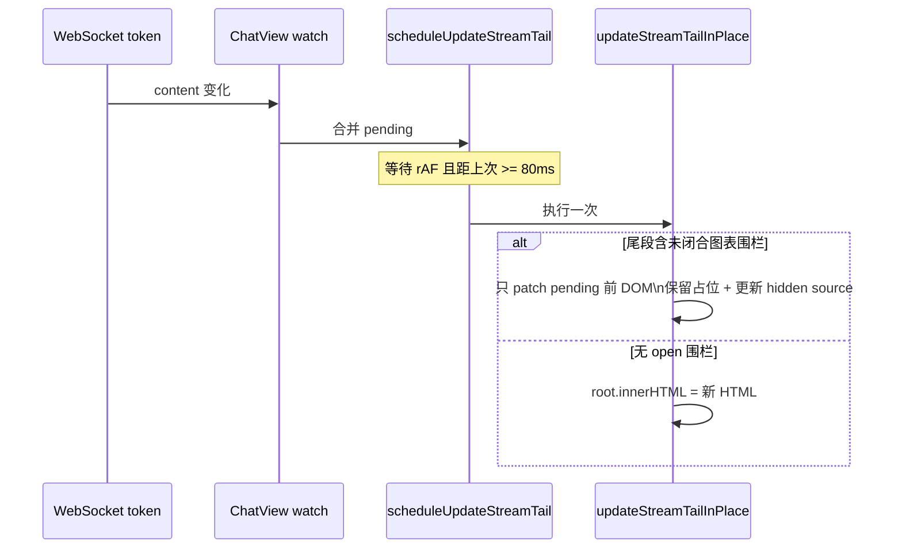

**效果**：

- token 频率可能 10~50/s，合并后 markdown-it 约 **12/s 上限**；
- open 围栏期间 **保留** `md-block-pending` 节点，流光动画不重启。

---

## 6. L3：图表渲染调度

### 6.1 deferDiagrams — 不渲染「写了一半」的块

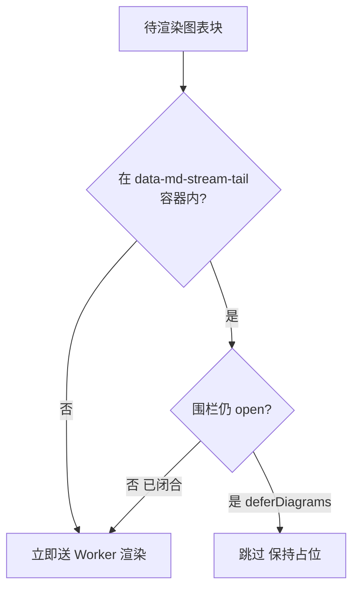

流式结束 `isBusyByState → false` 时 `flushActivateMarkdownBlocks()` **立即**补渲染被推迟的块。

### 6.2 触发 scan 的 debounce 与作用域

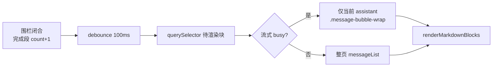

| 常量 | 值 |
|------|-----|
| `MARKDOWN_BLOCKS_DEBOUNCE_MS` | 100 |

**效果**：避免每个 token 全列表 DOM 扫描；流式时缩小 querySelector 范围。

### 6.3 视口优先 + 预取 + idle 后台

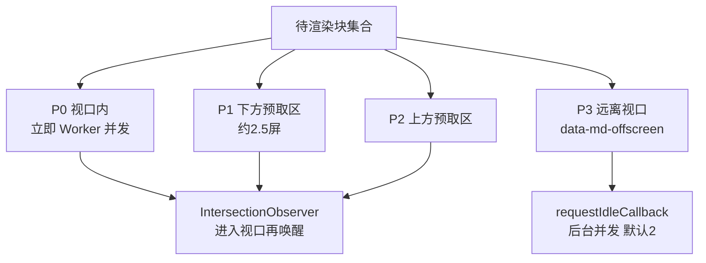

| 常量 | 值 | 说明 |
|------|-----|------|
| `DEFAULT_DIAGRAM_RENDER_CONCURRENCY` | 2 | 视口内 Worker 并发 |
| `DEFAULT_BACKGROUND_RENDER_CONCURRENCY` | 2 | 视口外 idle 并发 |
| `MARKDOWN_PREFETCH_VIEWPORT_MULTIPLIER` | 2.5 | 预取区倍数 |
| `MARKDOWN_MIN_PREFETCH_PX` | 2400 | 预取最小 px |
| heavy 块并发 | 1 | PlantUML / HTML 预览 |

**效果**：用户当前可见区域优先出图；远离视口的块不抢占 Worker 与主线程 fit。

### 6.4 渲染链串行化

多次 `renderMarkdownBlocks(root)` 调用通过 **Promise 链** 串行执行，避免并发 scan + 重复渲染同一批块。

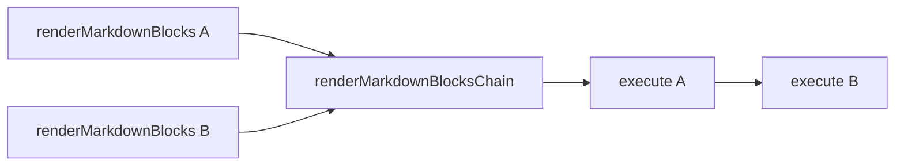

---

## 7. L4：Worker 任务治理

### 7.1 队列与并发

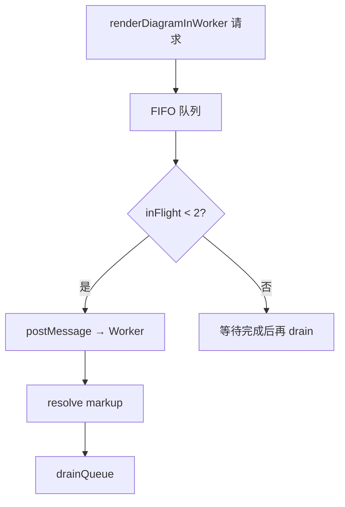

### 7.2 Abort 过期任务

流式尾段 DOM 被替换、块被 `resetStaleDiagramBlock` 时，对该块 **abort** 进行中的 Worker 任务。

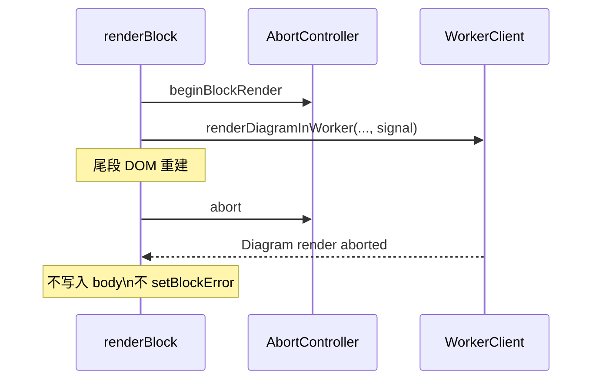

**效果**：避免过期 SVG 回写 DOM，减少无效内存占用与视觉闪动。

### 7.3 Idle warmup

聊天页 `requestIdleCallback` 调用 `preloadDiagramRuntimes()` → Worker 收到 `warmup`，预加载 mermaid/vega/plantuml 模块。

**效果**：首图冷启动延迟降低，且预热发生在 idle，不阻塞交互。

---

## 8. 主线程 DOM 后处理的轻量优化

图表注入后仍有少量主线程工作，也做了节流：

| 机制 | 参数 | 作用 |
|------|------|------|
| `scheduleFitDiagramSvg` | rAF 二次 fit | 避免占位态高度跳变 |
| `DIAGRAM_REFIT_THROTTLE_MS` | 100 | ResizeObserver 触发 refit 节流 |
| `batchRefitRafId` | 分帧 refit | 每帧最多 8 个 body，剩余下一 rAF |
| `diagramFitInProgress` | WeakSet | fit 期间忽略 RO 回调，打破反馈环 |
| `DIAGRAM_WINDOW_RESIZE_DEBOUNCE_MS` | 180 | 窗口 resize trailing debounce |
| `scheduleGlobalDiagramReflow` | 视口 ±1 屏优先 | 视口外 idle 补全 |
| `HTML_PREVIEW_FIT_DEBOUNCE_MS` | 150 | HTML 预览 iframe 测量防抖 |
| `diagramMaxHeightCache` | 缓存 CSS 变量解析 | 避免重复 probe DOM |

### 8.1 窗口 resize 防抖与反馈环

拖拽浏览器宽度时，旧逻辑会在每个 `resize` 事件上 invalidate 缓存并对 **全文档** `.md-diagram-body` 同步 refit，与 ResizeObserver、ChatView 滚动布局形成反馈环，主线程易被长时间占用。

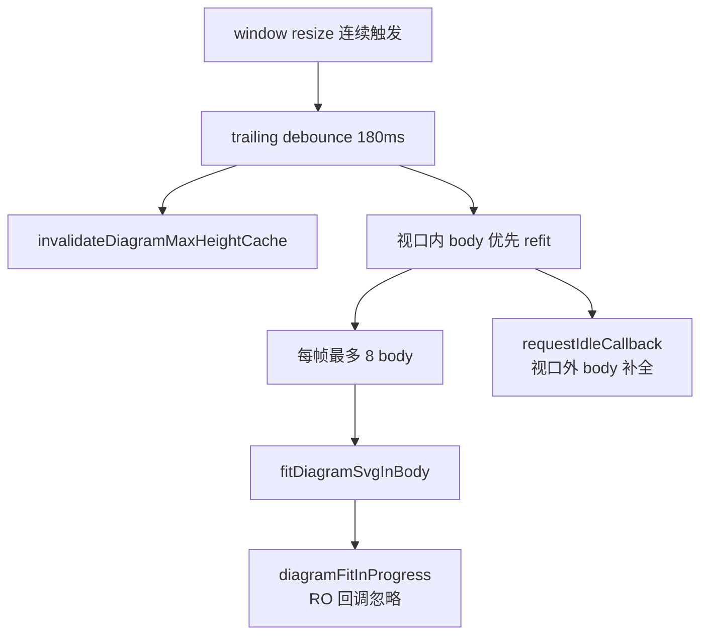

**效果**：拖拽宽度时主线程可响应；停拖约 200ms 后图表宽度正确，无闪烁循环。

---

## 9. Worker 渲染可靠性

Worker 计算成功后图表仍不可见，或永久停在「生成中」，根因通常是 **DOM 时序** 而非 Worker 本身失败。

### 9.1 不可见链路

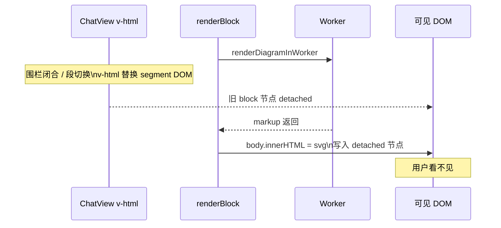

### 9.2 修复机制

| 机制 | 作用 |
|------|------|
| `assertBlockConnected` | Worker 返回后、注入前检查 `block.isConnected` |
| `scheduleDiagramBlockRetry` | abort / detached / 超时后 debounce 50ms 重扫 live DOM |
| 安全 Worker 回收 | `inFlightCount === 0` 且队列空才 `terminate()` |
| 成功即标记 rendered | SVG 已注入则写 `data-md-rendered`，不因迟到的 abort 丢弃 |
| 围栏闭合 `nextTick` flush | v-html 更新后再 scan，避免扫到即将替换的旧节点 |

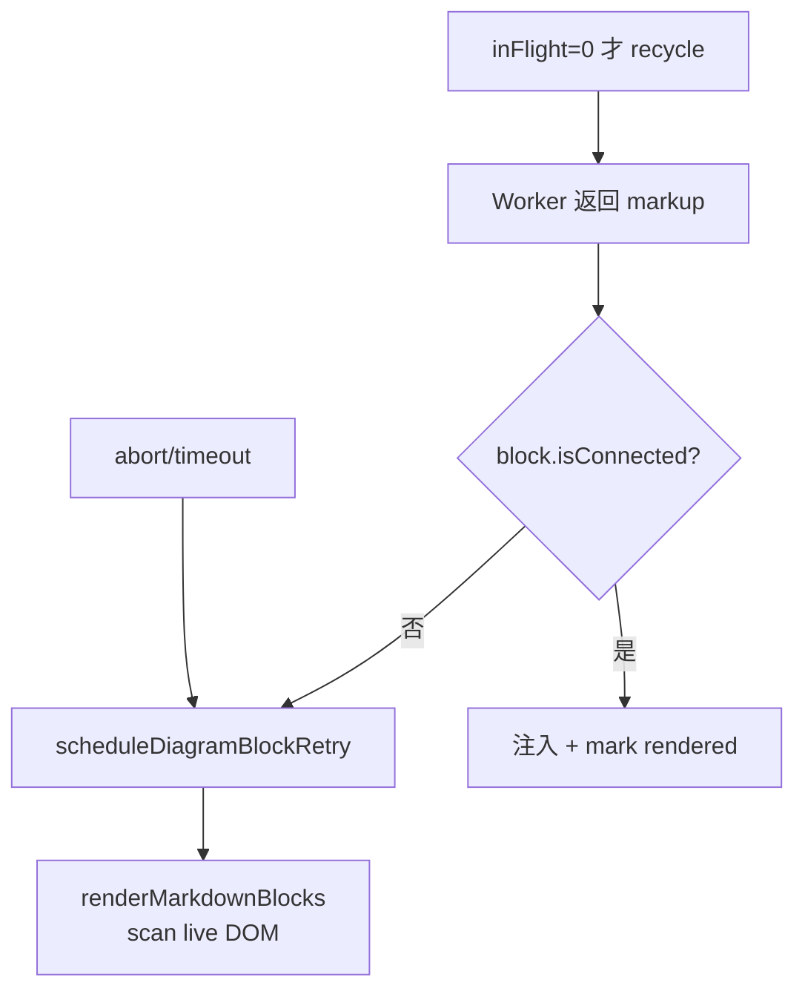

---

## 10. 一张图串起「一个 token 的生命周期」

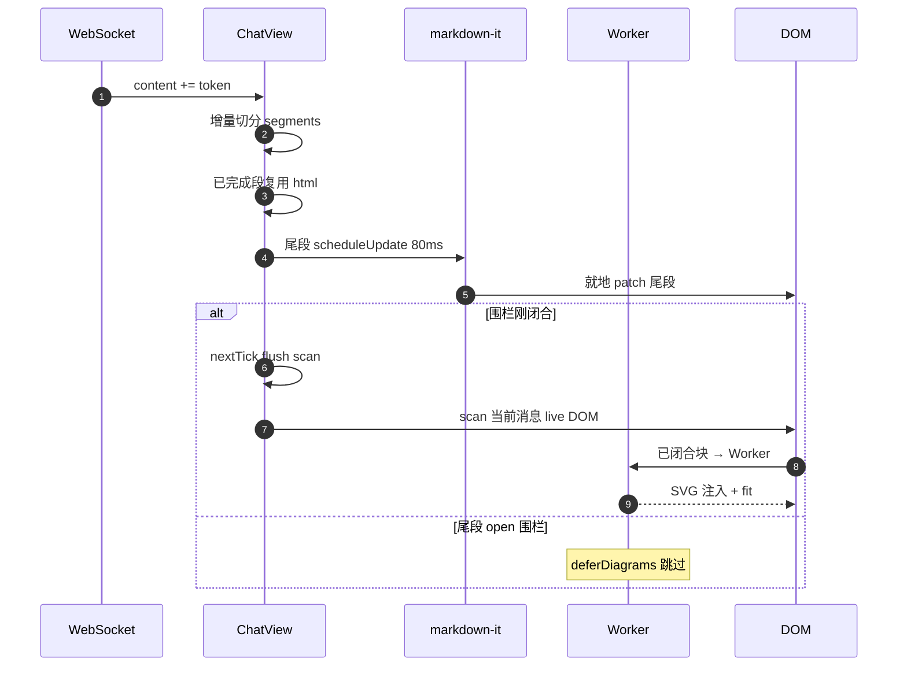

---

## 11. 关键参数速查表

| 参数 | 值 | 模块 |
|------|-----|------|
| 尾段 markdown-it 最小间隔 | 80 ms | `markdownRenderer.ts` |
| 窗口 resize refit debounce | 180 ms | `markdownRenderer.ts` |
| 单帧 refit 预算 | 8 body | `markdownRenderer.ts` |
| HTML 预览 fit debounce | 150 ms | `markdownRenderer.ts` |
| 图表块重试 debounce | 50 ms | `markdownRenderer.ts` |
| 图表 scan debounce | 100 ms | `ChatView.vue` |
| HTML LRU 容量 | 200 | `markdownRenderer.ts` |
| Worker 渲染并发 | 2 | `diagramRenderWorkerClient.ts` |
| Worker 回收阈值 | 18 次（空闲时 terminate） | `diagramRenderWorkerClient.ts` |
| 视口外 idle 并发 | 2 | `markdownRenderer.ts` |
| 预取区 | max(2400px, 2.5×视口高) | `markdownRenderer.ts` |
| heavy 块并发 | 1 | `markdownRenderer.ts` |
| SVG refit 节流 | 100 ms | `markdownRenderer.ts` |

---

## 12. 相关源码

| 优化点 | 主要文件 |
|--------|----------|
| Worker 渲染 | `src/workers/diagramRender.worker.ts` |
| Worker 队列/回收/Abort | `src/utils/diagramRenderWorkerClient.ts` |
| 占位/defer/视口调度/尾段更新 | `src/utils/markdownRenderer.ts` |
| 分段/缓存/触发 render | `src/pages/chat/components/ChatView.vue` |
| 源码规范化（Worker 共用） | `src/utils/diagramSourceNormalize.ts` |

---

## 13. 排查指引

| 现象 | 优先检查 |
|------|----------|
| 内存仍涨 | DevTools 看主堆 vs Worker；尾段是否误走 Cached |
| 图表闪动 | 已完成段是否被整段 v-html 重建；Abort 是否生效 |
| 流式不出图 | `deferDiagrams` + 尾段 open 围栏；busy 结束后是否 flush |
| 刷新后才出图 | Worker 是否写入 detached DOM；`scheduleDiagramBlockRetry` 是否触发 |
| 永久「生成中」 | abort/超时后是否重试；Worker 是否提前 recycle 丢在途任务 |
| 拖拽宽度卡死 | resize debounce 是否生效；RO 反馈环；单帧 refit 预算 |
| 首图慢 | warmup 是否调用；Worker chunk 是否加载 |
| 滚动卡顿 | 视口外块是否标记 offscreen；idle 并发是否过高 |
