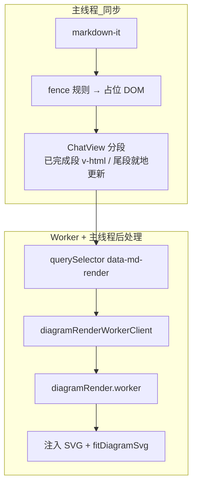

# 架构与流程

## 总览

LLM 回复渲染分为 **同步 Markdown**、**ChatView 流式挂载**、**Worker 异步图表** 三层。完整说明见 [渲染机制与Worker隔离.md](渲染机制与Worker隔离.md)。



1. **`renderMarkdown(markdown)`**：`markdown-it` 将 Markdown 转为 HTML；围栏图表只输出带 `data-md-render` 的占位 DOM。
2. **`renderMarkdownBlocks(root, options)`**：查找占位块，经 **Web Worker** 生成 SVG/HTML 字符串，主线程注入并适配尺寸。

## markdown-it 配置

文件：`src/utils/markdownRenderer.ts`

| 选项 | 值 | 说明 |
|------|-----|------|
| `html` | `false` | 禁止原始 HTML 注入（除 `html` 围栏走 iframe） |
| `linkify` | `true` | 自动链接 |
| `typographer` | `true` | 排版优化 |

自定义 renderer 规则：

- **fence**：识别 `html` / `mermaid` / `plantuml` / `puml` / `vega-lite` / `vegalite`，其余走默认高亮 `pre`
- **table**：外包 `md-table-wrap`，表头/单元格加 `md-*` 类名
- **link**：`target="_blank"` + `rel="noopener noreferrer"`
- **paragraph**：统一行高 CSS 变量

## 围栏类型

| 语言标识 | `data-md-render` | 占位 class | 渲染路径 |
|----------|------------------|------------|----------|
| `mermaid` | `mermaid` | `md-diagram-mermaid` | Worker → `renderMermaidBlock` |
| `plantuml` / `puml` | `plantuml` | `md-diagram-plantuml` | Worker → `renderPlantUmlBlock` |
| `vega-lite` / `vegalite` | `vegalite` | `md-diagram-vegalite` | Worker → `renderVegaLiteBlock` |
| `html` | `html` | `md-html-block` | 主线程 `renderHtmlPreviewBlock`（iframe） |

源码保存在隐藏节点 `<pre class="md-diagram-source" hidden>` 中，避免 `v-html` 转义问题。

## 异步渲染与去重

每个块维护属性：

- `data-md-rendering`：渲染进行中
- `data-md-rendered="true"`：已完成，跳过重复渲染
- `data-md-revision`：与 `MARKDOWN_RENDERER_REVISION` 对齐，版本升级时重绘

`renderMarkdownBlocks` 链式串行各次 `root` 扫描，块级渲染经 Worker 队列并发（默认 2），结束后 `refitDiagramBodies` 统一重算 SVG 外框。

## 流式输出

### 分段（ChatView）

- **已完成段**：以闭合围栏为界，`renderMarkdownCached` + `v-html`，DOM 稳定。
- **尾段**：`data-md-stream-tail` + ref 容器，`scheduleUpdateStreamTailSegmentInPlace`（rAF + 80ms 节流），**不走 HTML 缓存**。

### deferDiagrams

```ts
renderMarkdownBlocks(root, { deferDiagrams: isBusyByState.value })
```

当 `deferDiagrams: true` 时，**仅跳过** 仍处于流式尾段容器内、围栏**尚未闭合**的图表块；**已闭合** 的块照常立即渲染。

### 图表预加载

`preloadDiagramRuntimes()` 向 Worker 发送 `warmup`，在聊天页 idle 时降低首图冷启动延迟（不再于主线程 `import('mermaid')`）。

## 源码规范化

Mermaid / Vega-Lite 规范化函数位于 `src/utils/diagramSourceNormalize.ts`，Worker 与主线程 fallback 共用。Mermaid 渲染前执行 `normalizeMermaidSource`（弯引号、pie 标签、xychart 横向修正、flowchart 拆行等）。

## 导出 API

| 函数 | 用途 |
|------|------|
| `renderMarkdown` | 同步 HTML |
| `renderMarkdownCached` | 带 LRU 的同步 HTML |
| `renderMarkdownBlocks` | 异步图表（Worker） |
| `preloadDiagramRuntimes` | Worker warmup |
| `resetDiagramRenderWorker` | 重置 Worker 状态 |
| `refitDiagramBlocksInRoot` | 侧栏宽度变化后重算 SVG 框 |
| `resetMarkdownRendererForTest` | 测试重置单例 |
