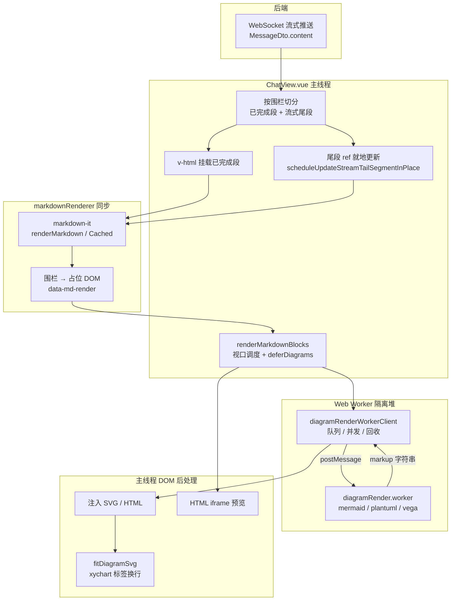
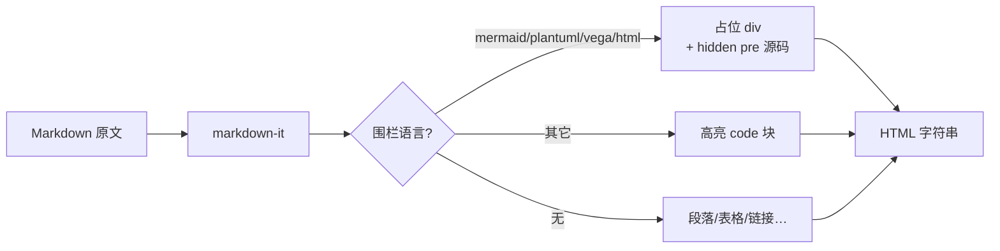
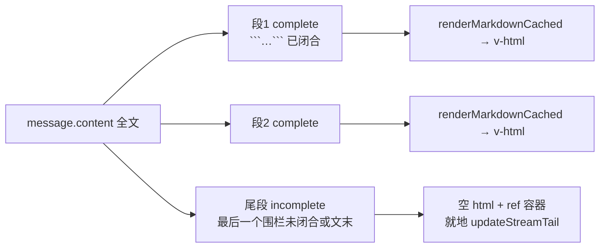
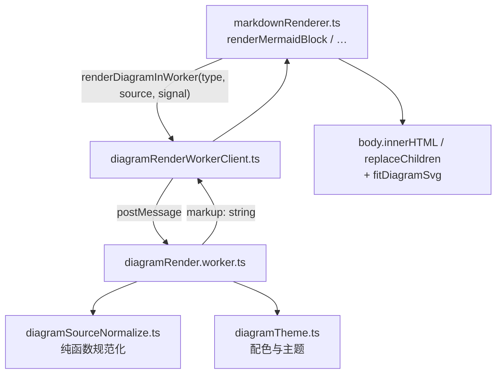
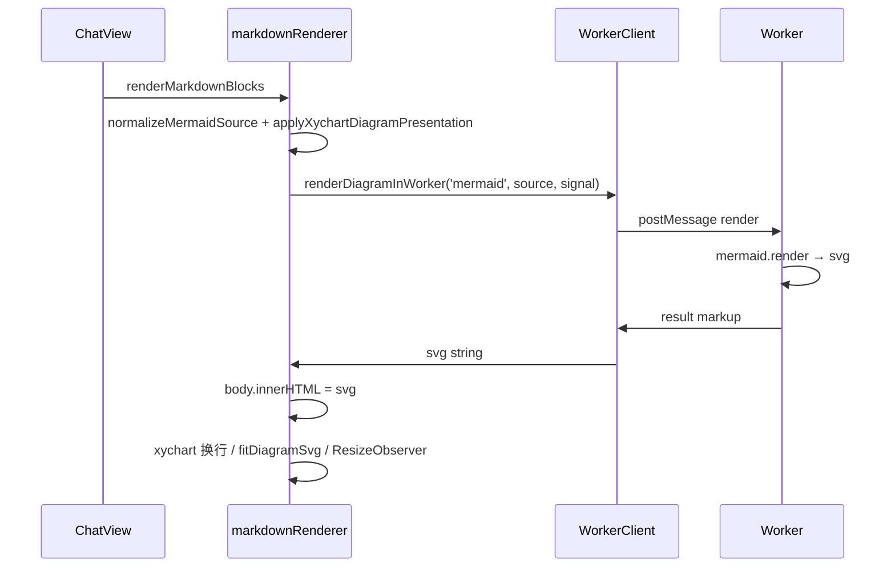
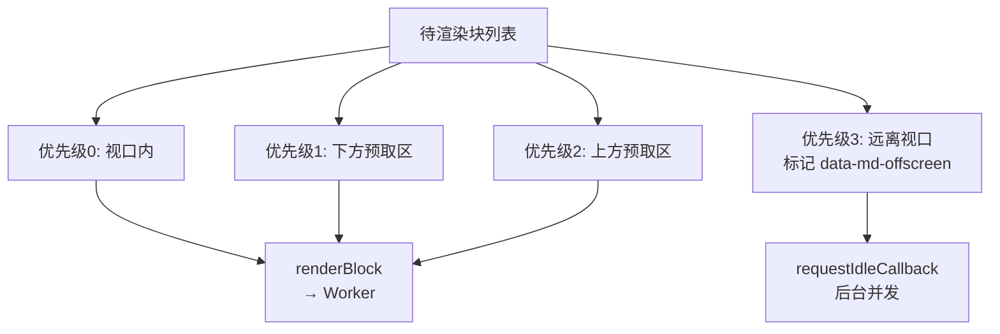
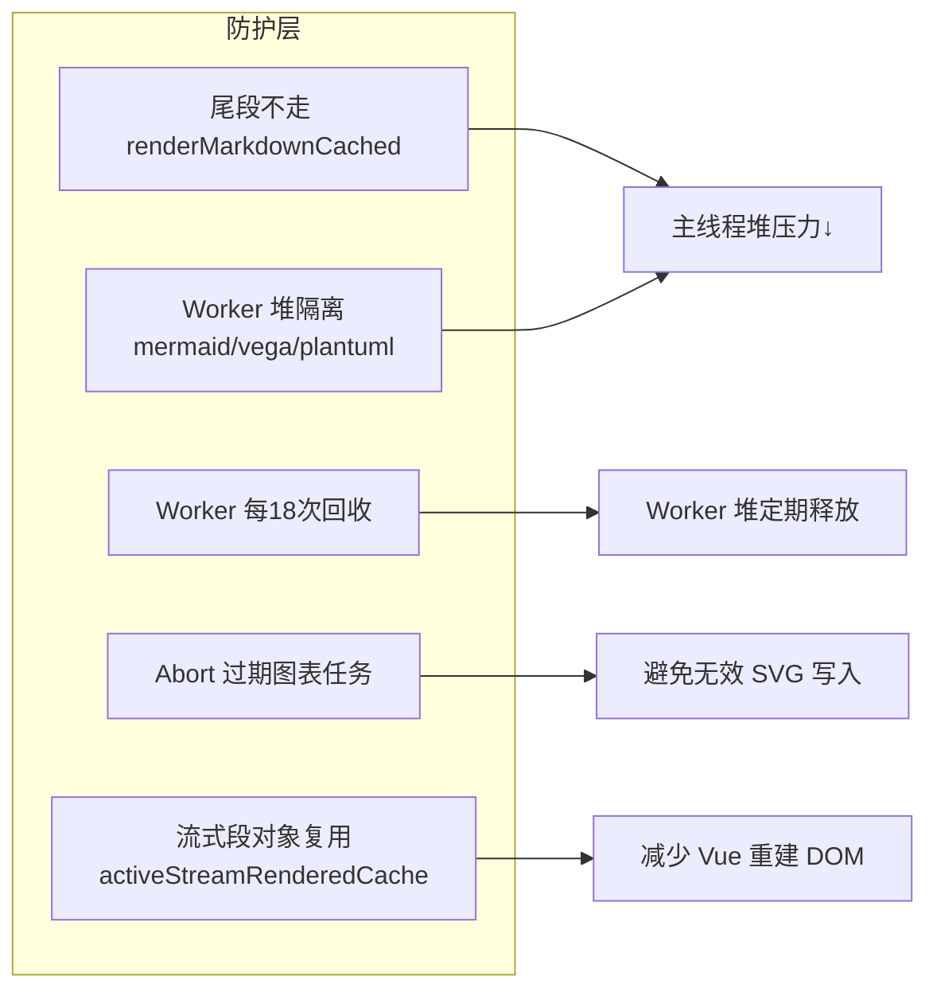

# 渲染机制与 Worker 隔离

本文描述 **LLM 流式输出从 Markdown 原文到聊天气泡可见内容** 的完整链路，包括主线程同步解析、流式分段策略、Web Worker 图表渲染与内存防护。适用于排查卡顿、OOM、图表不显示或流式抽搐等问题。

> **性能优化机制专篇**（分层示意图、优化前后对比、参数速查）：见 [图表渲染性能优化.md](图表渲染性能优化.md)。  
> **未闭合围栏与会话切换**（open-fence parse、段缓存 vs 图表 DOM、restoreSessionDiagrams）：见 [围栏与会话切换架构.md](围栏与会话切换架构.md)。  
> 围栏语法、xychart 修正、样式细节见 [图表渲染.md](图表渲染.md)、[样式约定.md](样式约定.md)。

## 端到端总览



**三阶段分工**：

| 阶段 | 运行环境 | 做什么 | 不做什么 |
|------|----------|--------|----------|
| 同步 Markdown | 主线程 | `markdown-it` → HTML 字符串、占位 DOM | 不调用 Mermaid / Vega / PlantUML |
| 流式挂载 | 主线程 Vue | 分段缓存、`v-html`、尾段就地 DOM 更新 | 不对尾段走 HTML LRU 缓存 |
| 异步图表 | **Web Worker**（主线程仅注入与 fit） | 重计算生成 SVG/HTML 字符串 | HTML iframe 预览仍留主线程 |

---

## 阶段一：同步 Markdown 解析（主线程）

入口：`renderMarkdown` / `renderMarkdownCached` → **`renderMarkdownWithOpenFenceSupport`**（[`markdownRenderer.ts`](../../../j2agent-ui/src/utils/markdownRenderer.ts)）。

未闭合 async 围栏（`mermaid` / `plantuml` / `vega-lite` / `html`）时：**仅对 opening fence 之前的 prefix 跑 markdown-it**，围栏 body 手工拼 placeholder，并打 `data-md-fence-open="true"`。详见 [围栏与会话切换架构.md](围栏与会话切换架构.md#3-未闭合围栏围栏感知-markdown)。



### markdown-it 要点

| 选项 | 值 | 说明 |
|------|-----|------|
| `html` | `false` | 禁止裸 HTML（`html` 围栏走 sandbox iframe） |
| `linkify` | `true` | 自动链接 |
| `typographer` | `true` | 排版优化 |

围栏识别后输出占位结构（示意）：

```html
<div class="md-diagram md-diagram-mermaid" data-md-render="mermaid" data-md-revision="28">
  <pre class="md-diagram-source" hidden>flowchart LR …</pre>
  <div class="md-diagram-body md-block-pending">
    <span class="md-block-generating">生成中…</span>
  </div>
</div>
```

未闭合围栏额外带 `data-md-fence-open="true"`（闭合后消失）。

源码保存在 **hidden `<pre>`**，避免 `v-html` 二次转义；异步阶段从该节点读取原文送 Worker。

### HTML 缓存（LRU）

- `renderMarkdownCached`：最多 **200** 条（`MARKDOWN_HTML_CACHE_MAX_ENTRIES`），键含 `MARKDOWN_RENDERER_REVISION`。
- **仅用于内容稳定的段**（已完成段、历史消息、用户消息）。
- **流式尾段禁止缓存**：尾段每 80ms 左右增长一次，若缓存会产生数百份「接近全文」的快照，导致 LRU 挤爆与 OOM（见下文「内存防护」）。

---

## 阶段二：ChatView 流式分段与挂载

文件：[`ChatView.vue`](../../../j2agent-ui/src/pages/chat/components/ChatView.vue)。

### 按围栏切分

一条 assistant 消息被拆成：



**已完成段**：内容不再随 token 变化 → HTML 恒定 → Vue 不重建其 DOM → 段内图表渲染一次后保持稳定。

**流式尾段**：带 `data-md-stream-tail` 标记；模板走 **ref + 就地更新**，不用 `v-html`，避免销毁 pending 占位、流光动画重启。

### 模板结构（简化）

```
assistant-answer.message-md
├── .assistant-stream-segment          [complete]  → v-html="seg.html"
├── .assistant-stream-segment          [complete]  → v-html
└── .assistant-stream-segment[data-md-stream-tail]
    └── div (ref=activeTailSegmentEl)  → scheduleUpdateStreamTailSegmentInPlace
```

### 尾段就地更新

`scheduleUpdateStreamTailSegmentInPlace` 合并策略：

- **rAF** + **最小间隔 80ms**（`STREAM_TAIL_MIN_INTERVAL_MS`），避免每个 token 跑完整 `markdown-it`。
- 若尾段含 **未闭合** async 围栏：**永不** `renderMarkdown(全文)`；前缀不变时仅 `syncBlockSourceText`，否则 `buildOpenFenceTailDom`（prefixHtml + placeholder）。
- 围栏 **已闭合** 后才走 `renderMarkdown` + patch / `innerHTML`。

详见 [围栏与会话切换架构.md](围栏与会话切换架构.md#4-流式尾段就地更新)。

### 何时触发图表渲染

| 时机 | 行为 |
|------|------|
| 流式中围栏闭合（完成段 +1） | `flushActivateMarkdownBlocks()` |
| 流式结束 `isBusyByState → false` | `flushActivateMarkdownBlocks()` 立即补渲染 |
| 历史消息入列 / 非 busy | `flushActivateMarkdownBlocks()` |
| **侧边栏 / keep-alive 切会话** | `showSessionView` → **`restoreSessionDiagrams()`**（复用 HTML 缓存，仅 flush 图表） |
| 聊天页 idle | `preloadDiagramRuntimes()` → Worker warmup |
| 流式中其它增量 | `activateMarkdownBlocks()` debounce 100ms |

流式期间调用：

```ts
renderMarkdownBlocks(scopeRoot, {
  deferDiagrams: isBusyByState.value,
  scrollRoot,
  prefetchRootMargin: buildMarkdownPrefetchRootMargin(scrollRoot)
})
```

`deferDiagrams: true` 时，**仅跳过** 仍位于 `[data-md-stream-tail]` 容器内、围栏未闭合的图表块；**已闭合** 的块在流式过程中也会立即渲染。未闭合块还带 `data-md-fence-open`，且 `isBlockPendingRender` 对其返回 false，不进入调度空转。

会话切换、段缓存、`restoreSessionDiagrams` 详见 [围栏与会话切换架构.md](围栏与会话切换架构.md)。

---

## 阶段三：Web Worker 图表渲染

### 模块关系



### Worker 内引擎

| 类型 | Worker 内实现 | 返回 |
|------|---------------|------|
| `mermaid` | `mermaid.render(id, normalizeMermaidSource(source))` | SVG 字符串 |
| `plantuml` | `@plantuml/core` `renderToString` + `injectPlantUmlTheme` | SVG/HTML 字符串 |
| `vegalite` | `vega-lite` compile + `vega.View({ renderer: 'svg' }).toSVG()` | SVG 字符串 |
| `html` | **不在 Worker** | 主线程 sandbox iframe |

源码规范化逻辑统一在 [`diagramSourceNormalize.ts`](../../../j2agent-ui/src/utils/diagramSourceNormalize.ts)，Worker 与主线程 fallback 共用，避免行为漂移。

### 主线程 postMessage 协议

**主线程 → Worker**

```ts
// 预热（聊天页 idle）
{ kind: 'warmup' }

// 渲染任务
{ kind: 'render', id: string, type: 'mermaid' | 'plantuml' | 'vegalite', source: string }
```

**Worker → 主线程**

```ts
{ kind: 'warmup-done' }

{ kind: 'result', id: string, ok: true, markup: string }
{ kind: 'result', id: string, ok: false, error: string }
```

### Client 调度策略

[`diagramRenderWorkerClient.ts`](../../../j2agent-ui/src/utils/diagramRenderWorkerClient.ts)：

| 机制 | 参数 / 行为 |
|------|-------------|
| 并发上限 | 2（与 `DEFAULT_DIAGRAM_RENDER_CONCURRENCY` 一致） |
| Worker 回收 | 每完成 **18** 次渲染 `terminate()` 并重建，释放 Worker 堆碎片 |
| 任务超时 | 120s 超时则回收 Worker |
| 取消 | 每块 `AbortController`；DOM 重置 / 流式替换时 abort，结果不写入 body |
| Fallback | Worker 不可用或任务失败 → 主线程 lazy 加载 mermaid/plantuml/vega-embed |

### 主线程注入与后处理（Mermaid 示例）



Mermaid **交互绑定**（`bindFunctions`）仅在主线程 fallback 路径可用；Worker 路径输出静态 SVG，聊天场景通常足够。

### 视口优先调度

`renderWithViewportScheduling`（lazy 默认开启）：



预取边距约 **2.5 屏**（至少 2400px）。PlantUML / HTML 块视为 heavy，heavy 并发上限为 1。

---

## 内存防护（为何不易 OOM）



| 风险 | 对策 |
|------|------|
| 尾段 LRU 存数百份近全文 HTML | 尾段只用 `renderMarkdown()` 无缓存 |
| 图表库在主线程分配大对象 | 正常路径仅在 Worker 加载 mermaid/vega/plantuml |
| Worker 堆长期碎片化 | 累计 18 次渲染后 terminate + 重建 |
| 流式尾段 DOM 替换时旧任务回写 | 块级 `AbortSignal`，abort 后不 `setBlockError` |
| 主线程 fallback 双份库 | fallback 仅失败时 lazy import，与 Worker 隔离 |

---

## 关键文件索引

| 文件 | 职责 |
|------|------|
| [`markdownRenderer.ts`](../../../j2agent-ui/src/utils/markdownRenderer.ts) | markdown-it、占位、流式尾段更新、`renderMarkdownBlocks`、DOM fit |
| [`diagramSourceNormalize.ts`](../../../j2agent-ui/src/utils/diagramSourceNormalize.ts) | Mermaid/Vega 源码规范化（Worker + 主线程共用） |
| [`diagramRenderWorkerClient.ts`](../../../j2agent-ui/src/utils/diagramRenderWorkerClient.ts) | Worker 单例、队列、并发、回收、fallback 调度 |
| [`diagramRender.worker.ts`](../../../j2agent-ui/src/workers/diagramRender.worker.ts) | 图表引擎计算 |
| [`diagramTheme.ts`](../../../j2agent-ui/src/utils/diagramTheme.ts) | 跨引擎配色与主题 |
| [`ChatView.vue`](../../../j2agent-ui/src/pages/chat/components/ChatView.vue) | 分段、v-html、尾段 ref、触发 `renderMarkdownBlocks` |
| [`MdViewerOverlay.vue`](../../../j2agent-ui/src/pages/chat/components/MdViewerOverlay.vue) | 全屏 Markdown 预览，同样走 Worker 图表路径 |
| [`markdown.scss`](../../../j2agent-ui/src/styles/markdown.scss) | 气泡内排版与图表容器样式 |

---

## 导出 API 速查

| 函数 | 用途 |
|------|------|
| `renderMarkdown` | 同步 HTML（无 LRU） |
| `renderMarkdownCached` | 带 LRU 的同步 HTML |
| `scheduleUpdateStreamTailSegmentInPlace` | 流式尾段 rAF+节流就地更新 |
| `renderMarkdownBlocks` | 异步图表块（经 Worker） |
| `preloadDiagramRuntimes` | Worker warmup |
| `resetDiagramRenderWorker` | 会话切换 / 测试时重置 Worker |
| `refitDiagramBlocksInRoot` | 侧栏宽度变化后重算 SVG 外框 |
| `hasPendingMarkdownBlocks` | 是否仍有未渲染占位 |

---

## 构建产物

Vite 将 Worker 打成独立 entry（`dist/workers/diagramRender.worker-*.js`），其依赖的 mermaid / vega / plantuml 位于 `dist/workers/chunks/`。主 bundle 中仍保留 fallback 用的 lazy chunk，**正常运行时首屏不加载**，仅在 Worker 失败时回退。

配置见 [`vite-config.ts`](../../../j2agent-ui/config/vite-config.ts) 顶层 `worker: { format: 'es' }`。

---

## 与后端的关系

后端只推送 **Markdown 原文**（`MessageDto.content`），不参与 HTML 或图表渲染。WebSocket busy 状态驱动 `isBusyByState`，进而影响 `deferDiagrams` 与尾段 UI。详见 [Agent-UI 交互机制](../../平台/agent-ui交互机制/README.md)。
