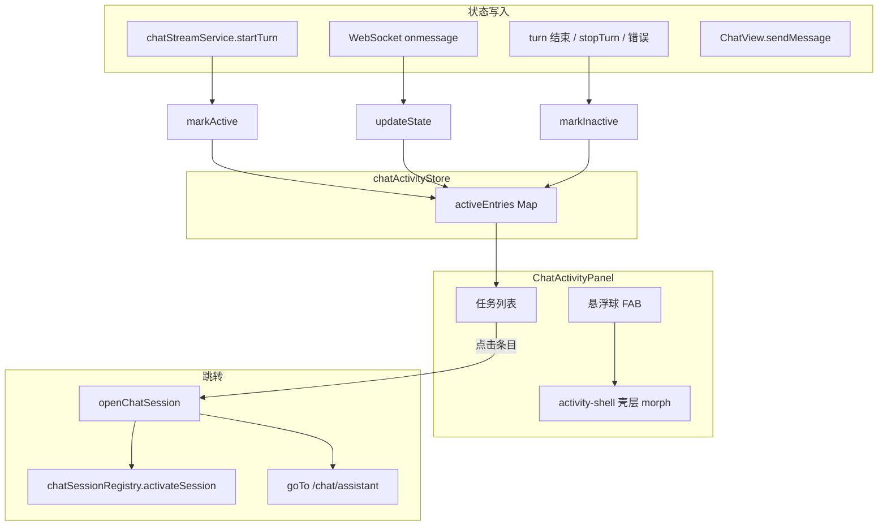

# 全局活跃任务浮窗（ChatActivityPanel）

## 1. 目标

在任意业务页提供全局可拖动的浮动入口，让用户：

- 看到当前进行中的智能体对话任务（含空闲时的入口引导）；
- 展开列表面板，查看任务标题、智能体名称与当前执行状态；
- 点击条目跳转到对应会话；
- 在移动端拖动时不与底层页面滚动冲突。

浮窗挂载在 `App.vue` 根层，与路由视图解耦，切换页面时状态（位置、展开/收起）保持不变。

## 2. 架构总览



## 3. 模块与文件

Chat 业务逻辑位于 `src/pages/chat/ts/`，按职责分子目录；浮窗组件与样式仍在 `components/` 与同级 scss。

| 文件 | 职责 |
|------|------|
| `src/pages/chat/components/ChatActivityPanel.vue` | 浮窗 UI、定位、拖动、展开动画、列表面板 |
| `src/pages/chat/ts/activity/store.ts` | `chatActivityStore`：进行中任务条目（`agentId` + `contextId`） |
| `src/pages/chat/ts/activity/display.ts` | `resolveActiveEntryDisplay`：列表项标题、智能体名、当前状态 |
| `src/pages/chat/ts/session/open.ts` | `openChatSession`：激活会话并按需路由跳转 |
| `src/pages/chat/ts/session/registry.ts` | `chatSessionRegistry`：`peekSession` / `activateSession`；批量停止活跃流 |
| `src/pages/chat/ts/session/types.ts` | `buildSessionKey` 等会话类型 |
| `src/pages/chat/ts/agent/name-registry.ts` | 智能体名称缓存与按需刷新 |
| `src/pages/chat/ts/stream/service.ts` | `startTurn` / `stopTurn`；流式与 activity store 同步 |
| `src/pages/chat/ts/stream/agent-ui.ts` | 状态 i18n、`formatStepLabelParts` 等步骤文案 |
| `src/pages/chat/ts/guard/leave.ts` | `guardLeaveWithActiveTasks`、`stopAllActiveChatTurns` |
| `src/pages/chat/ts/guard/before-unload.ts` | `useWarnBeforeUnloadOnActiveTasks`：拦截 F5 / Ctrl+R |
| `src/pages/chat/ts/index.ts` | App 层 barrel 导出（守卫、智能体名等） |
| `src/pages/chat/chatThinkGlow.scss` | 悬浮球/流式条目橙蓝光晕 mixin |
| `lib/core/App.vue` | 全局挂载 `<ChatActivityPanel />` |

## 4. 数据层：`chatActivityStore`

### 4.1 条目结构

```ts
type ChatActivityEntry = {
  sessionKey: string      // buildSessionKey(agentId, contextId)
  agentId: string
  contextId: string
  agentState: AgentState | null
  startedAt: number
  updatedAt: number       // 仅用户交互（如 markActive 新建）更新，LLM 推送走 updateState
}
```

### 4.2 API

| 方法 | 时机 |
|------|------|
| `markActive(agentId, contextId, agentState?)` | `startTurn` 开启 WebSocket 时 |
| `updateState(agentId, contextId, agentState)` | 每条 Agent UI 事件到达时，**不**更新 `updatedAt` |
| `markInactive(agentId, contextId)` | turn 正常结束、用户停止、连接错误等 |
| `activeEntries` | 面板列表数据源 |

### 4.3 写入来源

实现文件：`src/pages/chat/ts/activity/store.ts`（store）、`src/pages/chat/ts/stream/service.ts`（流式生命周期）。

- **主流**：`startTurn`（`ts/stream/service.ts`）→ `markActive`；`onmessage` → `updateState`；`onTurnClose` / `stopTurn` / `onerror` → `markInactive`。
- **辅助**：`ChatView.sendMessage` 发送前可预标记 `THINKING`。
- **清理**：`chatSessionRegistry.stopAllActiveTurns`（`ts/session/registry.ts`）遍历活跃条目并停止流。

列表排序：`updatedAt` 降序（用户最近触达的会话靠前，不受 LLM 状态推送影响）。

## 5. UI 结构

```text
chat-activity-panel（根锚点，width/height: 0）
└── activity-shell（绝对定位壳层，负责 morph 与象限偏移）
    ├── activity-fab-trigger（悬浮球按钮，收起时可拖）
    └── activity-panel-body（展开后的面板内容）
        ├── activity-panel-header（标题栏，展开时可拖）
        └── activity-panel-list（任务列表）
```

拖动时通过 `Teleport` 在全屏铺设透明 `activity-drag-shield`（`z-index: 1000`），阻断底层页面滚动与误触。

## 6. 坐标机制

### 6.1 单一存储：`posLeft` + `posTop`

- 始终表示**悬浮球左上角**相对视口的像素坐标。
- 持久化：`sessionStorage` 键 `chat-activity-fab-pos`，JSON `{ left, top }`。
- 兼容旧数据：若仅有 `bottom` 字段，加载时转换为 `top = innerHeight - bottom - FAB_SIZE`。

### 6.2 双层定位（避免错位）

| 层 | 定位方式 | 作用 |
|----|----------|------|
| 根节点 `.chat-activity-panel` | 固定 `left` + `top`（来自 `posLeft/posTop` 钳制后） | 球的锚点，**唯一坐标来源** |
| 壳层 `.activity-shell` | 相对根节点 `left/top` 偏移 + 显式 `width/height` | 控制展开方向与面板尺寸 |

**不再**在根节点上使用 `right`/`bottom` 切换锚点，避免存储坐标与 CSS 锚点混用导致窗口缩放后错位。

### 6.3 钳制规则 `clampPosition`

```text
left  ∈ [0, viewportWidth - FAB_SIZE]
top   ∈ [minBallTop, viewportHeight - FAB_SIZE]
minBallTop = topbar.bottom + TOPBAR_GAP（默认 8px）
```

默认位置：右上角，距顶栏 `BELOW_TOPBAR_GAP`（16px），距右缘 `EDGE_MARGIN`（24px）。

窗口 `resize`、拖动结束、加载存储后均执行钳制并写回 `sessionStorage`。

展示时用 `getClampedBallPos()` 计算钳制后的坐标渲染，保证越界时视觉与逻辑一致。

## 7. 象限与弹出方向

以球心相对屏幕中心划分四象限：

| 象限 | 条件 | 壳层偏移（展开时） | `transform-origin` |
|------|------|-------------------|-------------------|
| `tl` | 左上 | `(0, 0)` | top left |
| `tr` | 右上 | `(-(panelW - FAB_SIZE), 0)` | top right |
| `bl` | 左下 | `(0, -(panelH - FAB_SIZE))` | bottom left |
| `br` | 右下 | `(-(panelW - FAB_SIZE), -(panelH - FAB_SIZE))` | bottom right |

展开时壳层偏移使球的对应角与面板角重合，面板从该角「长出来」。

### 7.1 视口贴边（仅展示层）

展开状态下若面板超出视口，在 `shellStyle` 内微调 `offsetLeft/offsetTop`，**不写回** `posLeft/posTop`。

### 7.2 象限锁定（防拖动晃动）

拖动展开面板经过屏幕中线时，若实时切换象限会导致壳层偏移突变、面板晃动。

规则：

- `layoutQuadrant`：展开时快照当前象限；
- `isQuadrantLocked = panelOpen || shellAnimating`；
- 锁定期间 `popupQuadrant` 使用 `layoutQuadrant`，否则使用实时 `resolvePopupQuadrant()`；
- 收起动画结束后（`shellAnimating` 变 `false`）再按当前球位置重算象限。

**仅在缩小为球之后**才更新弹出方向判断。

## 8. 展开 / 收起动画

- 壳层通过 `width` / `height` / `left` / `top` / `border-radius` CSS transition 实现 morph（约 0.36s，`cubic-bezier(0.34, 1.15, 0.64, 1)`）。
- 尺寸使用 `shellStyle` 内**明确像素值**（`getPanelDimensions()`），不用 CSS `min()`，保证收起时宽高可过渡。
- `is-shell-animating` 期间暂停呼吸光晕动画，避免与形变冲突。
- 面板文案在收起时 `transition: none` 立即隐藏，避免文字溢出。
- 有活跃任务时壳层加 `is-active`，复用 `src/pages/chat/chatThinkGlow.scss` 橙蓝光晕。

面板最大尺寸：

```text
width  = min(320, viewportWidth - 48)
height = min(360, viewportHeight * 0.5)
```

## 9. 拖动交互

### 9.1 拖动源

| 源 | 条件 | 松开未移动 |
|----|------|-----------|
| `fab` | 面板收起 | 切换展开/收起 |
| `header` | 面板展开 | 收起面板 |

移动超过 `DRAG_THRESHOLD`（5px）视为拖动，否则视为点击。

### 9.2 移动端

- `pointerdown` + `setPointerCapture` 统一指针；
- `passive: false` 的 `pointermove` + `preventDefault`；
- 拖动时 `body { overflow: hidden; touch-action: none }`；
- FAB / 标题栏 `touch-action: none`。

### 9.3 展开态拖动

更新 `posLeft/posTop`，根锚点跟随移动；壳层偏移在锁定象限下保持稳定，过中线不晃。

## 10. 面板交互

| 操作 | 行为 |
|------|------|
| 点击悬浮球（无拖动） | 展开面板 |
| 点击标题栏（无拖动） | 收起面板 |
| 点击列表条目 | `openChatSession`，跳转或切换会话（面板保持当前展开状态，需手动收起或点外部） |
| 点击面板外 | 收起 |
| `Escape` | 收起 |
| 空列表 | 展示引导文案 +「选择智能体」跳转 `/agents` |

## 11. 会话跳转：`openChatSession`

实现：`src/pages/chat/ts/session/open.ts`。

```ts
openChatSession(agentId, contextId, { currentRoutePath, currentRouteAgentId })
```

1. `chatSessionRegistry.activateSession(agentId, contextId)`（`ts/session/registry.ts`）激活内存会话；
2. 若当前不在 `/chat/assistant` 或 `agent-id` 不同，则 `goTo('/chat/assistant?agent-id=...')`；
3. 若已在同智能体聊天页，仅切换 active 会话，不路由跳转。

配合 `ensureActiveSessionForAgent`：同 agent 下优先保留当前 active 会话，避免从浮窗跳回时被覆盖。

## 12. 列表展示：`resolveActiveEntryDisplay`

实现：`src/pages/chat/ts/activity/display.ts`；步骤/状态文案：`src/pages/chat/ts/stream/agent-ui.ts`。

对每个 `ChatActivityEntry` 解析为 `ActiveEntryDisplay`：

| 字段 | 来源 |
|------|------|
| `title` | 最近一条 user 消息摘要（`ts/history/title.ts`），否则 `contextId` 短码 |
| `agentName` | `ts/agent/name-registry.ts` |
| `stateText` | 当前步骤经 `formatStepLabelParts` 得到的状态文案；无步骤时用 `getStateI18nText` 回退 `agentState` |
| `toolName` | 当前步骤为工具调用时的内联工具名（可选） |
| `isTurnActive` | `session.dispatcher.isBusyByState` |

面板每行展示：标题、智能体名、一行状态（运行中带脉冲圆点 + `stateText`，工具调用时附加 `` `toolName` ``）。

`ChatActivityPanel` 的 `entryDisplays` 计算属性会订阅各 session 的 `messageContext`、`displayTurnStates`、`currentAgentState`、`isBusyByState` 等，保证流式过程中列表实时更新。

## 13. 可见性与权限

```ts
isVisible = !isAuthRoute && hasRoleAccess(ROLE_USER)
```

- 登录用户且在非认证页（`/login` 等）即显示浮窗；
- 无活跃任务时仍可展开，显示空状态引导；
- 角标 `activeCount` 仅在**收起**且有活跃任务时显示在球外右上。

## 14. 离开守卫

| 机制 | 文件 | 说明 |
|------|------|------|
| `guardLeaveWithActiveTasks` | `src/pages/chat/ts/guard/leave.ts` | 有活跃任务时弹窗确认，确认后 `stopAllActiveChatTurns` |
| `useWarnBeforeUnloadOnActiveTasks` | `src/pages/chat/ts/guard/before-unload.ts` | 拦截 F5 / Ctrl+R，走同一套确认逻辑 |

`lib/core/App.vue` 通过 `src/pages/chat/ts/index.ts` 引入 `useWarnBeforeUnloadOnActiveTasks`。

文案键：`ai.activity.beforeunload*`（见 `src/locale/lang/chat/zh-ai.js`、`src/locale/lang/chat/en-ai.js`）。

## 15. 常量速查

| 常量 | 值 | 含义 |
|------|-----|------|
| `FAB_SIZE` | 52 | 球直径 px |
| `EDGE_MARGIN` | 24 | 默认距右/左缘 |
| `TOPBAR_GAP` | 8 | 球顶距 topbar 底 |
| `BELOW_TOPBAR_GAP` | 16 | 默认位置额外下间距 |
| `PANEL_MAX_WIDTH` | 320 | 面板最大宽 |
| `PANEL_MAX_HEIGHT` | 360 | 面板最大高 |
| `PANEL_VIEWPORT_PAD` | 48 | 面板与视口边缘留白 |
| `DRAG_THRESHOLD` | 5 | 拖动判定阈值 px |
| `STORAGE_KEY` | `chat-activity-fab-pos` | 位置存储键 |

## 16. 设计决策摘要

1. **坐标只存球左上角**：渲染与存储一致，窗口缩放只钳制球 footprint，不把面板适配写回坐标。
2. **壳层偏移负责弹出方向**：相比根节点 `right/bottom` 锚点，偏移方案与存储坐标解耦，更易维护。
3. **象限锁定到收起完成**：展开态拖动体验稳定；收起后再按新位置决定下次展开方向。
4. **像素级 shell 尺寸**：解决 `min()` 导致收起动画失效、选任务后面板不缩回的问题。
5. **`updateState` 不碰 `updatedAt`**：列表顺序反映用户交互，而非 LLM 推送频率。
6. **`peekSession` 而非 `getOrCreate`**：列表展示不意外创建空会话。

## 17. 常见问题

| 现象 | 可能原因 | 处理 |
|------|----------|------|
| 拖过中线面板晃 | 象限实时切换 | 确认 `layoutQuadrant` 锁定逻辑生效 |
| 缩放后球位置跳 | 混用 right/bottom 与 left/top 存储 | 仅用 `posLeft/posTop` + 根锚点 |
| 收起无动画 | 壳层宽高用 CSS `min()` | 改由 `shellStyle` 注入像素值 |
| 展开态无法拖动 | 仅 FAB 监听 pointerdown | 标题栏需 `@pointerdown="onHeaderPointerDown"` |
| 跳转后会话不对 | `ensureActiveSessionForAgent` 覆盖 | 浮窗跳转走 `activateSession` 显式指定 context |
| 列表不更新 | 未订阅 session 响应式字段 | 检查 `entryDisplays` 内的依赖收集 |

## 18. i18n 键

| 键 | 中文 |
|----|------|
| `ai.activity.fab.label` | 运行中的智能体任务 |
| `ai.activity.fab.label.idle` | 智能体助手 |
| `ai.activity.panel.title` | 智能体任务 |
| `ai.activity.panel.empty` | 暂无运行中的任务 |
| `ai.activity.panel.empty.hint` | 去选择智能体，开始对话 |
| `ai.activity.panel.empty.cta` | 选择智能体 |

文案文件：`src/locale/lang/chat/zh-ai.js`、`src/locale/lang/chat/en-ai.js`。
