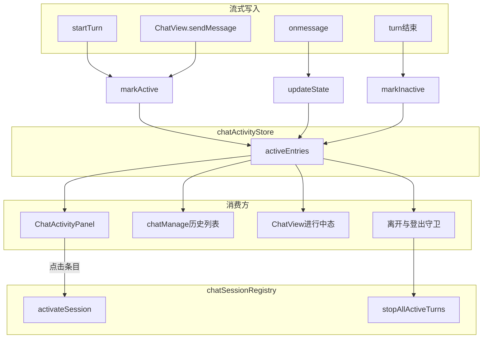
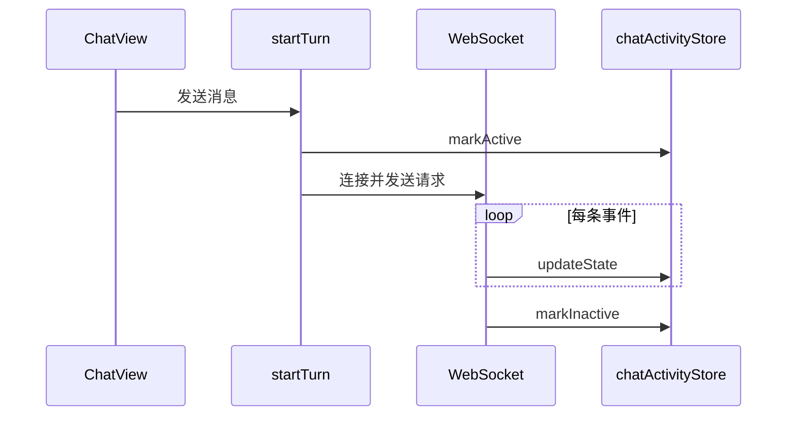

# 智能体多任务机制

## 1. 机制概述

前端允许用户**同时运行多个智能体流式对话**（不同 `agentId`、不同 `contextId` 可并行处于进行中状态）。机制核心是：

- **`chatActivityStore`**：登记、更新、清除所有「进行中」会话，作为前端单一真相源；
- **`chatSessionRegistry`**：内存会话运行时，与 activity 条目通过 `agentId + contextId` 关联；
- **多消费方**：全局任务浮窗、侧边栏历史、聊天页、离开/登出守卫，均读取同一份 `activeEntries`。

单轮流式状态迁移（`THINKING` → `STREAMING_TEXT` → 终态等）由 WebSocket 事件驱动，约定见 [Agent-UI 交互机制](../../平台/agent-ui交互机制/README.md)。本文只描述前端如何**跟踪并行任务**及**在各 UI 暴露与切换**。

## 2. 架构总览



## 3. 模块与文件

Chat 业务逻辑位于 `src/pages/chat/ts/`，按职责分子目录。

### activity — 活跃任务

| 文件 | 职责 |
|------|------|
| `src/pages/chat/ts/activity/store.ts` | `chatActivityStore`：进行中任务集合 |
| `src/pages/chat/ts/activity/display.ts` | `resolveActiveEntryDisplay`：任务展示文案 |

### session — 会话运行时

| 文件 | 职责 |
|------|------|
| `src/pages/chat/ts/session/registry.ts` | `chatSessionRegistry`：`peekSession` / `activateSession` / `stopAllActiveTurns` |
| `src/pages/chat/ts/session/open.ts` | `openChatSession`：激活会话并按需路由跳转 |
| `src/pages/chat/ts/session/types.ts` | `buildSessionKey`、`ChatSessionRuntime` 等类型 |

### stream — 流式与状态文案

| 文件 | 职责 |
|------|------|
| `src/pages/chat/ts/stream/service.ts` | `startTurn` / `stopTurn`；与 activity store 同步 |
| `src/pages/chat/ts/stream/agent-ui.ts` | 状态 i18n、`formatStepLabelParts` 等 |

### guard — 离开守卫

| 文件 | 职责 |
|------|------|
| `src/pages/chat/ts/guard/leave.ts` | `guardLeaveWithActiveTasks`、`stopAllActiveChatTurns` |
| `src/pages/chat/ts/guard/before-unload.ts` | `useWarnBeforeUnloadOnActiveTasks`：拦截 F5 / Ctrl+R |
| `src/pages/chat/ts/index.ts` | App 层 barrel 导出 |

### 其他

| 文件 | 职责 |
|------|------|
| `src/pages/chat/ts/agent/name-registry.ts` | 智能体名称缓存 |
| `src/pages/chat/components/ChatActivityPanel.vue` | 全局任务浮窗 UI（见 §9） |
| `src/pages/chat/components/chatManage.vue` | 侧边栏历史，进行中标记 |
| `src/pages/chat/components/ChatView.vue` | 聊天主视图，发送预标记 |
| `src/pages/chat/chatThinkGlow.scss` | 流式光晕 mixin |
| `src/routes/index.ts` | `goToLogout` 登出前守卫 |
| `lib/core/App.vue` | 挂载浮窗与 `useWarnBeforeUnloadOnActiveTasks` |

## 4. 活跃任务仓库 `chatActivityStore`

实现：`src/pages/chat/ts/activity/store.ts`。

### 4.1 条目结构

```ts
type ChatActivityEntry = {
  sessionKey: string      // buildSessionKey(agentId, contextId)
  agentId: string
  contextId: string
  agentState: AgentState | null
  startedAt: number
  updatedAt: number       // 新建/重复 markActive 时更新；updateState 不更新
}
```

### 4.2 API

| 方法 | 说明 |
|------|------|
| `markActive(agentId, contextId, agentState?)` | 登记或刷新进行中任务 |
| `updateState(agentId, contextId, agentState)` | 更新 Agent 状态，**不**改 `updatedAt` |
| `markInactive(agentId, contextId)` | 移除进行中标记 |
| `activeEntries` | 全部进行中条目数组 |
| `activeKeySet` | `sessionKey` 集合，供 O(1) 查询 |
| `isActive(agentId, contextId)` | 判断单会话是否进行中 |

### 4.3 列表排序

浮窗列表按 `updatedAt` **降序**排列：反映用户最近触达/发起的会话，不受 LLM 状态推送频率影响。

## 5. 流式生命周期与 store 同步

实现：`src/pages/chat/ts/stream/service.ts`。

| 时机 | store 操作 |
|------|------------|
| `startTurn` 开启 WebSocket | `markActive(..., 'THINKING')` |
| `onmessage` 每条 Agent UI 事件 | `updateState(..., currentAgentState)` |
| `onTurnClose` / 连接正常结束 | `markInactive` |
| `stopTurn` 用户主动停止 | `markInactive` |
| `onerror`（非 401） | 记录终态后 `markInactive` |

**辅助写入**：`ChatView.sendMessage` 在发起请求前可预调用 `markActive(..., 'THINKING')`，减少 UI 空窗期。

**批量清理**：`chatSessionRegistry.stopAllActiveTurns`（`ts/session/registry.ts`）遍历 `activeEntries`，对每个条目停止流并 `markInactive`；用于用户确认离开或登出。



## 6. 会话切换与跳转

### 6.1 `chatSessionRegistry` 要点

| API | 行为 |
|-----|------|
| `peekSession(agentId, contextId)` | 只读内存会话，**不创建**（列表展示用） |
| `activateSession(agentId, contextId)` | 激活指定会话为当前 `activeSessionKey` |
| `ensureActiveSessionForAgent(agentId)` | 同 agent 下优先保留当前 active，否则取最近访问，否则新建 |
| `stopAllActiveTurns()` | 停止所有进行中流并清理 activity |

### 6.2 `openChatSession`

实现：`src/pages/chat/ts/session/open.ts`。

```ts
openChatSession(agentId, contextId, { currentRoutePath, currentRouteAgentId })
```

1. `activateSession(agentId, contextId)` 显式激活目标会话；
2. 若不在 `/chat/assistant` 或 `agent-id` 不同 → `goTo('/chat/assistant?agent-id=...')`；
3. 若已在同智能体页 → 仅切换 active 会话，不跳转。

**注意**：从浮窗切任务时必须走 `activateSession` 指定 `contextId`，避免回到聊天页时被 `ensureActiveSessionForAgent` 覆盖为别的会话。

## 7. 任务展示解析

实现：`src/pages/chat/ts/activity/display.ts`；文案：`src/pages/chat/ts/stream/agent-ui.ts`。

`resolveActiveEntryDisplay(entry)` → `ActiveEntryDisplay`：

| 字段 | 来源 |
|------|------|
| `title` | 最近 user 消息摘要（`ts/history/title.ts`），否则 `contextId` 短码 |
| `agentName` | `ts/agent/name-registry.ts` |
| `stateText` | 当前步骤 `formatStepLabelParts`；无步骤时 `getStateI18nText(agentState)` |
| `toolName` | 工具调用步骤的内联工具名（可选） |
| `isTurnActive` | `session.dispatcher.isBusyByState` |

展示方需订阅 session 的 `messageContext`、`displayTurnStates`、`currentAgentState`、`isBusyByState` 等响应式字段以保证流式实时更新。

## 8. 消费方

### 8.1 全局任务浮窗 `ChatActivityPanel`

- 挂载：`lib/core/App.vue`，登录用户非认证页可见；
- 读取 `activeEntries` 列出全部进行中任务，点击条目调用 `openChatSession`；
- 无任务时展示空状态引导（跳转 `/agents`）；
- 浮窗坐标、象限、拖动、morph 动画等 **UI 实现见 §9**。

### 8.2 侧边栏历史 `chatManage`

实现：`src/pages/chat/components/chatManage.vue`。

```ts
const isHistoryItemBusy = (item) =>
  chatActivityStore.activeKeySet.value.has(historyRowKey(item))
```

- 进行中条目加 `is-streaming` 样式与 `streaming-orb` 指示；
- 进行中条目**不可删除**、不可加入批量删除、批量选择时 `disabled`；
- 删除前若 `isHistoryItemBusy` 则提示需先停止对话。

侧边栏与浮窗共用同一 `activeKeySet`，无需重复维护状态。

### 8.3 聊天页 `ChatView`

实现：`src/pages/chat/components/ChatView.vue`。

- 发送消息前 `markActive(..., 'THINKING')`；
- 通过 `chatActivityStore.isActive(agentId, contextId)` 判断当前会话是否进行中，驱动 UI _busy 态；
- 会话切换走 `activateSession` / `ensureActiveSessionForAgent`。

### 8.4 离开与登出守卫

| 入口 | 文件 | 行为 |
|------|------|------|
| `guardLeaveWithActiveTasks` | `ts/guard/leave.ts` | `activeEntries.length > 0` 时弹窗确认，确认后 `stopAllActiveChatTurns` |
| `useWarnBeforeUnloadOnActiveTasks` | `ts/guard/before-unload.ts` | 拦截 F5 / Ctrl+R，同上逻辑 |
| `goToLogout` | `src/routes/index.ts` | 登出前调用 `guardLeaveWithActiveTasks`，确认后才 `location.hash = '/logout'` |

`lib/core/App.vue` 在 `setup` 中调用 `useWarnBeforeUnloadOnActiveTasks()`。

文案键：`ai.activity.beforeunload*`（§10）。

## 9. 全局任务浮窗 UI 实现

组件：`src/pages/chat/components/ChatActivityPanel.vue`。本节为浮窗专项实现，与 §4–§8 机制层正交。

### 9.1 DOM 结构

```text
chat-activity-panel（根锚点，width/height: 0）
└── activity-shell（绝对定位壳层，morph 与象限偏移）
    ├── activity-fab-trigger（收起时可拖）
    └── activity-panel-body
        ├── activity-panel-header（展开时可拖）
        └── activity-panel-list
```

拖动时 `Teleport` 全屏 `activity-drag-shield`（`z-index: 1000`）阻断底层滚动。

### 9.2 坐标机制（水平就近锚边 + 固定 top）

**锚边** `anchorSide`：以球心相对屏幕竖中线选定水平锚边（`left` / `right`）。垂直轴**永远**使用 `top`，不切换 `bottom`。运行时绝对坐标 `posLeft` + `posTop`（球左上角）仍是拖动计算的基准，与水平偏移 `anchorOffsetX`（球外缘到锚定左/右缘的距离）及 `anchorOffsetY`（即 `top`）通过恒等式互相换算。

**存储**：`sessionStorage` 键 `chat-activity-fab-pos`，新格式 `{ side, x, y }`；兼容旧 `{ left, top }`、更早的 `{ left, bottom }`，以及曾写入的 `{ corner, x, y }`（取 `corner` 含 `r` 为 `right`，`y` 仍为 top），读入后 clamp 并重锚。

**双层定位**：

| 层 | 作用 |
|----|------|
| 根节点 `.chat-activity-panel` | 按锚边输出 `left` 或 `right` + **固定** `top`，锚点始终为球左上角点 |
| 壳层 `.activity-shell` | 相对偏移 + 显式 `width/height`，控制展开方向 |

**重锚时机**：拖动中固定用 `left/top` 渲染（避免频繁换属性对）；松手、收起动画结束（`isQuadrantLocked` 解锁）、挂载加载后按当前位置重锚水平边。水平表示法切换为恒等式（如 `right = vw - left - FAB_SIZE`），切换瞬间像素位置完全一致，且根节点无 transition，故无跳动。

**resize 跟边**：CSS 水平锚边使球在浏览器布局阶段即原生跟随左/右缘移动；resize 回调再由 `side + x/y` 反推绝对坐标、钳制并回写偏移，同时 `viewportTick` 自增驱动依赖视口尺寸的 computed 重算。垂直仍跟顶栏 clamp，不跟底边。

**钳制**：四边相等安全边距 `EDGE_MARGIN = 24px`；`left ∈ [EDGE_MARGIN, vw - FAB_SIZE - EDGE_MARGIN]`，`top ∈ [max(minBallTop, EDGE_MARGIN), vh - FAB_SIZE - EDGE_MARGIN]`，`minBallTop = topbar.bottom + 8px`。视口过窄/过矮时 `getBallBounds()` 保证 `min ≤ max`；加载非法坐标回退默认位置。

### 9.3 象限与弹出方向

以球心相对屏幕中心分 `tl` / `tr` / `bl` / `br`，展开时壳层偏移使球角与面板角重合。

**象限锁定**：`panelOpen || shellAnimating` 期间使用 `layoutQuadrant` 快照，避免拖过中线时偏移突变晃动；**收起完成后**再按当前位置重算。

### 9.4 动画与光晕

- morph：`width/height/left/top/border-radius` transition（约 0.36s）；
- 尺寸用 `shellStyle` 像素值，不用 CSS `min()`；
- 有活跃任务时 `is-active` + `src/pages/chat/chatThinkGlow.scss` 光晕；
- 收起时面板文案 `transition: none` 即时隐藏。

### 9.5 拖动与交互

| 拖动源 | 松开未移动 |
|--------|-----------|
| 悬浮球（收起） | 展开/收起切换 |
| 标题栏（展开） | 收起面板 |

阈值 `DRAG_THRESHOLD = 5px`。移动端 `pointerCapture`、`touch-action: none`、拖动时锁定 `body` 滚动。

| 操作 | 行为 |
|------|------|
| 点击列表条目 | `openChatSession`（面板可保持展开） |
| 点击外部 / Escape | 收起 |
| 空列表 | 引导跳转 `/agents` |

可见性：`isVisible = !isAuthRoute && hasRoleAccess(ROLE_USER)`；角标仅在收起且有任务时显示。

### 9.6 常量速查

| 常量 | 值 |
|------|-----|
| `FAB_SIZE` | 52 |
| `PANEL_MAX_WIDTH` / `HEIGHT` | 320 / 360 |
| `STORAGE_KEY` | `chat-activity-fab-pos` |

### 9.7 UI 设计决策

1. 水平就近锚边：球靠近左/右半屏即以该边为水平原点，存储与渲染均为边相对偏移，resize 时球跟随左/右缘；垂直永远 `top`，不锚底边。
2. 水平表示法切换只在松手/收起动画结束等静止时机进行，且换算为恒等式，切换瞬间像素位置不变。
3. 面板贴边适配不写回存储。
4. 壳层偏移负责弹出方向，与锚定坐标解耦。
5. 象限锁定到收起动画结束。
6. 像素级 shell 尺寸保证收起动画可过渡。

### 9.8 浮窗常见问题

| 现象 | 处理 |
|------|------|
| 拖过中线面板晃 | 检查 `layoutQuadrant` 锁定 |
| 缩放后球不跟左右边 | 检查 `anchorSide` 与 `anchorOffsetX/y` 是否在松手/解锁时同步（`syncAnchorFromPosition`） |
| 换锚边时闪跳 | 水平表示法切换须像素等价且只在静止时机进行；拖动中应固定 `left/top` 渲染 |
| 收起无动画 | `shellStyle` 注入像素宽高 |
| 跳转后会话不对 | 浮窗走 `activateSession` 指定 context |

## 10. i18n

| 键 | 中文 |
|----|------|
| `ai.activity.fab.label` | 运行中的智能体任务 |
| `ai.activity.fab.label.idle` | 智能体助手 |
| `ai.activity.panel.title` | 智能体任务 |
| `ai.activity.panel.empty` | 暂无运行中的任务 |
| `ai.activity.panel.empty.hint` | 去选择智能体，开始对话 |
| `ai.activity.panel.empty.cta` | 选择智能体 |
| `ai.activity.beforeunload*` | 离开/刷新确认文案 |

文件：`src/locale/lang/chat/zh-ai.js`、`src/locale/lang/chat/en-ai.js`。

## 11. 机制层设计决策

1. **`updateState` 不碰 `updatedAt`**：列表顺序反映用户交互，而非 LLM 推送频率。
2. **`peekSession` 而非 `getOrCreate`**：列表展示不意外创建空会话。
3. **单一 `chatActivityStore`**：浮窗、侧边栏、守卫共用，避免状态分叉。
4. **离开必先 `stopAllActiveTurns`**：确认离开后统一断流并清理条目。
