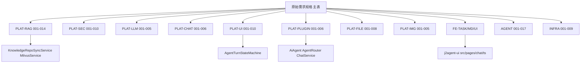

# 原始需求规格

> 本文档由 j2agent-docs 专题文档与 j2agent 代码反向归纳，非项目启动时的正式 SRS。
> 最后更新：2026-06-10

## 1. 范围与说明

### 1.1 目的

为 J2Agent 智能体平台建立统一的需求追溯入口，将分散于专题文档与代码中的能力规格汇总为主表（高层）与附录（详细）两层结构，便于评审、验收与后续迭代对照。

### 1.2 范围

| 板块 | 覆盖内容 |
|------|----------|
| 平台 | Agent 运行时、RAG、鉴权、LLM 配置、MCP、对象存储、Agent-UI 协议等 |
| 前端 | 多任务机制、Markdown 解析器、Agent 状态机 UI |
| Agent 开发 | 插件契约、工具 / Skill / MCP 扩展、可选能力 |
| 基础设施 | Docker Compose 部署、数据卷、离线镜像、前端热更新 |

### 1.3 字段说明

**主表**

| 列 | 说明 |
|----|------|
| 需求编号 | `REQ-{模块缩写}-{序号}` |
| 模块 | 平台 / 前端 / Agent 开发 / 基础设施 |
| 需求名称 | 一句话能力名 |
| 需求描述 | 2–3 句业务/能力说明 |
| 优先级 | 文档未标注时填「—」；README「待完善」项标 P2 |
| 状态 | 已实现 / 部分实现 / 规划中 |
| 详细需求 | 链接到附录锚点 |
| 文档来源 | 对应 README 路径 |
| 代码验证 | 关键类或 API 路径 |

**附录**

| 列 | 说明 |
|----|------|
| 需求编号 | `{模块}-{子域}-{序号}`，如 `PLAT-RAG-001` |
| 需求名称 | 短标题 |
| 需求描述 | 可验收的行为/约束 |
| 状态 | 已实现 / 规划中 |
| 文档来源 | 具体 `.md` 路径 |
| 代码验证 | 实现类或 Controller 路径 |

**状态标注规则**

- 文档描述且代码有对应实现 → **已实现**
- README「待完善」或 doc 标 planned → **规划中**
- 文件直传 RAG 可用但 CRUD UI 缺失 → **部分实现**

---

## 2. 需求总览（主表）

### 2.1 平台

| 需求编号 | 模块 | 需求名称 | 需求描述 | 优先级 | 状态 | 详细需求 | 文档来源 | 代码验证 |
|----------|------|----------|----------|--------|------|----------|----------|----------|
| REQ-PLAT-001 | 平台 | Agent 运行时与多智能体路由 | 基于 Spring AI Alibaba ReactAgent 提供单轮/流式推理；AgentRouter 按 agent-id 分发；插件 JAR 中 extends AiAgent 的业务 Agent 经 Spring 注入自动注册。 | — | 已实现 | [PLAT-PLUGIN-001~006](#plat-plugin) | [插件 Agent 接入与界面](../平台/插件Agent接入与界面/README.md) | `AiAgent`, `AgentRouter`, `ChatService`, `ChatController` |
| REQ-PLAT-002 | 平台 | Agent-UI 事件流与状态机 | WebSocket 推送 AgentUiEventEnvelope；9 态状态机驱动前端展示被动调度、工具调用、Skill 加载、深度思考与终态收敛。 | — | 已实现 | [PLAT-UI-001~010](#plat-ui) | [Agent-UI 交互机制](../平台/agent-ui交互机制/README.md) | `AgentTurnStateMachine`, `AgentUiEventEnvelope` |
| REQ-PLAT-003 | 平台 | 对话记忆与多轮上下文 | conversationId 复合键；Append-only 窗口记忆；Redis 缓存 + JDBC 持久化；流式进行中登记与中断补偿。 | — | 已实现 | [PLAT-CHAT-001~006](#plat-chat) | [Agent 记忆机制](../平台/agent记忆机制/README.md) | `RedissonCachingChatMemoryRepository`, `ChatContextService`, `ActiveChatTurnRegistry` |
| REQ-PLAT-004 | 平台 | RAG 知识库维护与检索 | knowledge-repo 文档增量同步至 Milvus；稠密+稀疏混合检索；超长 Query 多段融合；静态文件 URL 改写与直链。 | — | 已实现 | [PLAT-RAG-001~014](#plat-rag) | [RAG 机制](../平台/RAG机制/README.md) | `KnowledgeRepoSyncService`, `MilvusService`, `Retriever` |
| REQ-PLAT-005 | 平台 | RAG Rerank 重排序 | 对检索结果进行 Rerank 排序与过滤，提升 RAG 召回质量。 | P2 | 规划中 | — | [j2agent README 待完善](../../j2agent/README.md) | — |
| REQ-PLAT-006 | 平台 | 知识库 CRUD 管理界面 | 支持知识库创建、导入、导出、删除等完整生命周期管理。当前以文件直传模式为主，手动 CRUD API 返回 405。 | P2 | 部分实现 | [PLAT-RAG-014](#plat-rag) | README 待完善 + [知识库维护](../平台/RAG机制/知识库维护/知识库维护.md) | `KnowledgeController` |
| REQ-PLAT-007 | 平台 | LLM/Embedding 提供商配置与热更新 | api_provider_config 数据模型；多 Provider 支持；深度思考运行时优先级；配置变更热重载。 | — | 已实现 | [PLAT-LLM-001~005](#plat-llm) | [LLM 提供商配置](../平台/LLM提供商配置/README.md) | `ProviderConfigController`, `AiRuntimeReloadService` |
| REQ-PLAT-008 | 平台 | MCP 工具接入 | McpService 外连 MCP 服务；Client 与 LLM 以 Function Calling 交互；配置变更触发 Agent 重建。 | — | 已实现 | [PLAT-PLUGIN-005](#plat-plugin), [AGENT-011~012](#agent-dev) | [MCP](../agent开发/文档/MCP.md) | `McpService`, `McpController` |
| REQ-PLAT-009 | 平台 | MCP Streamable HTTP | 适配 MCP 协议的 Streamable HTTP 传输层。 | P2 | 规划中 | — | [j2agent README 待完善](../../j2agent/README.md) | — |
| REQ-PLAT-010 | 平台 | 用户鉴权与 RBAC | Cookie 会话；LoginInterceptor 鉴权；ADMIN/USER 角色矩阵；内置 aiadmin 不可删改。 | — | 已实现 | [PLAT-SEC-001~006](#plat-sec) | [安全与用户](../平台/安全与用户/README.md) | `LoginInterceptor`, `UserController`, `LoginController` |
| REQ-PLAT-011 | 平台 | 邮箱注册与找回密码 | 邮箱自助注册（开关+白名单）；SMTP 发信；邮箱验证码找回密码。 | — | 已实现 | [PLAT-SEC-007~010](#plat-sec) | [邮箱注册机制](../平台/安全与用户/邮箱注册机制.md) | `RegisterController`, `ResetPasswordController`, `EmailRegisterService` |
| REQ-PLAT-012 | 平台 | 对象存储与文件管理 | 多 OSS 供应商；浏览器直传；上传/删除对账；OSS-DB 差异检查与人工处置。 | — | 已实现 | [PLAT-FILE-001~008](#plat-file) | [文件管理与对象存储](../平台/文件管理与对象存储/README.md) | `FileManagementController`, `ObjectStorageService` |
| REQ-PLAT-013 | 平台 | 聊天图片附件 | 对话图片上传（限 4 张）；proxy/direct 访问模式；WebSocket Base64 发送；删除会话 OSS 清理。 | — | 已实现 | [PLAT-IMG-001~005](#plat-img) | [聊天图片附件](../平台/聊天图片附件/README.md) | `ChatFileController`, `ChatAttachmentService` |

### 2.2 前端

| 需求编号 | 模块 | 需求名称 | 需求描述 | 优先级 | 状态 | 详细需求 | 文档来源 | 代码验证 |
|----------|------|----------|----------|--------|------|----------|----------|----------|
| REQ-FE-001 | 前端 | 智能体多任务并行与离开守卫 | chatActivityStore 登记多 agent/context 并行流式任务；全局浮窗跳转；离开/登出守卫与 stopAllActiveTurns。 | — | 已实现 | [FE-TASK-001~005](#fe-task) | [智能体多任务机制](../前端/智能体多任务机制/README.md) | `src/pages/chat/ts/chatActivityStore.ts`, `ChatActivityPanel` |
| REQ-FE-002 | 前端 | Markdown 气泡与图表懒加载 | markdown-it 同步渲染；mermaid/plantuml/vega-lite 围栏懒加载；流式推迟图表渲染。 | — | 已实现 | [FE-MD-001~007](#fe-md) | [Markdown 解析器](../前端/md解析器/README.md) | `src/pages/chat/ts/markdown/` |
| REQ-FE-003 | 前端 | Agent 状态机 UI 消费 | useAgentEventDispatcher + agentRendererRegistry + AgentTurnTimeline 消费 WebSocket 事件。 | — | 已实现 | [FE-UI-001~002](#fe-ui) | [Agent-UI 交互机制](../平台/agent-ui交互机制/README.md) §4 | `src/pages/chat/ts/agent/` |
| REQ-FE-004 | 前端 | 热门问题 / 建议追问 UI | 空会话展示热门问题；COMPLETED 后展示建议追问；不写入 MessageDto 气泡。 | — | 已实现 | [FE-UI-003](#fe-ui), [PLAT-UI-006~008](#plat-ui) | [Agent-UI 交互机制](../平台/agent-ui交互机制/README.md) | `src/pages/chat/ts/` 热门问题/追问组件 |

### 2.3 Agent 开发

| 需求编号 | 模块 | 需求名称 | 需求描述 | 优先级 | 状态 | 详细需求 | 文档来源 | 代码验证 |
|----------|------|----------|----------|--------|------|----------|----------|----------|
| REQ-AGENT-001 | Agent 开发 | AiAgent 插件契约与热重载 | 一 Agent 一 Maven 工程；实现 getAgentId/Name/Description/loadSystemPrompt；POST /agents/reload 热重载。 | — | 已实现 | [AGENT-001~005](#agent-dev) | [Agent 开发](../agent开发/文档/Agent开发.md) | `AiAgent`, `AgentPluginRegistry`, `AgentPluginReloadService` |
| REQ-AGENT-002 | Agent 开发 | 工具 / Skill / MCP 扩展 | @Tool 工具注册；内部/外部 Skill；McpFeature 声明式 MCP 接入。 | — | 已实现 | [AGENT-006~012](#agent-dev) | [工具](../agent开发/文档/工具.md), [Skill](../agent开发/文档/Skill.md), [MCP](../agent开发/文档/MCP.md) | `AgentClassLoaderSkillRegistry`, `McpFeature` |
| REQ-AGENT-003 | Agent 开发 | 可选能力（RAG / 热门问题 / 深度思考） | buildDocumentRetriever RAG；qa-template.json 热门问题；getThinkingOverride 深度思考默认。 | — | 已实现 | [AGENT-013~016](#agent-dev) | [可选能力](../agent开发/文档/可选能力.md) | `AbstractCollectionKbRetriever`, `AgentThinkingOverride` |
| REQ-AGENT-004 | Agent 开发 | 示例 Agent 模板 | 可复制 0_example-agent 最小工程骨架快速开始开发。 | — | 已实现 | [AGENT-017](#agent-dev) | [0_example-agent](../agent开发/agents/0_example-agent/README.md) | `j2agent-plugins-agents/agents/0_example-agent/` |

### 2.4 基础设施

| 需求编号 | 模块 | 需求名称 | 需求描述 | 优先级 | 状态 | 详细需求 | 文档来源 | 代码验证 |
|----------|------|----------|----------|--------|------|----------|----------|----------|
| REQ-INFRA-001 | 基础设施 | Docker Compose 全栈部署 | PostgreSQL、Redis、etcd、Milvus、j2agent 五服务一键启动；product profile 要求。 | — | 已实现 | [INFRA-001,004~006](#infra) | [Docker 部署](../基础设施/docker部署/README.md) | `docker/docker-compose.yml` |
| REQ-INFRA-002 | 基础设施 | 数据卷与离线镜像 | J2AGENT_VOLUMES_PATH 宿主机数据卷布局；package_offline.sh 离线镜像打包。 | — | 已实现 | [INFRA-002,008~009](#infra) | [目录与数据卷](../基础设施/docker部署/目录与数据卷.md), [离线镜像打包](../基础设施/docker部署/离线镜像打包.md) | `docker/` |
| REQ-INFRA-003 | 基础设施 | 前端静态资源热更新 | ui 卷挂载；rsync 更新前端无需重启容器。 | — | 已实现 | [INFRA-003,007](#infra) | [前端静态资源更新](../基础设施/docker部署/前端静态资源更新.md) | `docker/docker-compose.yml` ui 卷 |

---

## 3. 模块需求映射图

---

## 4. 附录 — 详细需求

### 4.1 平台 — RAG 机制 {#plat-rag}

| 需求编号 | 需求名称 | 需求描述 | 状态 | 文档来源 | 代码验证 |
|----------|----------|----------|------|----------|----------|
| PLAT-RAG-001 | 知识库目录与 info.json 约定 | 根目录 root-path；仅 .md/.adoc/.asciidoc 入向量库；至少一个 info.json；禁止祖先/后代路径上多个 info.json | 已实现 | [知识库维护.md](../平台/RAG机制/知识库维护/知识库维护.md) | `KnowledgeRepoMetadataService` |
| PLAT-RAG-002 | info.json 字段规范 | collection_name 必填；可选 partition_names、min_heading_level(1–3)、filename_as_title | 已实现 | 同上 | `KnowledgeRepoMetadataService` |
| PLAT-RAG-003 | Markdown/AsciiDoc 分片规则 | 按标题层级分片；标题链作 Q、正文作 A；主键 sha1(sourcePath\|headingPath\|answer) | 已实现 | 同上 | `MarkdownQaParser` |
| PLAT-RAG-004 | 增量知识库同步 | 启动/目录监听/管理端 API 触发；按文件 SHA、info.json SHA、collection 差异增删改 | 已实现 | 同上 | `KnowledgeRepoSyncService` |
| PLAT-RAG-005 | 空 Collection 自动回收 | ACTIVE 文件数为 0 时 drop collection；后续写入自动重建 | 已实现 | 同上 | `MilvusKnowledgeWriteService` |
| PLAT-RAG-006 | Exclusive 完全重建 | drop collection → resetClient → probe 维度 → 全量 re-embed；Redis 分布式锁 | 已实现 | 同上 | `KnowledgeRepoMaintenanceCoordinator` |
| PLAT-RAG-007 | 维护协调器与状态机 | 单线程调度；任务类型 IDLE/INITIALIZING/PROBING/INCREMENTAL_SYNC/FULL_REBUILD/FAILED | 已实现 | 同上 | `KnowledgeRepoMaintenanceCoordinator` |
| PLAT-RAG-008 | 稠密+稀疏混合检索 | Milvus 双通道：embedding 稠密 + text BM25 稀疏；WeightedRanker 融合 | 已实现 | [融合检索.md](../平台/RAG机制/检索/融合检索.md) | `MilvusService.hybridRetrieval` |
| PLAT-RAG-009 | 超长 Query 多段融合 | >7500 字符切分（默认最多 4 段、200 重叠）；每段 hybrid 检索；按 segment_id 去重取 max 分 | 已实现 | 同上 | `QueryChunker`, `Retriever` |
| PLAT-RAG-010 | 查询向量维度校验 | hybrid/knn 前校验 query 向量与 lastDimension、collection schema 一致 | 已实现 | 同上 | `MilvusServiceDimensionGuard` |
| PLAT-RAG-011 | 维护期间检索降级 | isExclusiveSyncActive() 为 true 时不查 Milvus，返回空/降级结果 | 已实现 | 同上 | `KnowledgeRepoMaintenanceCoordinator` |
| PLAT-RAG-012 | 静态文件 URL 改写 | 入库前将相对图片路径转为 /v1/rest/j2agent/file/repo/**；外链不变 | 已实现 | [静态文件展示机制.md](../平台/RAG机制/静态文件展示机制.md) | `KnowledgeRepoSyncService` |
| PLAT-RAG-013 | 知识库静态文件 HTTP 直链 | GET /file/repo/** 按 root-path 读取；越界拒绝；Content-Type 按后缀映射 | 已实现 | 同上 | `FileController` |
| PLAT-RAG-014 | 知识库管理 REST API | 同步接口最长等待 10 分钟；需 ADMIN；支持 fullRebuild 参数 | 已实现 | [知识库维护.md](../平台/RAG机制/知识库维护/知识库维护.md) | `KnowledgeController` |

### 4.2 平台 — 安全与用户 {#plat-sec}

| 需求编号 | 需求名称 | 需求描述 | 状态 | 文档来源 | 代码验证 |
|----------|----------|----------|------|----------|----------|
| PLAT-SEC-001 | 用户模型与密码哈希 | 表 user；密码 SHA256(userId+password)；角色 1=ADMIN、2=USER | 已实现 | [用户权限.md](../平台/安全与用户/用户权限.md) | `UserService`, `UserEntity` |
| PLAT-SEC-002 | 内置管理员 aiadmin | Flyway 初始化；不可删、不可改角色、他人不可重置密码 | 已实现 | 同上 | `UserService` |
| PLAT-SEC-003 | LoginInterceptor 鉴权 | 拦截 /v*/**；排除 /v*/auth/**；401 未登录、403 角色不足 | 已实现 | 同上 | `LoginInterceptor` |
| PLAT-SEC-004 | 角色权限矩阵 | @RequiredRole(ADMIN/USER)；Knowledge/Property/MCP 等整类 ADMIN | 已实现 | 同上 | `@RequiredRole` |
| PLAT-SEC-005 | Cookie 会话管理 | SESSION-{port}；创建 24h；活跃续期 30min；改密/删用户/改角色使会话失效 | 已实现 | 同上 | `LoginService` |
| PLAT-SEC-006 | 用户管理 CRUD API | 列表/创建/删除/改角色(ADMIN)；改密(USER 仅自己，ADMIN 可重置他人) | 已实现 | 同上 | `UserController` |
| PLAT-SEC-007 | 邮箱自助注册 | 开关默认关闭；send-code + register；6 位验证码 Redis 10min；60s 内最多 5 次发码 | 已实现 | [邮箱注册机制.md](../平台/安全与用户/邮箱注册机制.md) | `RegisterController`, `EmailRegisterService` |
| PLAT-SEC-008 | 注册邮箱白名单 | 支持精确邮箱与 *@domain；开启但 rules 空则全拒 | 已实现 | 同上 | `EmailRegisterService` |
| PLAT-SEC-009 | SMTP 发信配置 | 存 ai_properties；host/port/from 必填；HTML+纯文本模板 | 已实现 | 同上 | `EmailVerificationService` |
| PLAT-SEC-010 | 邮箱找回密码 | 公开 API；独立 Redis 命名空间；已注册才发信（防枚举）；重置后失效会话 | 已实现 | 同上 | `ResetPasswordController` |

### 4.3 平台 — LLM 提供商配置 {#plat-llm}

| 需求编号 | 需求名称 | 需求描述 | 状态 | 文档来源 | 代码验证 |
|----------|----------|----------|------|----------|----------|
| PLAT-LLM-001 | api_provider_config 数据模型 | llm/embedding 各仅一条 enabled+is_current；config_json 存连接参数 | 已实现 | [LLM 提供商配置](../平台/LLM提供商配置/README.md) | `ApiProviderConfigService` |
| PLAT-LLM-002 | 多 Provider 支持 | open-ai、vllm、anthropic、ollama；baseUrl/completionsPath/thinkingMode 等字段 | 已实现 | 同上 | `LlmBackedChatModelFactory` |
| PLAT-LLM-003 | 深度思考运行时优先级 | 请求 thinkingMode > Agent 默认 > 提供商默认 | 已实现 | 同上 | `AgentThinkingOverride`, `ThinkingStreamSplitter` |
| PLAT-LLM-004 | SpringAiReasoningMetadataAdapter | 统一各 ChatModel metadata 为 reasoningContent | 已实现 | 同上 | `SpringAiReasoningMetadataAdapter` |
| PLAT-LLM-005 | Provider 配置热更新 | 修改当前项发布 ProviderConfigChangedEvent；AiRuntimeReloadService 热更新 | 已实现 | 同上 | `AiRuntimeReloadService`, `ProviderConfigController` |

### 4.4 平台 — Agent 记忆机制 {#plat-chat}

| 需求编号 | 需求名称 | 需求描述 | 状态 | 文档来源 | 代码验证 |
|----------|----------|----------|------|----------|----------|
| PLAT-CHAT-001 | conversationId 复合键 | 格式 userId:contextId:agentId；兼容两段老格式 | 已实现 | [Agent 记忆机制](../平台/agent记忆机制/README.md) / [对话记忆](../平台/agent记忆机制/对话记忆.md) | `CompositeKeyChatMemoryRepository` |
| PLAT-CHAT-002 | Append-only 窗口记忆 | 运行时窗口 100 条；持久化 Redis+JDBC 全量；add 仅 delta | 已实现 | 同上 | `RedissonCachingChatMemoryRepository` |
| PLAT-CHAT-003 | ReAct 兼容记忆 Advisor | 无 AssistantMessage 时 prepend 历史；工具循环后续跳不重复 prepend | 已实现 | 同上 | `ReactCompatibleMessageChatMemoryAdvisor` |
| PLAT-CHAT-004 | 历史 REST API | getHistory 必填 agent-id；delete 可选 agent-id；clear-all 跳过运行中会话 | 已实现 | 同上 | `ChatController`, `ChatContextService` |
| PLAT-CHAT-005 | 流式进行中 Redis 登记 | ActiveChatTurnRegistry；contextId+agentId 粒度；删除历史 409 CONFLICT | 已实现 | 同上 | `ActiveChatTurnRegistry` |
| PLAT-CHAT-006 | 中断补偿写入 | flushPartialAssistantOnInterrupt 补偿 content/reasoningContent | 已实现 | 同上 | `ChatService` |

### 4.5 平台 — Agent-UI 交互机制 {#plat-ui}

| 需求编号 | 需求名称 | 需求描述 | 状态 | 文档来源 | 代码验证 |
|----------|----------|----------|------|----------|----------|
| PLAT-UI-001 | AgentState 状态机 | 9 态：IDLE/AGENT_SCHEDULING/THINKING/STREAMING_TEXT/CALLING_TOOL/LOAD_SKILL/COMPLETED/FAILED/CANCELLED | 已实现 | [Agent-UI 交互机制](../平台/agent-ui交互机制/README.md) | `AgentTurnStateMachine` |
| PLAT-UI-002 | AgentUiEventEnvelope 协议 | eventId/contextId/turnId/seq/state/transition/phase/eventType/payload/ts | 已实现 | 同上 | `AgentUiEventEnvelope` |
| PLAT-UI-003 | 单轮单终态收敛 | COMPLETED/FAILED/CANCELLED 三选一 | 已实现 | 同上 | `AgentTurnStateMachine` |
| PLAT-UI-004 | read_skill → LOAD_SKILL | TOOL 事件 + 独立计数；审计行 kind=skill_load_audit | 已实现 | 同上 | `AgentUiSkillLoadToolInterceptor` |
| PLAT-UI-005 | turn_trace 回合轨迹 | 终态写入隐藏 assistant 行；历史回填 MessageDto.turnSteps | 已实现 | 同上 | `ChatService` |
| PLAT-UI-006 | 建议追问 NOTICE | COMPLETED 后可选 3–5 条 suggested-follow-ups | 已实现 | 同上 | `FollowUpSuggestionService` |
| PLAT-UI-007 | 整轮 FAILED 事件 | providerError/unsupportedAgent 等；下发后关闭 WebSocket | 已实现 | 同上 | `ChatService` |
| PLAT-UI-008 | 热门问题 qa-template | Agent 开关 showHotQuestions；GET /qa-template 随机抽取 | 已实现 | 同上 | `QaTemplateController` |
| PLAT-UI-009 | reasoningContent 双通道 | answerDelta 触发 STREAMING_TEXT；reasoningDelta 保持 THINKING | 已实现 | 同上 | `ThinkingStreamSplitter` |
| PLAT-UI-010 | 协议灰度迁移策略 | 后续升级建议独立 endpoint 或握手能力声明 | 规划中 | 同上 §6 | — |

### 4.6 平台 — 插件 Agent 接入 {#plat-plugin}

| 需求编号 | 需求名称 | 需求描述 | 状态 | 文档来源 | 代码验证 |
|----------|----------|----------|------|----------|----------|
| PLAT-PLUGIN-001 | 插件 JAR 动态加载 | tar.gz 解压到 plugin.path；AgentPluginRegistry 扫描 Spring 组件；支持热重载 | 已实现 | [插件 Agent 接入与界面](../平台/插件Agent接入与界面/README.md) | `AgentPluginRegistry`, `AgentPluginInstallService` |
| PLAT-PLUGIN-002 | AgentRouter 路由 | List&lt;AiAgent&gt; 聚合；route(agentId)；assistant/chat_assistant→mcp_assistant 别名 | 已实现 | 同上 | `AgentRouter` |
| PLAT-PLUGIN-003 | GET /agents 列表 | 返回 agentId/name/description/showHotQuestions；按 agentId 字典序 | 已实现 | 同上 | `ChatController` |
| PLAT-PLUGIN-004 | WebSocket 对话通道 | /ws/rest/j2agent/chat?context-id=&agent-id= | 已实现 | 同上 | `ChatController` |
| PLAT-PLUGIN-005 | MCP 刷新 Agent 重建 | McpToolCallbacksRefreshedEvent → 全部 AiAgent rebuildAgent() | 已实现 | 同上 | `McpToolCallbacksRefreshedListener` |
| PLAT-PLUGIN-006 | 列表按 getSort() 排序 | 当前未消费 getSort()；若前端需业务优先级需单独约定 | 规划中 | 同上 §3 | — |

### 4.7 平台 — 文件管理与对象存储 {#plat-file}

| 需求编号 | 需求名称 | 需求描述 | 状态 | 文档来源 | 代码验证 |
|----------|----------|----------|------|----------|----------|
| PLAT-FILE-001 | ADMIN 文件管理页 | 路由 /#/files；虚拟目录、面包屑、搜索、状态筛选、分页 | 已实现 | [文件管理与对象存储](../平台/文件管理与对象存储/README.md) | `FileManagementController` |
| PLAT-FILE-002 | 多对象存储供应商 | MinIO/OSS/七牛/R2；j2agent.storage.enabled 开关 | 已实现 | 同上 | `ObjectStorageService` 及各 Provider |
| PLAT-FILE-003 | 浏览器直传上传 | init→PUT OSS→complete；幂等 complete；abort 清理 | 已实现 | 同上 | `ObjectFileManagementService` |
| PLAT-FILE-004 | 上传后台对账 | Redisson 延迟队列；默认 10 次×30s；heartbeat 暂停 attempt 计数 | 已实现 | 同上 | `ObjectUploadReconcileWorker` |
| PLAT-FILE-005 | 删除引用保护 | object_file_reference 存在时 409；删除补偿延迟队列 | 已实现 | 同上 | `ObjectDeleteReconcileWorker` |
| PLAT-FILE-006 | OSS-DB 差异检查 | 管理员手动触发；OSS_ONLY/DB_ONLY/METADATA_MISMATCH/IN_PROGRESS | 已实现 | 同上 | `ObjectStorageSyncService` |
| PLAT-FILE-007 | 差异人工处置 | REGISTER_DB/DELETE_OSS/DELETE_DB/UPDATE_DB/DELETE_BOTH；STALE 重扫 | 已实现 | 同上 | `ObjectStorageSyncService` |
| PLAT-FILE-008 | 签名 URL 预览下载 | 15 分钟有效期；proxy/direct 访问模式（`access-mode` / `J2AGENT_STORAGE_ACCESS_MODE`） | 已实现 | 同上 | `ObjectStorageService` |

### 4.8 平台 — 聊天图片附件 {#plat-img}

| 需求编号 | 需求名称 | 需求描述 | 状态 | 文档来源 | 代码验证 |
|----------|----------|----------|------|----------|----------|
| PLAT-IMG-001 | 对话图片上传限制 | 单消息最多 4 张；前端转 JPEG 最长边 2048px；服务端 JPEG/PNG/WebP ≤10MB | 已实现 | [聊天图片附件](../平台/聊天图片附件/README.md) | `ChatAttachmentService` |
| PLAT-IMG-002 | 对象键规则 | chat/{userId}/{contextId}/{UUIDv7}_{文件名}；发送时服务端上传 | 已实现 | 同上 | `ChatAttachmentService` |
| PLAT-IMG-003 | 访问模式 proxy/direct | `j2agent.storage.access-mode`（`J2AGENT_STORAGE_ACCESS_MODE`）；proxy 经应用转发；direct 预签名直链；失败降级 proxy | 已实现 | 同上 | `ChatAttachmentUrlResolver` |
| PLAT-IMG-004 | WebSocket attachments | Base64 data 发送；持久化仅存 objectKey；LLM 从 OSS 读字节 | 已实现 | 同上 | `ChatController`, `ChatAttachmentService` |
| PLAT-IMG-005 | 删除会话 OSS 清理 | deleteByConversationId 清引用与孤儿文件；整 context 删除前缀清扫 | 已实现 | 同上 | `ChatContextService` |

### 4.9 前端 — 智能体多任务机制 {#fe-task}

| 需求编号 | 需求名称 | 需求描述 | 状态 | 文档来源 | 代码验证 |
|----------|----------|----------|------|----------|----------|
| FE-TASK-001 | 并行流式任务登记 | chatActivityStore 登记多 agentId/contextId 并行进行中任务 | 已实现 | [智能体多任务机制](../前端/智能体多任务机制/README.md) | `src/pages/chat/ts/chatActivityStore.ts` |
| FE-TASK-002 | 全局任务浮窗 | ChatActivityPanel；按 updatedAt 降序；点击 openChatSession 跳转 | 已实现 | 同上 | `ChatActivityPanel` |
| FE-TASK-003 | 侧边栏进行中保护 | 进行中历史不可删/不可批量选；与 activeKeySet 共用 | 已实现 | 同上 | `src/pages/chat/ts/` |
| FE-TASK-004 | 离开/登出守卫 | guardLeaveWithActiveTasks；F5/Ctrl+R beforeunload；确认后 stopAllActiveTurns | 已实现 | 同上 | `src/pages/chat/ts/` |
| FE-TASK-005 | 浮窗 UI 交互 | 象限弹出、morph 动画、拖动、sessionStorage 坐标持久化 | 已实现 | 同上 §9 | `ChatActivityPanel` |

### 4.10 前端 — Markdown 解析器 {#fe-md}

| 需求编号 | 需求名称 | 需求描述 | 状态 | 文档来源 | 代码验证 |
|----------|----------|----------|------|----------|----------|
| FE-MD-001 | Markdown 气泡渲染 | markdown-it 同步 HTML；ChatView v-html 挂载 | 已实现 | [Markdown 解析器](../前端/md解析器/README.md) | `src/pages/chat/ts/markdown/` |
| FE-MD-002 | 图表围栏懒加载 | mermaid/plantuml/vega-lite/html iframe；data-md-render 占位 | 已实现 | [架构与流程.md](../前端/md解析器/架构与流程.md) | `src/pages/chat/ts/markdown/` |
| FE-MD-003 | 流式推迟图表渲染 | deferDiagrams=true 时 busy 段跳过图表，终态后补渲染 | 已实现 | 同上 | `src/pages/chat/ts/markdown/` |
| FE-MD-004 | Mermaid xychart 自动修正 | 类目≥8 自动 horizontal；宽图横向滚动；标签换行 | 已实现 | [图表渲染.md](../前端/md解析器/图表渲染.md) | `diagramTheme.ts` |
| FE-MD-005 | 统一图表配色 | diagramTheme.ts + CSS 变量 palette 1–8 | 已实现 | 同上 | `diagramTheme.ts` |
| FE-MD-006 | 图表全屏预览 | 点击 SVG → ElImageViewer blob URL | 已实现 | 同上 | `src/pages/chat/ts/markdown/` |
| FE-MD-007 | Markdown 样式约定 | markdown.scss；行内 code vs 围栏 code 区分；表格玻璃态 | 已实现 | [样式约定.md](../前端/md解析器/样式约定.md) | `markdown.scss` |

### 4.11 前端 — Agent UI {#fe-ui}

| 需求编号 | 需求名称 | 需求描述 | 状态 | 文档来源 | 代码验证 |
|----------|----------|----------|------|----------|----------|
| FE-UI-001 | Agent 状态机 UI 消费 | useAgentEventDispatcher + agentRendererRegistry + AgentTurnTimeline | 已实现 | [Agent-UI 交互机制](../平台/agent-ui交互机制/README.md) §4 | `src/pages/chat/ts/agent/` |
| FE-UI-002 | AgentThinkingBlock | reasoningContent 半折叠、流式滚底 | 已实现 | 同上 | `src/pages/chat/ts/agent/` |
| FE-UI-003 | 热门问题/建议追问 UI | 空会话热门问题；输入框上方建议追问；不写入 MessageDto 气泡 | 已实现 | 同上 | `src/pages/chat/ts/` |

### 4.12 Agent 开发 {#agent-dev}

| 需求编号 | 需求名称 | 需求描述 | 状态 | 文档来源 | 代码验证 |
|----------|----------|----------|------|----------|----------|
| AGENT-001 | AiAgent 核心契约 | 必须实现 getAgentId/Name/Description/loadSystemPrompt | 已实现 | [Agent 开发.md](../agent开发/文档/Agent开发.md) | `AiAgent` |
| AGENT-002 | 插件工程模型 | 一 Agent 一独立 Maven 工程；JDK 21；依赖 j2agent-server provided | 已实现 | 同上 | `j2agent-plugins-agents/` |
| AGENT-003 | agentId 全局唯一 | 冲突时启动/reload 失败 | 已实现 | 同上 | `AgentPluginRegistry` |
| AGENT-004 | 插件打包与部署 | mvn package → target 目录+tar.gz；解压到 plugin.path/agents/ | 已实现 | 同上 | `AgentPluginInstallService` |
| AGENT-005 | POST /agents/reload | ADMIN 热重载；修改 resources 无需重打 JAR | 已实现 | 同上 | `AgentPluginReloadService` |
| AGENT-006 | @Tool 工具注册 | @Component + @Tool；buildTools() 挂载；ToolCallbacks.from | 已实现 | [工具.md](../agent开发/文档/工具.md) | `AiAgent.buildTools()` |
| AGENT-007 | 平台内置工具 | get_current_time、timestamp_to_datetime、view_website_content、math_calculator | 已实现 | 同上 | `TimeTool`, `WebTool`, `MathTool` |
| AGENT-008 | 工具 UI/错误拦截器 | AgentUiToolEventInterceptor + AgentToolErrorReturnInterceptor 自动挂载 | 已实现 | 同上 | `AgentUiToolEventInterceptor` |
| AGENT-009 | 内部 Skill 默认加载 | resources/skills/*/SKILL.md；AgentSkillsAgentHook + read_skill | 已实现 | [Skill.md](../agent开发/文档/Skill.md) | `AgentSkillsAgentHook` |
| AGENT-010 | ExternalSkills 外部技能 | implements ExternalSkills；plugins/skills/；useAllExternalSkills/useExternalSkills 筛选 | 已实现 | 同上 | `ExternalSkills`, `AgentClassLoaderSkillRegistry` |
| AGENT-011 | McpFeature 声明式接入 | implements McpFeature；useAllMcpServers/useMcpServers 筛选；配置存 mcp-config-json | 已实现 | [MCP.md](../agent开发/文档/MCP.md) | `McpFeature`, `McpService` |
| AGENT-012 | MCP 传输类型 | stdio、sse、streamable_http；变更触发 rebuildAgent | 已实现 | 同上 | `McpClientManager` |
| AGENT-013 | RAG DocumentRetriever | buildDocumentRetriever() → AbstractCollectionKbRetriever | 已实现 | [可选能力.md](../agent开发/文档/可选能力.md) | `AbstractCollectionKbRetriever` |
| AGENT-014 | 热门问题 qa-template.json | isQaTemplateEnabled()=true + zh_CN/en_US 数组 | 已实现 | 同上 | `QaTemplateController` |
| AGENT-015 | Agent 级深度思考默认 | getThinkingOverride()：USE_PROVIDER_DEFAULT/ON/OFF | 已实现 | 同上 | `AgentThinkingOverride` |
| AGENT-016 | 自定义拦截器扩展 | override buildInterceptors()；错误兜底强制保留 | 已实现 | 同上 | `AiAgent.buildInterceptors()` |
| AGENT-017 | 0_example-agent 模板 | 可复制最小 Agent 工程骨架 | 已实现 | [0_example-agent](../agent开发/agents/0_example-agent/README.md) | `j2agent-plugins-agents/agents/0_example-agent/` |

### 4.13 基础设施 {#infra}

| 需求编号 | 需求名称 | 需求描述 | 状态 | 文档来源 | 代码验证 |
|----------|----------|----------|------|----------|----------|
| INFRA-001 | Docker Compose 全栈 | PostgreSQL、Redis、etcd、Milvus、j2agent 五服务 | 已实现 | [Docker 部署](../基础设施/docker部署/README.md) | `docker/docker-compose.yml` |
| INFRA-002 | 宿主机数据卷布局 | J2AGENT_VOLUMES_PATH/volumes/ 下 ui/logs/knowledge-repo/plugins 等 | 已实现 | [目录与数据卷.md](../基础设施/docker部署/目录与数据卷.md) | `docker/` |
| INFRA-003 | 前端不打包进镜像 | ui 卷挂载；product profile file: 静态资源 | 已实现 | 同上 | `docker/docker-compose.yml` |
| INFRA-004 | Maven 打包与镜像构建 | tar.gz 优先 docker/j2agent/ 同级，否则 target/ | 已实现 | [构建与启动.md](../基础设施/docker部署/构建与启动.md) | `docker/Dockerfile` |
| INFRA-005 | 空库自动初始化 | `sql/schema/postgresql/schemas.sql` + `sql/data/postgresql/${I18N}.sql` + Flyway 迁移；生产环境 `.env` 须配置 `I18N` | 已实现 | 同上 | `SqlBootstrapFlywayConfig` |
| INFRA-006 | product profile 要求 | SPRING_OPTIONS 须含 --spring.profiles.active=product | 已实现 | 同上 | `docker/.env.example` |
| INFRA-007 | 前端静态资源热更新 | rsync 到已有 ui 目录；禁止 rm 挂载点；无需重启容器 | 已实现 | [前端静态资源更新.md](../基础设施/docker部署/前端静态资源更新.md) | `docker/docker-compose.yml` |
| INFRA-008 | 离线镜像打包 | package_offline.sh 导出中间件+基镜像 tar | 已实现 | [离线镜像打包.md](../基础设施/docker部署/离线镜像打包.md) | `docker/package_offline.sh` |
| INFRA-009 | 外置 etcd 迁移 | Milvus 依赖外置 etcd；避免内嵌 etcd panic 循环 | 已实现 | [Docker 部署](../基础设施/docker部署/README.md) | `docker/docker-compose.yml` |

---

## 5. 变更记录

| 日期 | 版本 | 变更说明 |
|------|------|----------|
| 2026-07-01 | 1.1 | PostgreSQL 迁移文档同步：Flyway/I18N 初始化说明、首次部署 LLM 配置、修正代码路径与 `app_user` 表名 |
| 2026-06-10 | 1.0 | 初版：从 j2agent-docs 36 篇专题文档与 j2agent 代码反向归纳；主表 24 条、附录 93 条 |
