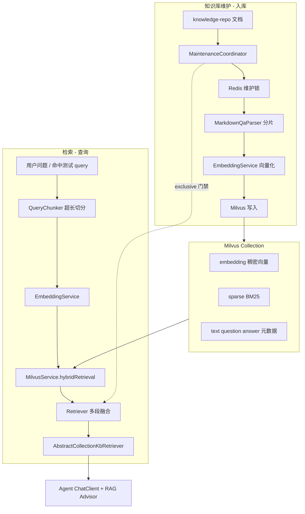

# RAG 机制

本文档目录描述智能体平台的 **检索增强生成（RAG）** 全链路，按 **检索** 与 **知识库维护** 两大模块组织。

## 总体架构



## 模块索引

### 检索

| 文档 | 说明 |
|------|------|
| [检索模块 README](检索/README.md) | 查询侧入口与代码速查 |
| [融合检索](检索/融合检索.md) | 稠密 + 稀疏混合检索、超长 query 多向量融合、维护降级、查询维度校验 |

### 知识库维护

| 文档 | 说明 |
|------|------|
| [知识库维护模块 README](知识库维护/README.md) | 入库与维护入口 |
| [知识库维护](知识库维护/知识库维护.md) | 目录约定、增量同步、协调器、Redis 锁、exclusive 完全重建、维度一致性 |
| [静态文件展示机制](静态文件展示机制.md) | 图片等静态资源 URL 改写与 `FileController` 直链 |

> 历史文档 [知识库同步.md](知识库同步.md)、[融合检索.md](融合检索.md) 已迁移至上述模块目录，保留跳转链接。

## 代码入口（速查）

| 模块 | 路径 |
|------|------|
| 维护协调器 | `j2agent/j2agent-server/.../repo/KnowledgeRepoMaintenanceCoordinator.java` |
| 检索引擎 | `j2agent/j2agent-server/.../service/rag/retrieval/Retriever.java` |
| Milvus 混合检索 | `.../service/rag/vdb/milvus/MilvusService.java` |
| 知识库同步逻辑 | `.../service/rag/knowledge/repo/KnowledgeRepoSyncService.java` |
| 向量写入 | `.../service/rag/knowledge/MilvusKnowledgeWriteService.java` |

## 相关配置

```yaml
j2agent:
  knowledge:
    repo:
      root-path: /opt/j2agent/volume/knowledge-repo
      watch-enabled: true
  retrieve:
    max-embedding-input-chars: 7500
    query-chunk-overlap-chars: 200
    max-query-chunks: 4
```

Embedding 提供商连接见 [LLM 提供商配置](../LLM提供商配置/README.md)。对话记忆见 [Agent 对话记录机制](../agent对话记录/README.md)。
