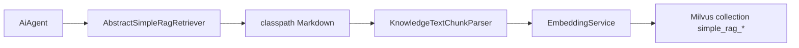
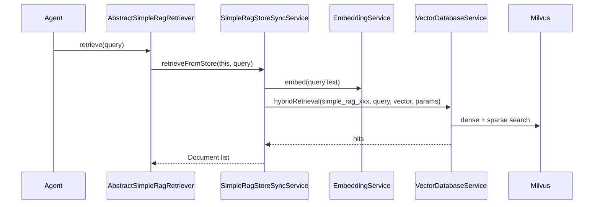

# SimpleRag 机制

SimpleRag 用于 Agent 随附的小型 Markdown 资料检索，例如页面路由说明、工具使用规则、领域枚举片段等。它不是对话记忆，也不是 `knowledge-repo` 文件知识库；它只解决“Agent 插件自带资料如何自动入库并参与 RAG”的问题。

## 定位

| 类型 | 文档来源 | 典型用途 | 同步服务 |
|------|----------|----------|----------|
| knowledge-repo | 文件仓库 | 大型知识库、用户维护资料 | `KnowledgeRepoSyncService` |
| SimpleRag | Agent 插件 classpath 下的 Markdown | Agent 自带路由、工具规则、小型领域资料 | `SimpleRagStoreSyncService` |

SimpleRag 统一写入 Milvus，复用平台 `VectorDatabaseService`。为避免和知识库 collection 混淆，平台会自动给 SimpleRag collection 加 `simple_rag_` 前缀；插件 retriever 只需要返回业务库名。

SimpleRag 命中结果只作为 Agent 上下文使用，不作为知识库来源展示给前端，也不写入对话消息的 `srcFile` 来源列表。

## Retriever 定义

Agent 需要提供一个继承 `AbstractSimpleRagRetriever` 的检索器。子类只声明库名和资源目录：

```java
@Component
public class ExampleSimpleRagRetriever extends AbstractSimpleRagRetriever {
    @Override
    public String ragStoreName() {
        return "example_agent_docs";
    }

    @Override
    public String simpleRagResourcePath() {
        return "skills/example-docs";
    }
}
```

- `ragStoreName()` 是业务库名，需稳定；平台实际落库 collection 为 `simple_rag_` + 业务库名。
- `simpleRagResourcePath()` 按 classpath 解析，平台会自动读取该目录及子目录下所有 `.md` 文件。
- `ownerAgentId` 不手填；平台扫描 `AiAgent`，通过 `agent.resolveDocumentRetriever()` 反推归属 Agent，并使用 `agent.getAgentId()`。

## 默认参数

默认参数统一定义在 `AbstractSimpleRagRetriever`，子类按需覆盖：

| 方法 | 默认值 | 说明 |
|------|--------|------|
| `topK()` | `5` | 单次检索返回条数 |
| `metricType()` | `COSINE` | Milvus 向量距离指标 |
| `denseWeight()` | `0.5` | 稠密向量权重 |
| `sparseWeight()` | `0.5` | 稀疏/BM25 权重 |
| `minHeadingLevel()` | `1` | Markdown 切片最小标题级别 |
| `filenameAsTitle()` | `true` | 无标题时使用文件名生成标题 |

## 同步链路

SimpleRag 的 Markdown parse 复用 `KnowledgeTextChunkParser`，因此标题识别、`heading_path`、`text_chunk` 生成规则与知识库保持一致。同步、刷新、删除、检索链路仍由 SimpleRag 自己的服务处理。



生命周期：

- 服务启动时扫描所有 Agent 的 `AbstractSimpleRagRetriever`，刷新当前存在的 SimpleRag collection。
- Agent reload 成功后重新扫描，新增/变更的 SimpleRag 资料会刷新。
- 已不存在的 SimpleRag collection 会按 `simple_rag_` 前缀识别并删除，避免插件移除后残留旧数据。
- Agent 移除时删除对应 SimpleRag collection。

## 检索链路



检索参数由 `AbstractSimpleRagRetriever.resolveParams()` 归一化。权重小于 `0` 会按 `0` 处理，大于 `1` 会按 `1` 处理；若稠密和稀疏权重总和为 `0`，默认退回纯稠密检索。

## 使用示例

某个插件 Agent 可以使用 SimpleRag 承载随包发布的 Markdown 资料：

| 项 | 值 |
|----|----|
| 业务库名 | `example_agent_docs` |
| Milvus collection | `simple_rag_example_agent_docs` |
| 资源目录 | `skills/example-docs/**/*.md` |
| 用途 | 根据用户问题召回插件随附的规则、枚举或小型领域资料 |

SimpleRag 只负责把这些资料召回到 Agent 上下文，帮助模型理解本 Agent 自带的小型资料；具体业务动作仍由 Agent 自身的工具链完成。

## 代码入口

| 模块 | 路径 |
|------|------|
| SimpleRag 抽象 | `j2agent/j2agent-server/.../service/rag/inf/AbstractSimpleRagRetriever.java` |
| SimpleRag 同步与检索 | `.../service/rag/SimpleRagStoreSyncService.java` |
| Markdown 切片 | `.../service/rag/knowledge/repo/KnowledgeTextChunkParser.java` |
| 向量库抽象 | `.../service/rag/vdb/VectorDatabaseService.java` |
| Milvus 向量库 | `.../service/rag/vdb/milvus/MilvusService.java` |
