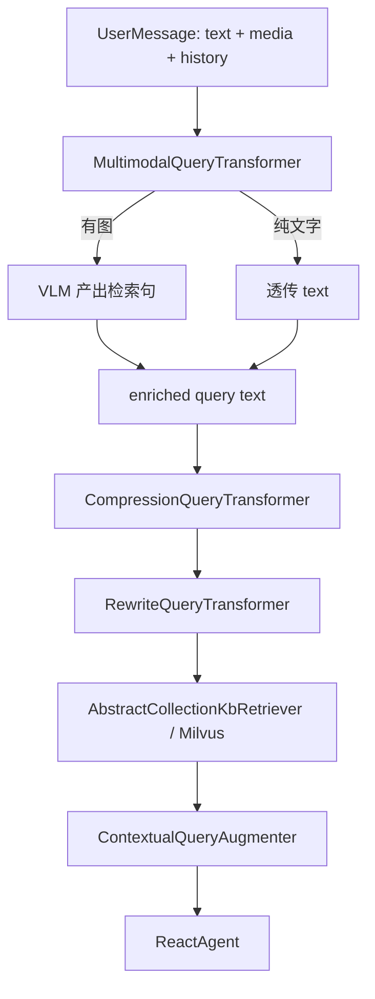

# Query 预处理（Advanced RAG）

本文说明对话 RAG 在 Milvus 混合检索**之前**，如何通过 Spring AI **QueryTransformer 链**将用户原始输入（文字 + 图片 + 多轮 history）归一化为检索用 query 文本。

混合检索本身见 [融合检索](融合检索.md)。Agent 挂载 RAG 见 [可选能力 §1](../../../agent开发/文档/可选能力.md#1-rag检索增强生成)。

## 1. 链路位置



平台在 `AiAgent.buildAgent()` 中，当 `buildDocumentRetriever()` 非空时，**默认全开**挂载上述 Transformer 链（无 yaml 开关）。**插件 Agent 无需改代码**，升级 server 后凡已挂载 RAG 的 Agent 自动生效。

## 2. 各环职责

| 顺序 | 组件 | 作用 |
|------|------|------|
| 1 | `MultimodalQueryTransformer` | 读取最后一条 `UserMessage` 的 text + media（或 metadata `attachments`），有图时调用多模态 LLM 生成检索用 query 文本 |
| 2 | `CompressionQueryTransformer` | 多轮 history 压缩为独立检索句（history ≤ 1 条时自动跳过） |
| 3 | `RewriteQueryTransformer` | 口语化/冗长问题改写为检索友好表述（单轮短句且无指代时自动跳过） |

当 Multimodal 已产出检索句时，**自动跳过**后续 Compression / Rewrite，减少 LLM 调用。

## 3. 输入组合与降级

| 输入 | 行为 |
|------|------|
| 纯文字 | Multimodal 透传 → 多轮时 Compression → 需改写时 Rewrite |
| 纯文字（单轮短句，如「你是谁」） | Multimodal 透传 → 跳过后续 LLM 改写，直接检索 |
| 纯图片 | Multimodal VLM 描述 + 关键词 → 跳过文本改写 |
| 图 + 文字 | Multimodal 融合语义生成检索句 |
| 无 vision 模型 / VLM 失败 | 回退用户文字；纯图则 `SKIP_RETRIEVAL` 跳过 Milvus（日志含 media 大小与 finishReason 诊断） |
| 无文字且无图片 | `EmptyQuerySkippingRetrievalAugmentationAdvisor` 跳过 RAG |

**skip 条件：** 仅当用户消息**既无文字又无图片附件**时 skip；纯图消息会先注入不可见占位 query text（满足 Spring AI `Query` 非空约束），再由 Multimodal 产出真实检索句。

## 4. 专用 ChatModel 与降级

Query 改写等短同步 LLM 调用统一走 **`LlmSyncService`**（非 Agent 主 `ReloadableRoutingChatModel`）：

- 持有与当前所选 LLM 提供商一致的 {@link ChatModel}（`LlmBackedChatModelFactory` 装配）
- **文本改写**（Compression / Rewrite）：**OFF**（显式关闭深度思考）
- **Multimodal VLM**：构建 ChatModel 与每次请求的 `ChatOptions` 均 **OFF**（Anthropic `thinking: disabled`、Ollama `disableThinking`；OpenAI 兼容不传参）
- 不读取会话级 thinking 覆盖
- **temperature=0**；Multimodal VLM **maxTokens=1024**，Compression/Rewrite **maxTokens=512**
- LLM 配置热更新时与主 ChatModel 一并 `reload()`

纯图 VLM 若仍返回空，WARN 日志含 `finishReason`、`outputTokens`、metadata 键等诊断；纯图失败时 `SKIP_RETRIEVAL` 降级，不阻断主对话。

本地可用 `j2agent-server/scripts/bailian-anthropic-thinking-ab.sh` 对百炼 Anthropic 做 thinking omit vs disabled 的 curl A/B。

Compression / Rewrite 外层包裹 `FaultTolerantQueryTransformer`：LLM 超时或失败时 **passthrough** 原 query，不阻断 RAG 与主对话。

关闭整条链（仅代码级，无配置项）：

```java
@Override
protected QueryTransformer[] buildQueryTransformers() {
    return new QueryTransformer[0];
}
```

默认实现委托 `DefaultQueryTransformers.build(attachmentService)`。

Multimodal 步骤需当前 LLM 支持 vision 才能处理图片。

## 5. 代码入口

| 类 | 路径 |
|----|------|
| 工厂 | `.../rag/query/DefaultQueryTransformers.java` |
| 同步 LLM | `.../service/llm/LlmSyncService.java` |
| 条件跳过 | `.../rag/query/QueryTransformPredicates.java` |
| 失败降级 | `.../rag/query/FaultTolerantQueryTransformer.java` |
| 多模态 | `.../rag/query/MultimodalQueryTransformer.java` |
| 响应解析 | `.../service/llm/LlmSyncResponseSupport.java` |
| 条件包装 | `.../rag/query/ConditionalQueryTransformer.java` |
| 用户消息解析 | `.../rag/query/QueryUserMessageSupport.java` |
| RAG skip | `.../service/llm/advisor/EmptyQuerySkippingRetrievalAugmentationAdvisor.java` |
| Agent 挂载 | `.../service/llm/agent/inf/AiAgent.java` — `buildQueryTransformers()` |

## 6. 与 React 工具循环

`AbstractCollectionKbRetriever` 在工具循环后续轮次检测到 `ToolResponseMessage` 时返回空列表，**不会重复检索**。Query 预处理仅作用于首轮用户消息触发的 RAG。
