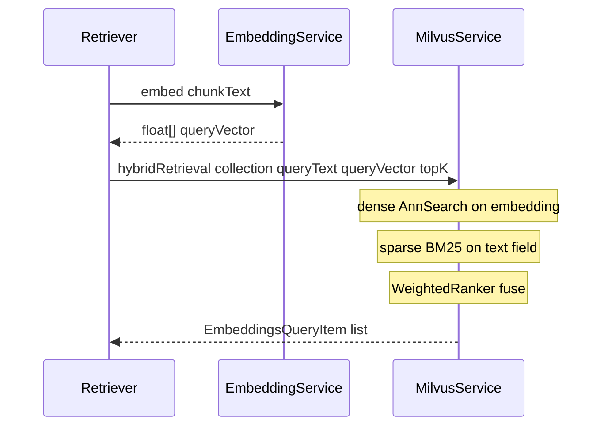
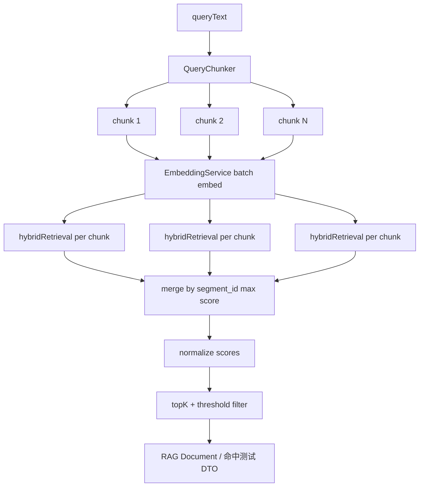
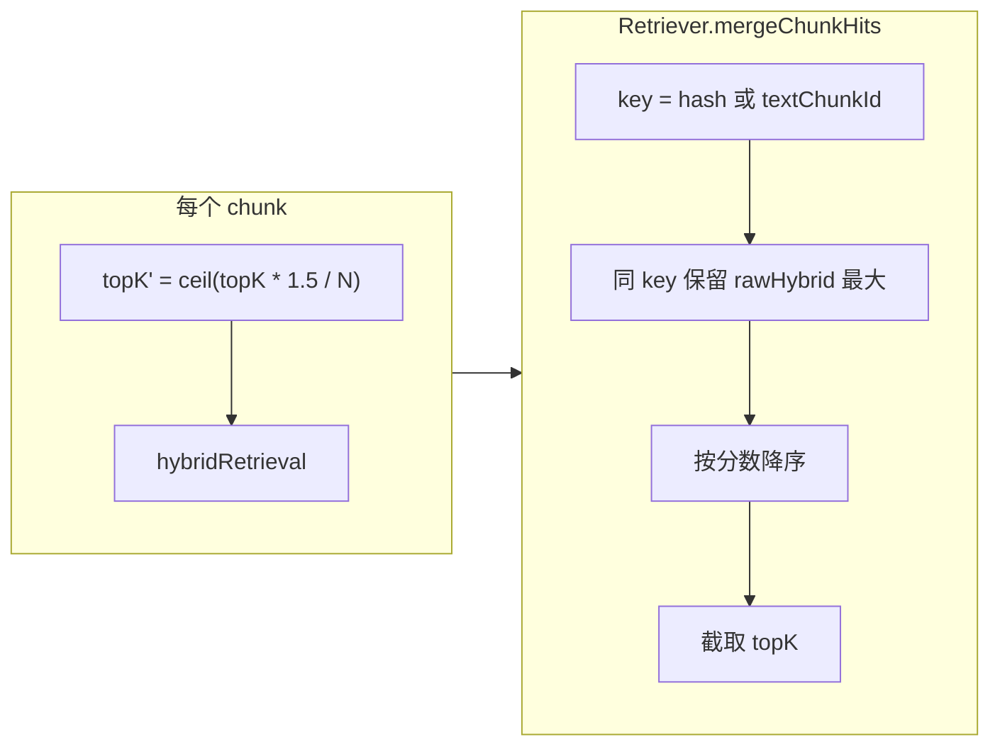
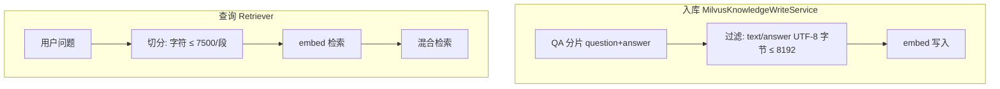

# 融合检索

本文说明 RAG **查询侧**如何将用户问题转为向量、在 Milvus 中执行 **稠密 + 稀疏混合检索**，以及超长问题 **多段向量化与结果融合**。

入库侧分片与维护见 [知识库维护](../知识库维护/知识库维护.md)；Embedding 厂商配置见 [LLM 提供商配置](../../LLM提供商配置/README.md)。

## 1. 单次混合检索（Milvus 层）

每次检索传入一对 **`(queryText, queryVector)`**：稀疏通道用原文做 BM25，稠密通道用 Embedding 向量，由 Milvus `WeightedRanker` 按权重融合。



核心实现：[`MilvusService.hybridRetrieval`](../../../../j2agent/j2agent-server/src/main/java/io/github/jerryt92/j2agent/service/rag/vdb/milvus/MilvusService.java)

| 通道 | 字段 | 度量 |
|------|------|------|
| 稠密 | `embedding` | 由 collection 配置（如 IP / COSINE / L2） |
| 稀疏 | `sparse` | BM25（`EmbeddedText(queryText)`） |

权重来自运行时配置 `RETRIEVE_DENSE_WEIGHT` / `RETRIEVE_SPARSE_WEIGHT`（见 `RetrieverParams`）。

## 2. 超长 query：多向量 + 融合检索

### 2.1 背景

百炼等 OpenAI 兼容 Embedding 单条 input 通常为 **`[1, 8192]`**。用户问题可长达数万字（聊天配置 `j2agent.chat-input.max-user-message-length`），若整段 embed 会 HTTP 400。

策略：**按段向量化 → 每段独立混合检索 → 应用层按分片主键去重融合 → 取 topK**。

### 2.2 端到端流程



### 2.3 切分规则（QueryChunker）

| 规则 | 说明 |
|------|------|
| 触发条件 | `queryText.length() > max-embedding-input-chars` |
| 单段上限 | 默认 **7500** 字符（低于厂商 8192 留余量） |
| 重叠 | 默认 **200** 字符，减轻句边界切断 |
| 最大段数 | 默认 **4**；末段槽位用于 **全文尾部**（保留长文末尾意图） |
| 断点 | 段尾优先在 `\n` 处切开 |

配置前缀：`j2agent.retrieve`（见 `application.yaml`）。

### 2.4 每段检索与融合



- **去重键**：优先 `EmbeddingsQueryItem.hash`（对应 Milvus `segment_id`），其次 `textChunkId`。
- **分数**：多段命中同一分片时取 **原始混合分最大值**（`dense * w_dense + sparse * w_sparse`，或已有 `hybridScore`）。
- **归一化**：多段场景在 **融合后的候选集** 上取 max dense/sparse 做百分制，避免每段再做 reference 二次检索。

### 2.5 调用入口

| 场景 | 方法 | 说明 |
|------|------|------|
| Agent 对话 RAG | `Retriever.retrieveRagChunks` → `AbstractCollectionKbRetriever` | Spring AI `DocumentRetriever` |
| 管理端命中测试 | `Retriever.retrieveKnowledge` | HTTP 知识检索 API |
| 内部相似度 | `Retriever.similarityRetrieval` | 带阈值表达式过滤 |

三者共用私有方法 `searchAndNormalize`；日志字段 **`queryChunks=N`** 便于排查是否走多段。

## 3. 与入库侧限制的区别



| 维度 | 入库 | 查询 |
|------|------|------|
| 长度单位 | UTF-8 **字节**（Milvus VarChar） | Java **字符** + Embedding API 字符上限 |
| 超长处理 | 跳过该分片 | 多段检索 + 融合 |
| 配置 | Schema `maxLength=8192` | `j2agent.retrieve.*` |

## 4. 配置参考

```yaml
com:
  nms:
    ai:
      retrieve:
        max-embedding-input-chars: 7500
        query-chunk-overlap-chars: 200
        max-query-chunks: 4
```

**Embedding 批量大小**（`embeddingBatchSize`）保存在当前生效 Embedding 提供商的 `config_json` 中（管理端「设置 → Embedding 接口」），默认 **10**，**不**在 `j2agent.retrieve.*` 下配置。

[`EmbeddingService`](../../../../j2agent/j2agent-server/src/main/java/io/github/jerryt92/j2agent/service/embedding/EmbeddingService.java) 对任意 embed 请求的单条 input 也会按 `max-embedding-input-chars` 防御截断，并按当前配置的 `embeddingBatchSize` 分批调用 Embedding API。

## 5. 代价与调优

| 项 | 说明 |
|----|------|
| 延迟 | 约 **N 次** Milvus hybrid（N ≤ max-query-chunks）；embed 可 batch，Milvus 串行 |
| 成本 | Embedding 调用次数随段数线性增加 |
| 噪声 | 超长粘贴中间段可能与意图无关；可调低 `max-query-chunks` 或缩短 overlap |
| 收益 | 关键词分散在长文多段时，分段 BM25 + 多稠密向量通常优于「只取前 8192 字」 |

## 6. 验证建议

1. 发送 **>7500 字** 用户问题触发 RAG，日志应出现 `queryChunks=2`（或更多），且无百炼 `Range of input length should be [1, 8192]`。
2. 管理端知识 **命中测试** 使用同一超长 query，应返回结果且 `segment_id` 不重复。
3. SQL / 日志核对：融合后返回条数 ≤ 配置的 `topK`。

## 7. 维护期间的检索降级

知识库 **exclusive 完全重建**（Embedding 模型变更或手动完全重建）期间，Milvus collection 可能被 drop/recreate，query 向量维度与旧 schema 可能不一致。

[`Retriever`](../../../../j2agent/j2agent-server/src/main/java/io/github/jerryt92/j2agent/service/rag/retrieval/Retriever.java) 在 `KnowledgeRepoMaintenanceCoordinator.isExclusiveSyncActive()` 为 true 时：

- **不**调用 Milvus 混合检索；
- 返回空结果 / 可识别的降级语义，避免 `Incorrect dimension for field 'embedding'` 等异常。

维护状态与门禁见 [知识库维护 §10](../知识库维护/知识库维护.md#10-维护协调器与状态机)。

## 8. 查询侧维度校验

[`MilvusService`](../../../../j2agent/j2agent-server/src/main/java/io/github/jerryt92/j2agent/service/rag/vdb/milvus/MilvusService.java) 在 `hybridRetrieval` / `knnRetrieval` 执行前调用 `validateQueryVectorDimension`：

- query 向量长度须与 `lastDimension`（`reBuildVectorDatabase` 同步后的期望值）一致；
- 若 collection 已存在，须与 **describeCollection** 得到的 schema 维度一致；
- 不一致时拒绝检索并打 error 日志，而不是向 Milvus 发送错误维度向量。

写入侧在 upsert 前做对称校验；完全重建前通过 `VectorDatabaseInit.probeAndConfigure()` 对齐两处维度状态。
