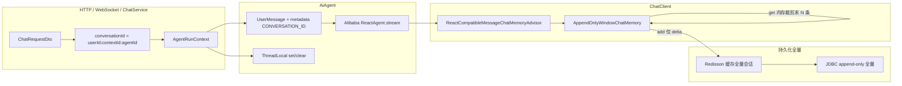
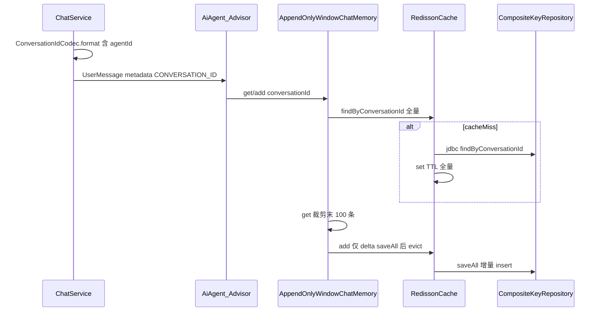

# Agent 对话记录机制

本文说明本服务中 **多轮对话如何与 Spring AI `ChatMemory` 衔接**、**会话键如何传递（含按 `agentId` 隔离）**、**ReAct 场景下如何避免重复 prepend 历史**，以及 **Advisor 拦截 → Redis 缓存 → JDBC 入库** 的全链路分工。

## 1. 总体数据流



- **业务入口**：`ChatService` 在 `AgentRouter.route` 得到具体 `AiAgent` 后，用 **`ConversationIdCodec.format(userId, contextId, resolvedAgentId)`** 生成 `conversationId`，组装 `AgentRunContext`（含用户文案、`ToolEventEmitter` 等）并调用 `stream`。
- **模型调用**：各 Agent 在构建 `ChatClient` 时注册 `ReactCompatibleMessageChatMemoryAdvisor`，与注入的 **同一个** `ChatMemory` Bean 绑定；Advisor 在每次 LLM 调用前后读写记忆。
- **双轨存储**：
  - **运行时**（`AppendOnlyWindowChatMemory`）：`get` 从仓储读出全量后在内存裁剪为最近 **100** 条（超出则丢弃最早非 `SystemMessage`）；`add` **只追加**本次新消息，不删库。
  - **持久化**（`ChatMemoryRepository`）：Redis 缓存与 JDBC **保留全量** `chat_context_item`；**Redis key 与 DB 行均隐含 `agentId`**，切换智能体即切换记忆空间。
  - **前端历史**（`ChatContextService.getChatContext`）：直接 `repository.findByConversationId`，**不经** `ChatMemory.get`，始终返回库内完整记录。

LLM 提供商连接参数（baseUrl、Anthropic/百炼兼容）见 [LLM 提供商配置](../LLM提供商配置/README.md)。

## 2. 会话键：`conversationId` 与库表对应关系

- **格式**：**`userId:contextId:agentId`**（`String.split(":", 3)` 解析）。`userId` 为空时在格式化阶段使用 `anonymous`；`agentId` 为空串表示与历史迁移默认行对齐（`ConversationIdCodec.LEGACY_AGENT_ID`）。
- **兼容**：仅含两段的老键 `userId:contextId` 仍可读，第三段按空串解析，便于旧 Redis 条目与库中 `agent_id = ''` 的行继续工作。
- **构造位置**：`ChatService` 在路由后取 `aiAgent.getAgentId()`，再调用 `ConversationIdCodec.format`（见 `service/llm/ChatService.java`）。
- **解析与落库**：`CompositeKeyChatMemoryRepository` 通过 `ConversationIdCodec.parse` 得到 `userId`、`contextId`、`agentId`；**`chat_context_record` 主键为 `(context_id, agent_id)`**，**`chat_context_item` 按 `context_id + agent_id` 过滤**；非法格式会抛 `IllegalArgumentException`。

与 Alibaba Graph 的 `RunnableConfig`：`AiAgent.stream` 中将 `threadId` 设为 `context.conversationId()`（已含 agent），图内 thread 与业务记忆隔离维度一致。

## 3. 拦截层：从入口到 Advisor

### 3.1 `AiAgent.stream`

1. 构造单条 `UserMessage`，在 **metadata** 中放入 `ChatMemory.CONVERSATION_ID -> context.conversationId()`，供 Advisor 在 **流式、`publishOn` 换线程** 后仍能从消息上解析会话键（**键中已含 `agentId`**）。
2. 调用 `ReactCompatibleMessageChatMemoryAdvisor.setConversationId(conversationId)`，在 **当前线程** 上增加一层兜底；流式子线程上 ThreadLocal 可能为空，因此 **主路径依赖 metadata**。
3. `doFinally` 中调用 `ReactCompatibleMessageChatMemoryAdvisor.clear()`，避免线程池复用导致会话串线。

对应代码：`j2agent-server/.../service/llm/agent/AiAgent.java`。

### 3.2 `ReactCompatibleMessageChatMemoryAdvisor`

实现类：`j2agent-server/.../service/llm/advisor/ReactCompatibleMessageChatMemoryAdvisor.java`。

#### 会话键写入 `ChatClientRequest` 的 context

在 `before` 早期执行 `ensureConversationIdInContext`：

1. 若 `context` 已有 `ChatMemory.CONVERSATION_ID`，跳过。
2. 否则从本轮 `prompt` 中 **按顺序** 查找 `UserMessage`，读取其 metadata 中的 `ChatMemory.CONVERSATION_ID`。
3. 再否则读取当前线程 ThreadLocal（`setConversationId` 绑定值）。
4. 仍没有则打 warn，后续依赖 Spring AI 默认会话 id。

后续 `ChatMemory.get` / `add` 均使用上述 **同一字符串**，因此 **不会跨 Agent 混读**。

#### ReAct 兼容：何时合并持久化历史

- **首轮 / 无助手消息**：`prompt` 的 instructions 中 **没有** `AssistantMessage` 时，从 `ChatMemory.get(conversationId)` 取出窗口内历史并 **前置**。
- **工具循环后续跳**：instructions 中 **已含** `AssistantMessage` 时，**不再** prepend 持久化记忆，避免 ReAct 内重复拼接。

#### 写入记忆

- **`before`**：合并后的 prompt 上取「最后一条用户或工具响应消息」，`chatMemory.add(conversationId, ...)`。
- **`after`**：本轮 `AssistantMessage` 列表写入同一 `conversationId`。
- **流式**：`adviseStream` 聚合后再走 `after`，与同步路径一致。

## 4. 缓存层：`RedissonCachingChatMemoryRepository`

- **Key**：`{spring.application.name}:chat-memory:` + **完整** `conversationId`（含 `agentId`）。默认 `spring.application.name=j2agent`。不同智能体天然不同 key。前缀由 `RedisKeyNamespaces` 统一生成。
- **读路径**：先读 Redis；反序列化失败则删 key 回源；miss 时读 JDBC 并 **`putCache`（TTL）**。
- **写路径**：`saveAll` / `deleteByConversationId` 先委托 JDBC，再 **异步 `evict`**，避免缓存与库不一致。

实现：`service/llm/memory/RedissonCachingChatMemoryRepository.java`。

## 5. 入库层：`CompositeKeyChatMemoryRepository` 与表结构

| 组件 | 作用 |
|------|------|
| `ChatMemoryConfig` | 装配 `AppendOnlyWindowChatMemory`，运行时窗口 **`MEMORY_WINDOW_SIZE = 100`**；超出窗口仅影响 LLM 上下文，不删库。 |
| `AppendOnlyWindowChatMemory` | `get` 裁剪；`add` 仅把 delta 交给仓储增量落库。 |
| `MessageWindowTrimmer` | 与 Spring AI `MessageWindowChatMemory` 一致的头部淘汰语义（`SystemMessage` 优先保留）。 |
| `RedissonCachingChatMemoryRepository`（`@Primary`） | 见上一节 cache-aside；缓存 **全量** 会话消息。 |
| `CompositeKeyChatMemoryRepository`（`jdbcChatMemoryRepository`） | 解析 `conversationId` 后按 **`context_id` + `agent_id`** 读写；`saveAll` 仅接收 **本批 delta**，从 `lastMessageIndex + 1` 连续追加；`SystemMessage` 不落库；**不**按窗口删行。 |
| `ConversationIdCodec` | 会话键编解码与两段老格式兼容（`service/llm/memory/ConversationIdCodec.java`）。 |

消息与库表字段的编解码见 `ChatMemoryMessageCodec`。

**Schema 与迁移**：新建库见 `j2agent-server/src/main/resources/sql/schema/mysql/V0_0__schemas.sql`；已有库见 `sql/migration/mysql/20260511_chat_memory_agent_id.sql`。

## 6. 端到端时序（拦截 → 缓存 → 入库）



## 7. REST / 历史接口与 WebSocket

- **WebSocket**：连接参数已有 `agent-id`，与 `conversationId` 第三段一致即可与 HTTP 历史对齐。
- **HTTP**：`getHistoryContext` **必填** `agent-id`；`getHistoryContextList` 可选 `agent-id` 过滤；`deleteHistoryContext` 可选 `agent-id`（不传则删除当前用户在该 `context-id` 下 **全部** 智能体行）；`MessageFeedbackRequest` 携带 `agentId` 以定位 `chat_context_item` 行。
- **按 ID 删除**：`DELETE /context?context-id=...` 在落库前经 `ActiveChatTurnRegistry` 查询 Redis，若目标会话正在 WebSocket 流式中则返回 **409 CONFLICT**（`CHAT_CONTEXT_IN_PROGRESS` / 「请先停止对话」）。前端对单条删除与批量勾选做 busy 预判，后端仍作兜底。
- **全部清除**：`DELETE /context?clear-all=true`（可选 `agent-id` 过滤）由服务端查询当前用户全部历史记录，**跳过运行中会话**后删除其余，无需前端拼接 `context-id` 列表。

OpenAPI：`j2agent/j2agent-model/src/main/resources/openapi-interface.yaml` / `openapi-model.yaml`。

## 8. 中断与补偿：`ChatService`

正常路径下，助手内容由 Advisor 的 `after` 写入 `ChatMemory`。当流被中断或异常结束时，可能尚未触发完整 `after`：`ChatService` 通过 `flushPartialAssistantOnInterrupt`（配合 `interruptAssistantFlushed` 原子变量）**最多补偿写入一条**不完整的 `AssistantMessage`；补偿使用与本轮相同的 `conversationId`（已含 agent）。

补偿范围：

- **最终回答**（`content`）：流式过程中累积的 `answerDelta`；中断时在末尾追加 `...` 表示未完成。
- **深度思考**（`reasoningContent`）：流式过程中累积的 `reasoningDelta`，写入 `AssistantMessage` metadata / 库表 `meta_json`，与正常完成路径下 `ChatMemoryMessageCodec` 编码一致。
- 当 **仅有深度思考、尚无回答 token** 时中断，仍会落库一条 `content=""` 且带 `reasoningContent` 的 assistant 行（刷新历史后可由 `Translator` 回填至 `MessageDto.reasoningContent`）。
- 若 `content` 与 `reasoningContent` **均为空**，则不补偿 assistant 行（`turn_trace` 审计行仍可在终态写入）。

## 9. 扩展或排查清单

- **新 Agent 要对齐记忆**：注入与全局一致的 `ChatMemory` Bean，并在 `ChatClient` 上挂载同一套 `ReactCompatibleMessageChatMemoryAdvisor`。
- **会话串线**：检查自定义线程上是否丢失 `UserMessage` metadata；检查是否漏调 `clear()`。
- **历史条数 vs 模型上下文**：`getHistoryContext` 为库内 **全量**；送入模型的为 `ChatMemory.get` 裁剪后的 **≤100** 条，条数不一致属预期。
- **模型上下文偏少**：确认 `MEMORY_WINDOW_SIZE`；确认 ReAct 分支 prepend 行为是否符合预期。
- **同 context 多 Agent**：列表中会出现多行（`context_id` 相同、`agent_id` 不同）；前端需用 `agentId` 区分。

## 10. 流式进行中状态（Redis）

WebSocket 一轮对话从首条用户消息被接受、到 `COMPLETED` / `FAILED` / `CANCELLED` 收尾，服务端需在**多实例**间共享「是否仍在流式」标记，供删除历史等写操作拒绝误删。该状态与 `ChatMemory` 缓存分离，由 `ActiveChatTurnRegistry` 维护。

### 10.1 索引维度

- **粒度**：`contextId + agentId`（与库表主键 `(context_id, agent_id)` 对齐，**不是**仅 `contextId`）。
- **`agentId` 归一化**：`null` 视为 `ConversationIdCodec.LEGACY_AGENT_ID`（空串），与记忆键第三段一致。
- **登记时机**：`ChatService` 在 `AgentRouter.route` 得到 **resolved `agentId`** 后 `register`；空消息列表等提前失败路径**不**登记。

### 10.2 Redis 结构

| Key | 类型 | 说明 |
|-----|------|------|
| `{spring.application.name}:active-chat-turn:{contextId}:{agentId}` | `RAtomicLong` | 引用计数；同一 `(contextId, agentId)` 并发 register/unregister 时安全递减 |
| `{spring.application.name}:active-chat-turn-ctx:{contextId}` | `RSet<String>` | 该 `contextId` 下当前有流式对话的 `agentId` 集合，供「删整 context」快速判断 |

- **TTL**：24 小时兜底，防止异常路径未 `unregister` 导致 key 永驻。
- **Redis 客户端**：Redisson（`RedisConfig#redissonClient`），与 `RedissonCachingChatMemoryRepository` 共用连接。

### 10.3 生命周期

```mermaid
sequenceDiagram
  participant WS as ChatService
  participant REG as ActiveChatTurnRegistry
  participant REDIS as Redis
  participant API as ChatContextService
  WS->>WS: route(agentId) → resolvedAgentId
  WS->>REG: register(contextId, resolvedAgentId)
  REG->>REDIS: INCR counter; SADD ctx set
  Note over WS,REDIS: 流式进行中…
  WS->>REG: unregister(contextId, resolvedAgentId)
  REG->>REDIS: DECR counter; SREM ctx set
  API->>REG: isActive / isAnyActive
  REG->>REDIS: GET counter / SMEMBERS set
```

**`unregister` 触发路径**（幂等，仅首次生效）：

- 流式正常结束（`completeCall`）
- WebSocket 关闭（`closeCall`，含用户中断）
- 整轮 `FAILED`（`terminateTurnWithFailure`）
- `handleChat` 外层 catch

### 10.4 删除历史校验规则

**按 `context-id` 删除**（`ChatContextService#deleteHistoryContext`）在事务删除前检查：

| 请求 `agent-id` | 检查方式 |
|-----------------|----------|
| **有值** | `isActive(contextId, agentId)` — 仅拦截该智能体行 |
| **无值** | `isAnyActive(contextId)` — 该 context 下任意 agent 流式中则拒绝 |

- **HTTP 响应**：`409 CONFLICT`，错误码 `CHAT_CONTEXT_IN_PROGRESS`。
- **i18n**：`j2agent-i18n.properties` / `_en.properties`。
- **前端**：单条删除与批量勾选对运行中会话做 busy 预判（提示「请先停止对话」）；后端仍作兜底。

**全部清除**（`ChatContextService#clearAllHistoryContext`，`DELETE /context?clear-all=true`）：

- 服务端查询当前用户全部历史（可选 `agent-id` 过滤），对运行中会话 **跳过**，删除其余。
- 不传 `context-id`，避免前端分页拼接全量 ID。

### 10.5 与记忆 Redis 的区别

| 维度 | `RedissonCachingChatMemoryRepository` | `ActiveChatTurnRegistry` |
|------|--------------------------------------|--------------------------|
| Key | `{spring.application.name}:chat-memory:` + `userId:contextId:agentId` | `{spring.application.name}:active-chat-turn:` + `contextId:agentId` |
| 内容 | 会话消息 JSON 全量 | 进行中引用计数 + context 级 agent 集合 |
| 用途 | 读加速 / cache-aside | 写保护（删历史） |
| 生命周期 | 随记忆读写与 evict | 单轮流式 register → unregister |

### 10.6 排查清单

- **误拦删除**：确认删除请求带的 `agent-id` 与当前流式 Agent 一致；同 `contextId` 下另一 Agent 流式不应拦截单 Agent 删除。
- **漏拦删除**：查 Redis 是否存在对应 counter；多实例下确认各节点共用同一 Redis。
- **key 残留**：counter 带 24h TTL；若长期残留可查 `unregister` 是否在所有终态路径执行。
- **Redis 不可用**：register/unregister 失败仅打 warn、不阻断聊天；`isActive` 查询失败视为未进行中（允许删除），需结合监控告警。

## 11. 相关源码索引

| 主题 | 路径 |
|------|------|
| 会话键编解码 | `j2agent-server/src/main/java/io/github/jerryt92/j2agent/service/llm/memory/ConversationIdCodec.java` |
| Agent 流式入口 | `j2agent-server/src/main/java/io/github/jerryt92/j2agent/service/llm/agent/AiAgent.java` |
| 运行上下文 | `j2agent-server/src/main/java/io/github/jerryt92/j2agent/service/llm/agent/AgentRunContext.java` |
| 聊天服务与会话键 | `j2agent-server/src/main/java/io/github/jerryt92/j2agent/service/llm/ChatService.java` |
| 历史与 REST | `j2agent-server/src/main/java/io/github/jerryt92/j2agent/service/llm/ChatContextService.java` |
| 流式进行中 Redis 登记 | `j2agent-server/src/main/java/io/github/jerryt92/j2agent/service/llm/ActiveChatTurnRegistry.java` |
| Redis key 前缀 | `j2agent-server/src/main/java/io/github/jerryt92/j2agent/config/redis/RedisKeyNamespaces.java` |
| ReAct 记忆 Advisor | `j2agent-server/src/main/java/io/github/jerryt92/j2agent/service/llm/advisor/ReactCompatibleMessageChatMemoryAdvisor.java` |
| 窗口记忆 Bean | `j2agent-server/src/main/java/io/github/jerryt92/j2agent/config/chat/ChatMemoryConfig.java` |
| 运行时窗口记忆 | `j2agent-server/src/main/java/io/github/jerryt92/j2agent/service/llm/memory/AppendOnlyWindowChatMemory.java` |
| 消息窗口裁剪 | `j2agent-server/src/main/java/io/github/jerryt92/j2agent/service/llm/memory/MessageWindowTrimmer.java` |
| JDBC 复合键仓储 | `j2agent-server/src/main/java/io/github/jerryt92/j2agent/service/llm/memory/CompositeKeyChatMemoryRepository.java` |
| Redisson 装饰 | `j2agent-server/src/main/java/io/github/jerryt92/j2agent/service/llm/memory/RedissonCachingChatMemoryRepository.java` |
| 助手 Agent 装配示例 | `j2agent-plugins-agents/agents/assistant/AssistantReactAgent.java` |
