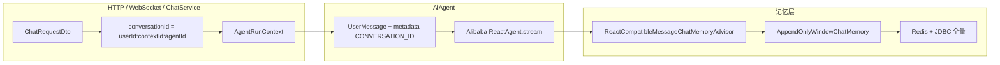
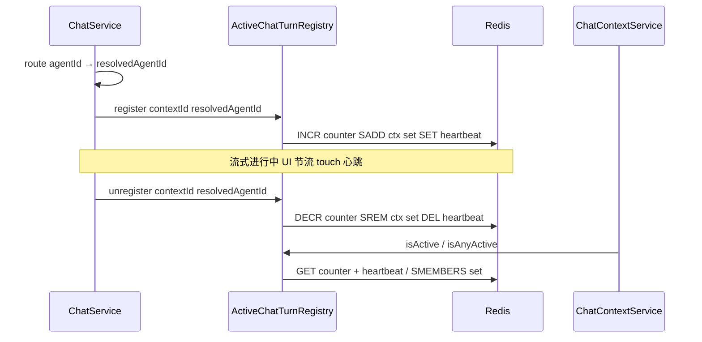

# Agent 记忆机制

本目录描述智能体平台的 **多轮对话记忆**：会话键隔离、滑动窗口 LLM 上下文、Redis/JDBC 全量持久化，以及流式进行中的写保护。

滑动窗口与 Advisor 细节见专题 [对话记忆](对话记忆.md)。

## 总体架构

## 模块索引

| 文档 / 章节 | 说明 |
|-------------|------|
| [对话记忆](对话记忆.md) | 双轨设计、`MessageWindowTrimmer`、ReAct prepend、Redis/JDBC cache-aside |
| [通用助手与调用子智能体记忆](#通用助手与调用子智能体记忆) | `universal_assistant` 与专业 Agent 双会话键 |
| [会话键](#会话键) | `conversationId` 格式与库表对应 |
| [REST / WebSocket 历史](#rest--websocket-历史) | 历史接口与删除规则 |
| [中断与补偿](#中断与补偿) | 流中断时 assistant 落库补偿 |
| [流式进行中状态](#流式进行中状态redis) | `ActiveChatTurnRegistry` 与删历史 409 |
| [源码索引](#源码索引) | 记忆与运维类路径 |

## 会话键

- **格式**：`userId:contextId:agentId`（`ConversationIdCodec` 编解码，必须三段且 `agentId` 非空）。
- **构造**：`ChatService` 在 `AgentRouter.route` 后取 `aiAgent.getAgentId()`，调用 `ConversationIdCodec.format`。
- **库表**：`chat_context_record` 主键 `(context_id, agent_id)`；`chat_context_item` 按 `context_id + agent_id` 过滤。
- **`userId` 为空**：格式化为 `anonymous`。

记忆读写、Redis key、按 `agentId` 隔离详见 [对话记忆 §8](对话记忆.md#8-会话隔离conversationid)。

## 通用助手与调用子智能体记忆

平台内置 **`universal_assistant`（AI 助手）** 与插件专业 Agent 共用同一套 `ChatMemory` / Advisor。同一 `contextId` 下可存在 **多条会话键**（按 `agent_id` 隔离），但编排委派与直接访问的落库行为不同：

| 场景 | 会话键第三段 | 记忆内容 |
|------|--------------|----------|
| 用户在 AI 助手入口对话 | `universal_assistant` | 用户消息、assistant（来自子智能体 bridge 或主 ReAct；编排 Trace 不落库） |
| 编排 Hook 委派子智能体 | `universal_assistant`（同上） | 委派过程 `subAgentCallRun=true`，Advisor **跳过**专业键读写；可见答复仅落 universal 键 |
| 用户直接进入专业 Agent | `<targetAgentId>`（目标 Agent 的 `getAgentId()`） | 完整 user / assistant 历史 |

编排 Hook 以 `subAgentCallRun=true` 无状态调用子智能体；`userId:contextId:targetAgentId` 在委派时仅作运行时上下文（thinking、RAG 等），**不**持久化 ReAct 轮次。

详见 [平台通用助手 — 子智能体调用与记忆](../通用助手/子智能体调用与记忆.md)。

## REST / WebSocket 历史

- **WebSocket**：连接参数 `agent-id` 与 `conversationId` 第三段一致，即可与 HTTP 历史对齐。
- **HTTP**：`getHistoryContext` **必填** `agent-id`；`getHistoryContextList` 可选 `agent-id` 过滤；`deleteHistoryContext` 可选 `agent-id`（不传则删除该 `context-id` 下 **全部** 智能体行）；`MessageFeedbackRequest` 携带 `agentId`。
- **按 ID 删除**：`DELETE /context?context-id=...` 删除前经 `ActiveChatTurnRegistry` 检查，流式中返回 **409**（`CHAT_CONTEXT_IN_PROGRESS`）。
- **全部清除**：`DELETE /context?clear-all=true`（可选 `agent-id`）服务端查询用户全部历史，**跳过运行中会话**后删除其余。

OpenAPI：`j2agent/j2agent-model/src/main/resources/openapi-interface.yaml` / `openapi-model.yaml`。

前端历史直读 Repository **全量**，不经 `ChatMemory.get` 裁剪——见 [对话记忆 §10](对话记忆.md#10-三轨对比)。

## 中断与补偿

正常路径下助手内容由 Advisor `after` 写入 `ChatMemory`。流被中断或异常结束时可能尚未触发完整 `after`：`ChatService#flushPartialAssistantOnInterrupt`（配合 `interruptAssistantFlushed`）**最多补偿一条**不完整 `AssistantMessage`。

补偿范围：

- **最终回答**（`content`）：流式 `answerDelta`；中断时末尾追加 `...`。
- **深度思考**（`reasoningContent`）：写入 metadata / `meta_json`，与 `ChatMemoryMessageCodec` 一致。
- **仅思考无回答**时中断：落库 `content=""` 且带 `reasoningContent`（UI 由 `Translator` 回填）。
- **content 与 reasoningContent 均为空**：不补偿 assistant 行。

纯 reasoning 行不进 LLM 回放但保留在 UI——见 [对话记忆 §5](对话记忆.md#5-可回放过滤filterreplayable)。

## 扩展或排查清单

- **新 Agent 对齐记忆**：同一 `ChatMemory` Bean + `ReactCompatibleMessageChatMemoryAdvisor`（见 [对话记忆 §13](对话记忆.md#13-排查要点)）。
- **历史条数 vs 模型上下文**：UI 全量；模型 ≤100 条，属预期。
- **同 context 多 Agent**：列表多行，前端用 `agentId` 区分。

## 流式进行中状态（Redis）

WebSocket 一轮从首条用户消息到 `COMPLETED` / `FAILED` / `CANCELLED`，服务端在多实例间共享「是否仍在流式」标记，供删除历史等写操作拒绝误删。与 `ChatMemory` 缓存分离，由 `ActiveChatTurnRegistry` 维护。

### 索引维度

- **粒度**：`contextId + agentId`（对齐库表主键，**不是**仅 `contextId`）。
- **`agentId`**：必填非空。
- **登记时机**：`ChatService` 在 `route` 得到 resolved `agentId` 后 `register`；提前失败路径不登记。

### Redis 结构

| Key | 类型 | 说明 |
|-----|------|------|
| `{spring.application.name}:active-chat-turn:{contextId}:{agentId}` | `RAtomicLong` | 引用计数 |
| `{spring.application.name}:active-chat-turn-ctx:{contextId}` | `RSet<String>` | 该 context 下流式中的 agentId 集合 |
| `{spring.application.name}:active-chat-turn-hb:{contextId}:{agentId}` | `RBucket` | 活动心跳 |

- **counter TTL**：默认 24h（`j2agent.active-chat-turn.key-fallback-ttl-hours`）。
- **心跳看门狗**：心跳 TTL 30s、续期间隔 10s、清扫 60s。`isActive` 要求 counter > 0 且心跳未过期；`ActiveChatTurnWatchdog` 清扫孤儿 key。
- **Redis 客户端**：Redisson，与记忆缓存共用连接。

### 生命周期

**`unregister` 触发**（幂等）：`completeCall`、`closeCall`、`terminateTurnWithFailure`、`handleChat` 外层 catch。

### 删除历史校验

**按 `context-id` 删除**（`ChatContextService#deleteHistoryContext`）：

| 请求 `agent-id` | 检查 |
|-----------------|------|
| 有值 | `isActive(contextId, agentId)` |
| 无值 | `isAnyActive(contextId)` |

响应 **409**，错误码 `CHAT_CONTEXT_IN_PROGRESS`；i18n 见 `j2agent-i18n.properties`。

**全部清除**（`clearAllHistoryContext`）：查询用户全部历史，跳过运行中，删除其余。

### 与记忆 Redis 的区别

| 维度 | `RedissonCachingChatMemoryRepository` | `ActiveChatTurnRegistry` |
|------|--------------------------------------|--------------------------|
| Key | `chat-memory:` + `userId:contextId:agentId` | `active-chat-turn:` + `contextId:agentId` |
| 内容 | 会话消息 JSON 全量 | 引用计数 + agent 集合 |
| 用途 | 读加速 | 删历史写保护 |
| 生命周期 | 随记忆 evict | 单轮流式 register → unregister |

### 流式进行中排查

- **误拦删除**：确认 `agent-id` 与当前流式 Agent 一致。
- **漏拦删除**：查 counter 与 heartbeat；多实例共用 Redis。
- **中断后仍无法删除**：心跳 TTL 默认 30s；前端 `isContextStreaming` 以 WebSocket 为准。
- **Redis 不可用**：`isActive` 失败视为未进行中（允许删除），需监控告警。

## 源码索引

### 记忆（详见 [对话记忆 §14](对话记忆.md#14-源码索引)）

| 主题 | 路径 |
|------|------|
| 窗口记忆 / 裁剪 / Advisor / 仓储 | 见 [对话记忆 §14](对话记忆.md#14-源码索引) |

### 运维与入口

| 主题 | 路径 |
|------|------|
| 聊天服务与会话键 | `j2agent/j2agent-server/.../service/llm/ChatService.java` |
| 历史与 REST | `j2agent/j2agent-server/.../service/llm/ChatContextService.java` |
| 运行上下文 | `j2agent/j2agent-server/.../service/llm/agent/core/AgentRunContext.java` |
| 流式进行中登记 | `j2agent/j2agent-server/.../service/llm/ActiveChatTurnRegistry.java` |
| 流式心跳看门狗 | `j2agent/j2agent-server/.../service/llm/ActiveChatTurnWatchdog.java` |
| 看门狗配置 | `j2agent/j2agent-server/.../config/chat/ActiveChatTurnProperties.java` |
| Redis key 前缀 | `j2agent/j2agent-server/.../config/redis/RedisKeyNamespaces.java` |
