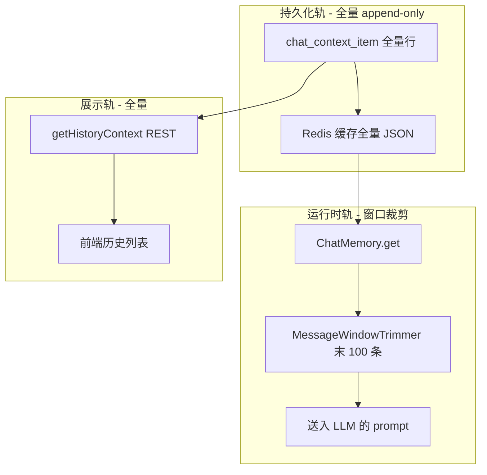
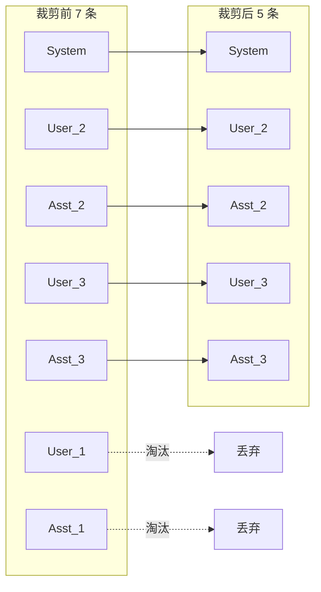
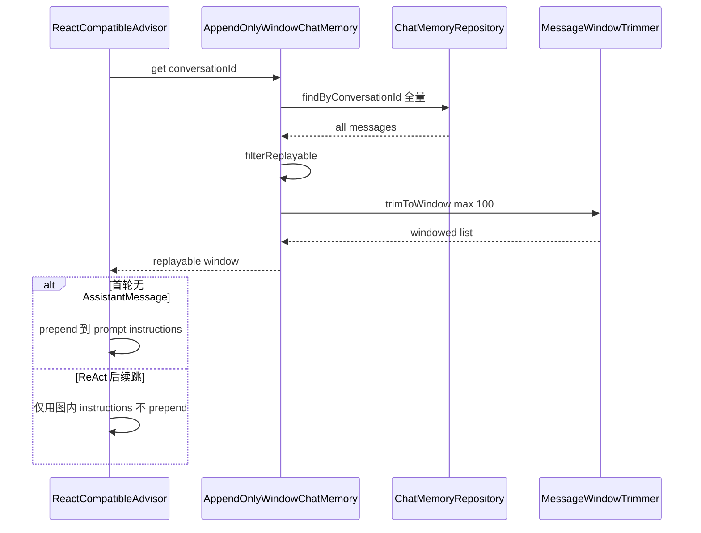
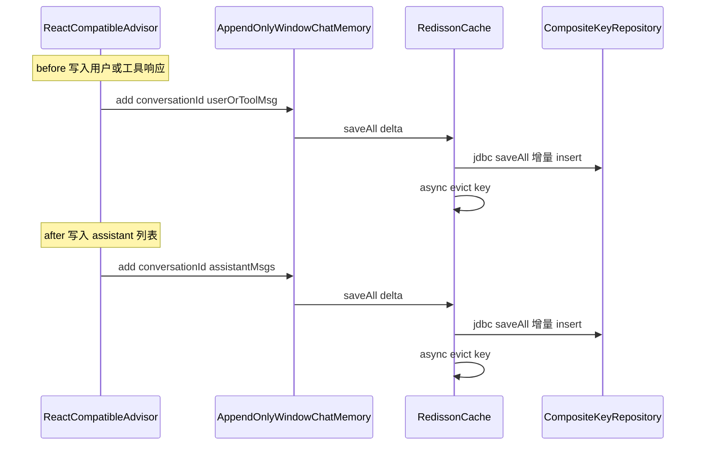
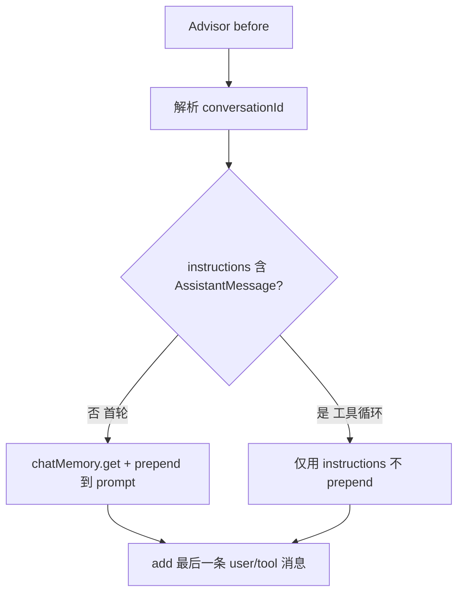
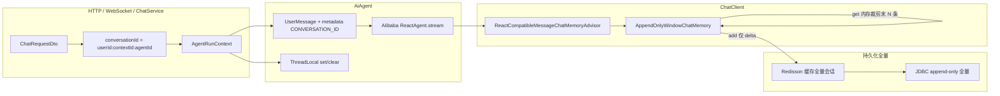

# 对话记忆

本文专题说明本服务中 **滑动窗口会话记忆** 的设计与实现：如何在 **不删库** 的前提下，将全量对话历史裁剪为适合 LLM 上下文的最近 N 条，并与 Spring AI `ChatMemory`、ReAct 工具循环、Redis/JDBC 持久化衔接。

模块总览与 REST/流式运维见 [Agent 记忆机制 README](README.md)。

## 1. 设计动机

Spring AI 默认的 `MessageWindowChatMemory` 在窗口溢出时会 **从仓储中删除** 最早消息，导致：

- 前端历史列表随窗口收缩而丢失早期轮次；
- 审计、反馈、附件引用等依赖全量 `chat_context_item` 的能力受损。

本服务采用 **双轨记忆**：

| 轨道 | 行为 | 消费者 |
|------|------|--------|
| **持久化轨** | append-only，Redis + JDBC 保留 **全量** 消息 | UI 历史、反馈、附件清理 |
| **运行时轨** | `get` 时读全量后在内存裁剪为末 **100** 条 | LLM prompt（经 Advisor prepend） |

核心实现为 [`AppendOnlyWindowChatMemory`](../../j2agent/j2agent-server/src/main/java/io/github/jerryt92/j2agent/service/llm/memory/AppendOnlyWindowChatMemory.java)：`add` 只追加 delta，**永不按窗口删行**；窗口语义仅在 `get` 中生效。

## 2. 三轨架构



- **业务入口**：`ChatService` 在 `AgentRouter.route` 后，用 `ConversationIdCodec.format(userId, contextId, resolvedAgentId)` 生成 `conversationId`，组装 `AgentRunContext` 并调用 `AiAgent.stream`。
- **模型调用**：各 Agent 在 `ChatClient` 上注册 `ReactCompatibleMessageChatMemoryAdvisor`，与全局 `@Primary` `ChatMemory` Bean 绑定。
- **前端历史**：`ChatContextService.getChatContext` 直读 `repository.findByConversationId`，**不经** `ChatMemory.get`。

LLM 提供商连接参数见 [LLM 提供商配置](../LLM提供商配置/README.md)。

## 3. 窗口参数

[`ChatMemoryConfig`](../../j2agent/j2agent-server/src/main/java/io/github/jerryt92/j2agent/config/chat/ChatMemoryConfig.java) 装配默认记忆 Bean：

```java
private static final int MEMORY_WINDOW_SIZE = 100;

@Bean("defaultChatMemory")
@Primary
public ChatMemory chatMemory(ChatMemoryRepository chatMemoryRepository) {
    return new AppendOnlyWindowChatMemory(chatMemoryRepository, MEMORY_WINDOW_SIZE);
}
```

修改窗口上限仅需调整 `MEMORY_WINDOW_SIZE`；**不影响**库内行数，只影响送入模型的消息条数。

## 4. 裁剪算法：`MessageWindowTrimmer`

[`MessageWindowTrimmer.trimToWindow`](../../j2agent/j2agent-server/src/main/java/io/github/jerryt92/j2agent/service/llm/memory/MessageWindowTrimmer.java) 与 Spring AI `MessageWindowChatMemory` 头部淘汰语义一致：

1. 若 `messages.size() <= maxMessages`，原样返回（拷贝）。
2. 否则计算 `messagesToRemove = size - maxMessages`。
3. 从左到右扫描：遇到 `SystemMessage` **始终保留**；其余消息在 `removed < messagesToRemove` 时丢弃，之后全部保留。

### 4.1 裁剪示意

假设 `maxMessages = 5`，库内按时间序存有 7 条（含 1 条 System）：

```
裁剪前（库内全量，index 0..6）:
  [0] System
  [1] User_1
  [2] Assistant_1
  [3] User_2
  [4] Assistant_2
  [5] User_3
  [6] Assistant_3

messagesToRemove = 7 - 5 = 2
淘汰 [1] User_1、[2] Assistant_1（System 跳过计数）

裁剪后（送入 LLM，共 5 条）:
  [0] System
  [3] User_2
  [4] Assistant_2
  [5] User_3
  [6] Assistant_3
```



库内 `[1]`、`[2]` 行 **仍在** `chat_context_item` 与 Redis 全量缓存中；仅 `ChatMemory.get` 返回值被裁剪。

## 5. 可回放过滤：`filterReplayable`

`AppendOnlyWindowChatMemory.get` 在裁剪前先调用 `filterReplayable`：

- 移除 **无正文且无 tool_calls** 的 `AssistantMessage`。
- 典型场景：中断补偿写入的「仅 `reasoningContent`、content 为空」行——对 UI 历史有价值，但 Provider 要求 assistant 至少提供 content 或 tool_calls，故 **不进 LLM 回放**。

## 6. 读写路径

### 6.1 `get` 时序（读全量 → 裁剪 → Advisor 可选 prepend）



### 6.2 `add` 时序（仅 delta 追加）



`CompositeKeyChatMemoryRepository.saveAll` 从 `lastMessageIndex + 1` 连续追加；`SystemMessage` 不落库；**不按窗口删行**。

## 7. ReAct 兼容：prepend 决策

Alibaba ReAct 在一轮用户提问内会多次调用 LLM（工具循环）。若每跳都 `chatMemory.get` 并 prepend，历史会在图内 messages 上 **重复叠加**。

[`ReactCompatibleMessageChatMemoryAdvisor`](../../j2agent/j2agent-server/src/main/java/io/github/jerryt92/j2agent/service/llm/advisor/ReactCompatibleMessageChatMemoryAdvisor.java) 规则：



### 7.1 会话键传递

`AiAgent.stream` 在 `UserMessage` metadata 写入 `ChatMemory.CONVERSATION_ID`；Advisor `before` 通过 `ensureConversationIdInContext` 写入 request context。流式 `publishOn` 换线程后 ThreadLocal 可能为空，**主路径依赖 metadata**；`setConversationId` / `clear()` 作线程池兜底。

### 7.2 写入时机

| 阶段 | 行为 |
|------|------|
| `before` | 合并 prompt 后，取最后一条 user/tool 消息 `add` |
| `after` | 本轮 `AssistantMessage` 列表 `add`（WebSocket 纯文本 assistant 可由 `ChatService` 按流式 delta 落库，Advisor 跳过重复文本） |
| `adviseStream` | 聚合 chunk 后走 `after`，与同步路径一致 |

## 8. 会话隔离：`conversationId`

| 字段 | 说明 |
|------|------|
| 格式 | `userId:contextId:agentId`（`split(":", 3)`） |
| `userId` 为空 | 格式化为 `anonymous` |
| `agentId` 为空 | `ConversationIdCodec.LEGACY_AGENT_ID`（`""`），与迁移默认行对齐 |
| 老格式 | 两段 `userId:contextId` 仍可读，第三段视为空串 |
| 库表 | `chat_context_record` 主键 `(context_id, agent_id)`；`chat_context_item` 按 `context_id + agent_id` 过滤 |
| Redis key | `{spring.application.name}:chat-memory:` + 完整 `conversationId` |

切换智能体即切换记忆空间；与 Alibaba Graph `RunnableConfig.threadId`（设为 `context.conversationId()`）维度一致。

## 9. 持久化与缓存

### 9.1 组件分工

| 组件 | 作用 |
|------|------|
| `AppendOnlyWindowChatMemory` | 运行时 `get` 裁剪；`add` 仅 delta |
| `MessageWindowTrimmer` | 头部淘汰，`SystemMessage` 优先保留 |
| `RedissonCachingChatMemoryRepository`（`@Primary`） | cache-aside；缓存 **全量**；TTL 1800s；写后 async evict |
| `CompositeKeyChatMemoryRepository`（`jdbcChatMemoryRepository`） | JDBC append-only 落库 |
| `ConversationIdCodec` | 会话键编解码 |
| `ChatMemoryMessageCodec` | 消息 ↔ 库表字段编解码 |

### 9.2 缓存读路径

1. 读 Redis；反序列化失败则删 key 回源。
2. miss 时读 JDBC，`putCache` 带 TTL。

Schema：新建库 `sql/schema/postgresql/schemas.sql`（含 `chat_context_record` / `chat_context_item` 的 `agent_id` 列）；历史 MySQL 库需另行规划数据迁移。

## 10. 三轨对比

| 维度 | 库内 / Redis | `ChatMemory.get` | `getHistoryContext` |
|------|-------------|------------------|---------------------|
| 条数 | 全量，只增不减 | ≤ 100（裁剪后） | 全量 |
| 空 reasoning assistant | 保留 | 过滤，不回放 | 保留 |
| SystemMessage | 通常不落库 | 裁剪时优先保留 | 视落库策略 |
| 用途 | 持久化、缓存 | LLM 上下文 | 前端展示 |

**历史条数与模型上下文不一致属预期**；排查时勿将 UI 条数与 prompt 条数直接对比。

## 11. 与 Spring AI 对照

| | `MessageWindowChatMemory` | `AppendOnlyWindowChatMemory` |
|--|---------------------------|------------------------------|
| 窗口溢出 | 从仓储 **删除** 最早消息 | 仅 `get` 时内存裁剪，**不删库** |
| `add` | 追加后可能触发删库 | 仅 `saveAll` delta |
| 裁剪算法 | 头部淘汰非 System | 同语义（`MessageWindowTrimmer`） |
| UI 全量历史 | 随窗口丢失 | 直读 Repository，不受影响 |

## 12. 端到端数据流



## 13. 排查要点

- **模型上下文偏少**：确认 `MEMORY_WINDOW_SIZE`；确认 ReAct 是否误走 prepend 分支。
- **会话串线**：检查 `UserMessage` metadata 是否丢失；是否漏调 `ReactCompatibleMessageChatMemoryAdvisor.clear()`。
- **新 Agent 对齐记忆**：注入同一 `ChatMemory` Bean，挂载同一 `ReactCompatibleMessageChatMemoryAdvisor`。
- **同 context 多 Agent**：列表多行（`context_id` 相同、`agent_id` 不同）；前端用 `agentId` 区分。

## 14. 源码索引

| 主题 | 路径 |
|------|------|
| 窗口记忆 Bean | `j2agent/j2agent-server/.../config/chat/ChatMemoryConfig.java` |
| 运行时窗口记忆 | `j2agent/j2agent-server/.../service/llm/memory/AppendOnlyWindowChatMemory.java` |
| 消息窗口裁剪 | `j2agent/j2agent-server/.../service/llm/memory/MessageWindowTrimmer.java` |
| 会话键编解码 | `j2agent/j2agent-server/.../service/llm/memory/ConversationIdCodec.java` |
| ReAct 记忆 Advisor | `j2agent/j2agent-server/.../service/llm/advisor/ReactCompatibleMessageChatMemoryAdvisor.java` |
| JDBC 复合键仓储 | `j2agent/j2agent-server/.../service/llm/memory/CompositeKeyChatMemoryRepository.java` |
| Redisson 装饰 | `j2agent/j2agent-server/.../service/llm/memory/RedissonCachingChatMemoryRepository.java` |
| Agent 流式入口 | `j2agent/j2agent-server/.../service/llm/agent/inf/AiAgent.java` |
| 插件 Agent 模板 | `j2agent-plugins-agents/agents/0_example-agent/` |
