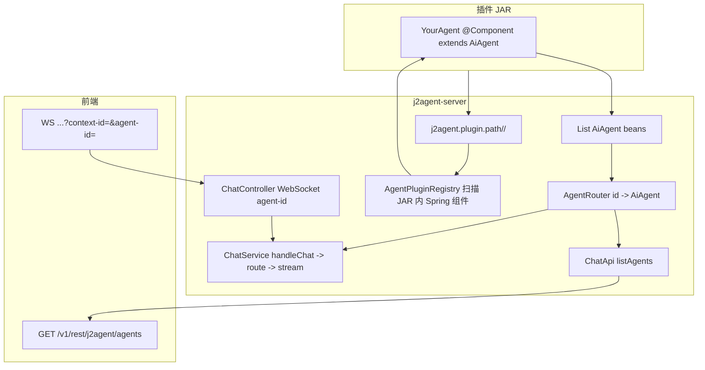

# 插件智能体接入与界面展示机制

本文说明插件中的 `AiAgent` 实现如何进入 **j2agent-server** 运行时，并经由 **HTTP 列表 + WebSocket 对话** 暴露给前端的完整链路。实现上并非「界面直连插件」，而是 **插件 JAR 放入 `j2agent.plugin.path` → `AgentPluginRegistry` 扫描注册 Bean → 路由器聚合 → REST/WebSocket 协议**。

## 1. 总览

> **平台内置通用助手**：`universal_assistant`（AI 助手）由 **server 工程内** `UniversalAssistantAgent` 注册，**不**经插件 JAR 加载，且 **不出现在** `GET /agents` 列表；入口为 `/chat/assistant?agent-id=universal_assistant`。调用子智能体时仍走同一 `ChatService` → `AiAgent.stream` 链路，详见 [平台通用助手](../通用助手/README.md)。

## 2. 插件 JAR 加载（插件类进入 Spring 容器）

| 环节 | 说明 |
|------|------|
| 部署 | 将各业务插件模块 `mvn package` 产出的 **tar.gz** 解压到 **`j2agent.plugin.path`**（每 Agent 一个子目录，含瘦 JAR + `resources/`；兼容根目录裸 JAR）。 |
| 注册 | **`AgentPluginRegistry`** 扫描 JAR 内**全部** Spring 组件（`@Component` 等），注册 BeanDefinition 后先实例化依赖 Bean，再实例化 `AiAgent`；支持运行时热重载。 |

插件内的 Agent 类声明为 `@Component` 并继承平台侧的 `io.github.jerryt92.j2agent.service.llm.agent.inf.AiAgent`；`@PostConstruct` 时在 `AiAgent` 基类中完成底层 Alibaba `ReactAgent` 的构建（模型、记忆、工具拦截器等见基类实现）。

## 3. Bean 聚合与路由

- Spring 会注入 **`List<AiAgent>`**，收集容器中所有 `AiAgent` 实现（含内置与插件）。
- **`AgentRouter`** 在构造时将列表转为 **`Map<String, AiAgent>`**，键为各实现 **`getAgentId()`** 的返回值，值为实现本身。
- **`route(String agentId)`**：
  - 若需兼容旧客户端，可将历史别名映射为实际 `getAgentId()`。
  - 未知 `agentId` 抛出 `IllegalArgumentException`（不支持该智能体）。

插件 Agent 的约定标识（由各实现自行覆盖）：

- **`getAgentId()`**：全局唯一路由键。
- **`getAgentName()` / `getAgentDescription()`**：插件内部必须返回 `I18nString`；平台按当前语言解析后，列表与卡片接口返回普通字符串；不支持旧版 `String` 返回值。
- **`getOrchestrationPrompt()`**（可选）：编排提示词，仅供通用助手**被动意图召回**内部路由，**不**映射到 `AgentInfoDto`、不展示到界面；未实现时回退中文 `getAgentDescription()`。
- **`getSort()`**：基类默认 100；可覆盖；`listRegisteredAgents` 按 **sort 升序、再 agentId 字典序**排序。
- **`getLogo()`**：基类默认 `🤖`；可覆盖为自定义 emoji；经 `AgentInfoDto.logo` 供列表与聊天页展示（全局 `chatLogoUrl` 仍优先）。
- **`getThinkingOverride()`**（可选）：Agent 级默认深度思考策略；默认 `USE_PROVIDER_DEFAULT`。单轮可被 WebSocket 消息体 `ChatRequestDto.thinkingMode` 覆盖（优先级更高）。

运行时国际化由平台统一处理：HTTP 通过统一 Header 透传语言；WebSocket 通过连接查询参数 `locale=zh_CN|en_US` 透传语言，且该显式参数优先于浏览器自动携带的 `Accept-Language`。服务端解析进 `UserContextBo` 并随 `AgentRunContext` 传递。插件 Agent 可在 `AiAgent` 子类中使用 `currentUserContext()`、`currentLanguage()`、`currentLanguageIsEnglish()` 获取当前轮语言上下文；当当前语言为 `en_US` 时，`AiAgent#stream` 会在当前 Agent 的 `loadSystemPrompt()` 返回内容后追加 `Please output content in English.`，不按语言创建多份 Agent 实例。

## 4. HTTP：列出已注册智能体（界面卡片/下拉数据源）

- **实现**：`ChatController#listAgents` 委托 `agentRouter.listRegisteredAgents(language)`。
- **行为**：遍历已注册的 `AiAgent`，按当前请求语言将内部 `I18nString` 解析为 `AgentInfoDto.name` / `description` 普通字符串，再按 **`sort` 升序、再 `agentId` 字典序**排序后封装为 `AgentInfoList`。
- **OpenAPI**：`GET /v1/rest/j2agent/agents`，`operationId: listAgents`（见 `j2agent-model` 中 `openapi-interface.yaml`）。

前端典型用法：启动或进入聊天页时请求该接口，用返回的 **`agentId`** 作为后续 WebSocket 与历史接口的 **`agent-id`**。

## 5. WebSocket：选中智能体后的对话通道

- **路径**：`/ws/rest/j2agent/chat`（见 `ChatController` 上 `@AutoRegisterWebSocketHandler`）。
- **查询参数**（连接建立时解析）：
  - **`context-id`**：业务会话上下文 ID，必填。
  - **`agent-id`**：与目标 Agent 的 `getAgentId()` 一致，必填；缺失时服务端下发失败态事件并关闭连接。
  - **`locale`**：当前语言，取值 `zh_CN` / `en_US`；用于写入 `UserContextBo.language`，供 Agent 运行时系统提示词与工具文案国际化使用。
- **会话属性**：`agentId` 存入 WebSocket session，随后在 **`handleTextMessage`** 中随 `ChatRequestDto` 一并交给 **`ChatService#handleChat(..., userContext, agentId)`**。
- **运行时选择**：`ChatService` 内 **`agentRouter.route(agentId)`** 得到具体 `AiAgent`，再按 [Agent 记忆机制](../agent记忆机制/README.md) / [对话记忆](../agent记忆机制/对话记忆.md) 组装 **`conversationId = userId:contextId:agentId`** 与 **`AgentRunContext`**，调用 **`AiAgent#stream`**。

因此：**界面展示的「选中的智能体」必须落到连接上的 `agent-id` 与每条业务会话的 context**，才能保证记忆与历史与 `AgentRouter` 中的键一致。

## 6. 与「Agent-UI 事件协议」的关系

对话过程中，工具与状态机事件由 `ChatService` 与 `AiAgent` 侧拦截器（如 `AgentUiToolEventInterceptor`）统一产出 **`AgentUiEventEnvelope`**，经 WebSocket 推送给前端；协议与状态机约定见 [Agent-UI 交互机制](../agent-ui交互机制/README.md)。  
插件 Agent 通过继承 **`AiAgent`** 自动挂载默认拦截器链；**不**等同于「单独的前端加载器」，而是同一套 WS 事件流。

## 7. MCP 刷新与 Agent 重建

容器中全部 `AiAgent` Bean 会监听 **`McpToolCallbacksRefreshedEvent`**，在 MCP 工具回调更新后执行 **`rebuildAgent()`**（见 `McpToolCallbacksRefreshedListener`）。已实现 **`McpFeature`** 的 Agent 会在重建时由基类 `buildToolCallbacks()` 重新合并 MCP 工具，因此该机制会同步刷新其运行时图。

## 8. 新增插件内 Agent 时的检查清单

接入侧最小检查：

1. Agent 类 **`@Component` + `extends AiAgent`**；同 JAR 内依赖 Bean 亦需 Spring 注解；**`getAgentId()`** 全局唯一。
2. 将 tar.gz 解压到 **`j2agent.plugin.path`**，启动或 **`POST /v1/rest/j2agent/agents/reload`** 后确认 `loadedAgentIds` 含新 id。
3. 前端列表与 WebSocket / 历史接口使用同一 **`agent-id`**（见 [Agent 记忆机制](../agent记忆机制/README.md)）。
4. `getAgentName()` 与 `getAgentDescription()` 返回 `I18nString`；平台不提供旧 `String` 签名兼容层。
5. 如需按语言调整运行时逻辑，在 `AiAgent` 子类中调用 `currentLanguage()` / `currentUserContext()`，不要自行扩展接口参数。
6. 若需兼容旧客户端字符串，在 **`AgentRouter#route`** 增加别名映射（旧别名 → 实际 `getAgentId()`）。

## 9. 关键代码位置索引

| 主题 | 路径（仓库内相对 j2agent） |
|------|----------------------------------------|
| 插件 Agent 模板 | **j2agent-plugins-agents** 仓库 `agents/0_example-agent/`（独立工程模板） |
| 插件注册与热加载 | [`AgentPluginRegistry.java`](../../j2agent/j2agent-server/src/main/java/io/github/jerryt92/j2agent/service/llm/agent/core/AgentPluginRegistry.java) |
| 路由与列表 | [`AgentRouter.java`](../../j2agent/j2agent-server/src/main/java/io/github/jerryt92/j2agent/service/llm/agent/core/AgentRouter.java) |
| Agent 基类与 stream | [`AiAgent.java`](../../j2agent/j2agent-server/src/main/java/io/github/jerryt92/j2agent/service/llm/agent/inf/AiAgent.java) |
| 热门问题模板 | 插件 JAR 内 `qa-template.json` + `AiAgent#isQaTemplateEnabled()`；`QaTemplateController` |
| 对话编排 | [`ChatService.java`](../../j2agent/j2agent-server/src/main/java/io/github/jerryt92/j2agent/service/llm/ChatService.java) |
| WebSocket 与 listAgents | [`ChatController.java`](../../j2agent/j2agent-server/src/main/java/io/github/jerryt92/j2agent/controller/ChatController.java) |

---

**文档版本说明**：与当前代码结构一致；列表排序与 `logo` 展示字段已接入 `GET /agents` 与前端智能体列表/聊天页。
