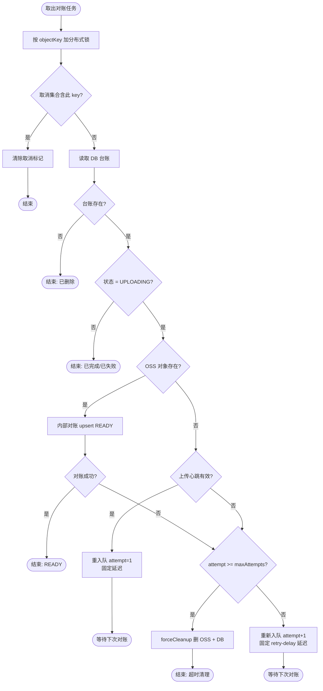
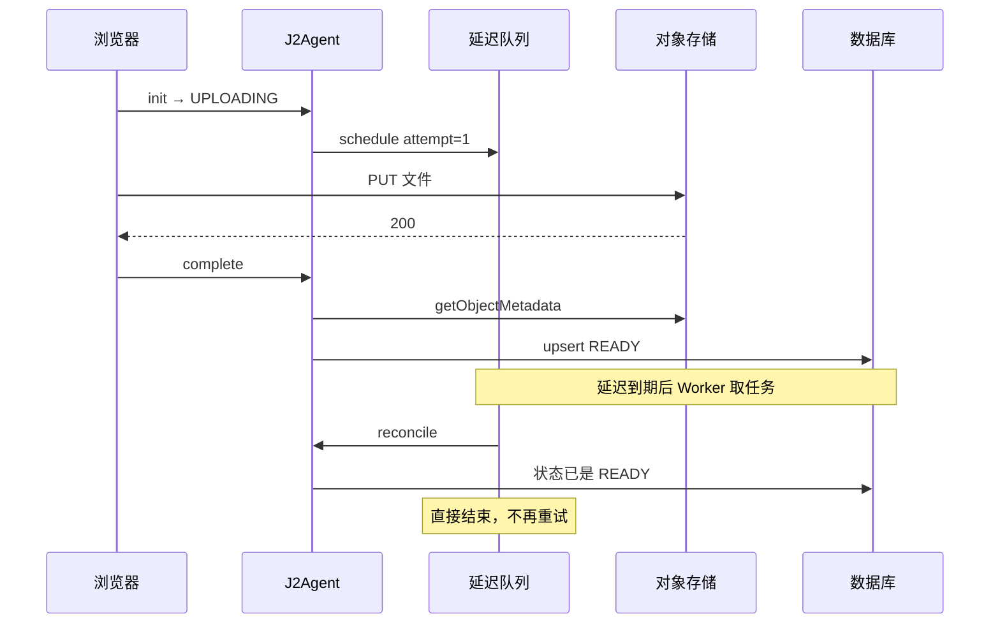
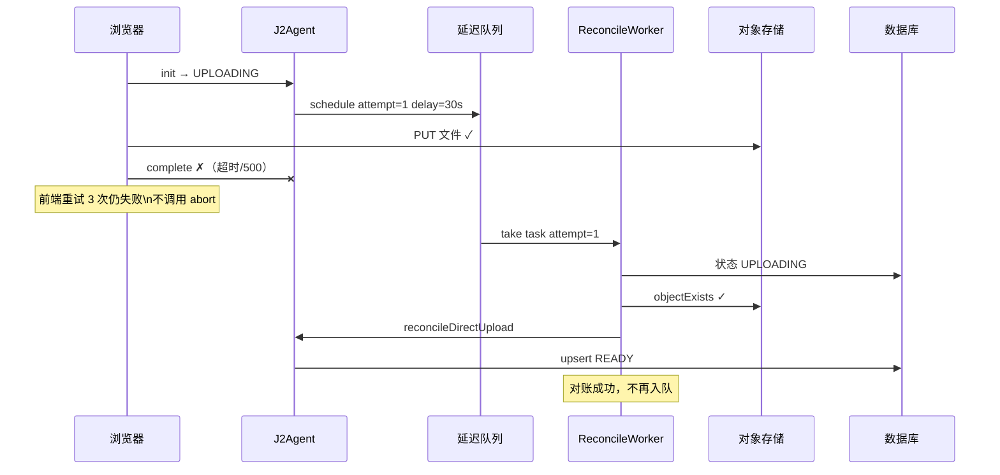
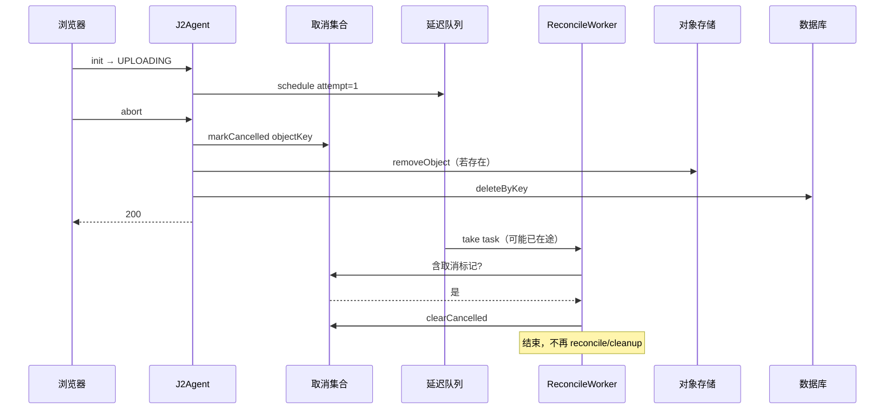
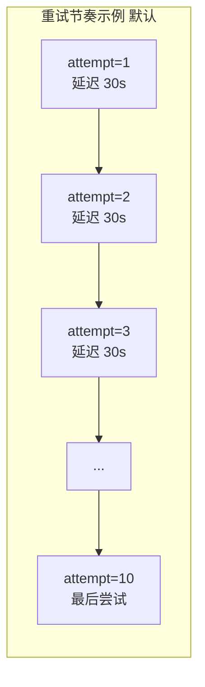
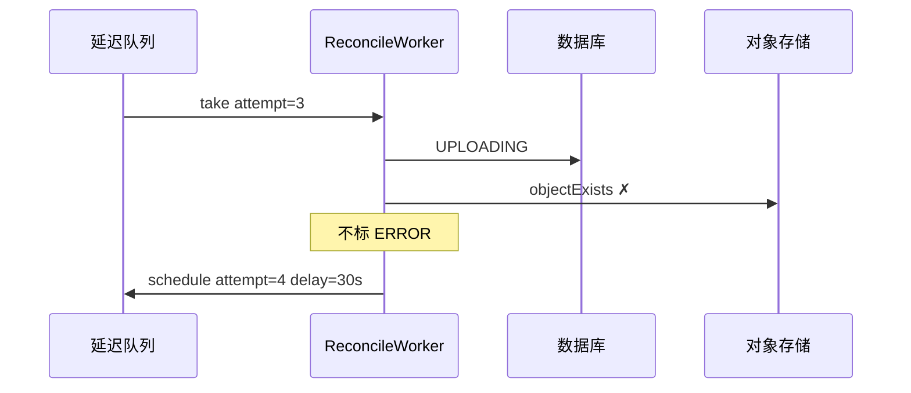
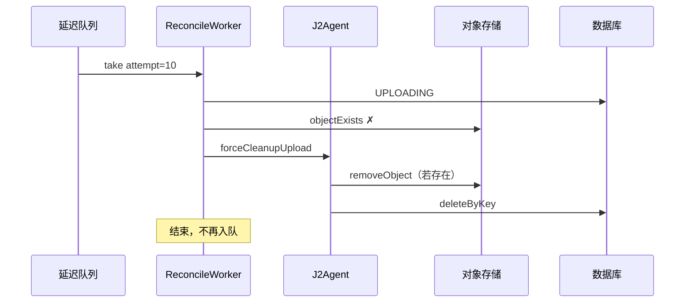
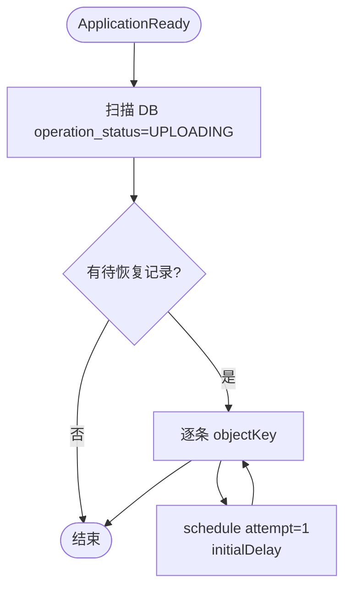
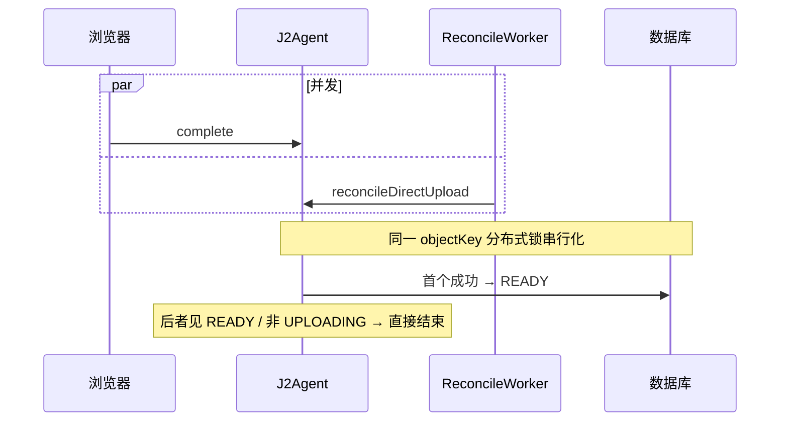

# 文件管理与对象存储

本文档说明 J2Agent 文件管理功能、对象存储供应商配置，以及对象存储和数据库台账之间的差异检查与人工处置流程。

## 1. 功能范围

- 仅 `ADMIN` 角色可访问首页入口、系统菜单和 `/files` 页面。
- 首版只管理 `j2agent.storage.bucket` 配置的默认 Bucket，不支持页面切换 Bucket。
- 支持虚拟目录、面包屑导航、名称搜索、状态筛选和分页。
- 支持单个或批量上传、短期签名 URL 预览/下载、单个删除和批量删除。
- 支持浏览器直传对象存储（带上传进度），以及经后端中转上传（兼容保留）。
- 支持 MinIO、阿里云 OSS、七牛云 Kodo 和 Cloudflare R2。
- 差异检查和处置均由管理员手动触发，不包含定时检查和云事件通知。
- 数据库仅保存对象元数据，不保存文件正文。

对象键中的 `/` 用于构建虚拟目录。例如 `manual/images/logo.png` 会显示为 `manual / images / logo.png`，对象存储中不会额外创建目录对象。

## 2. 启用配置

本地配置位于：

```text
j2agent/j2agent-starter/src/main/resources/application.yaml
```

生产环境配置位于：

```text
j2agent/j2agent-starter/src/main/resources/application-product.yaml
```

通用配置：

```yaml
j2agent:
  storage:
    enabled: true
    # minio、oss、qiniu、r2
    type: minio
    bucket: j2agent-files
    sync:
      retention-days: 7
      cleanup-cron: "0 30 2 * * *"
```

`enabled=false` 时不会创建对象存储服务和文件管理 REST Controller，前端调用文件接口会返回 404。

本地开发配置默认启用 MinIO。MinIO 适配器首次访问默认 Bucket 时会检查 Bucket 是否存在，不存在则自动创建。阿里云 OSS、七牛云 Kodo 和 Cloudflare R2 的 Bucket 仍需提前创建。

### 2.1 MinIO

```yaml
j2agent:
  storage:
    enabled: true
    type: minio
    bucket: j2agent-files
    minio:
      endpoint: http://127.0.0.1:19000
      access-key: minioadmin
      secret-key: change-me
```

### 2.2 阿里云 OSS

```yaml
j2agent:
  storage:
    enabled: true
    type: oss
    bucket: your-bucket
    oss:
      endpoint: https://oss-cn-hangzhou.aliyuncs.com
      access-key-id: ${OSS_ACCESS_KEY_ID}
      access-key-secret: ${OSS_ACCESS_KEY_SECRET}
```

`endpoint` 应填写 Bucket 所在地域的 OSS Endpoint。运行环境需要具备列举对象、读取元数据、上传、下载签名和删除对象权限。

### 2.3 七牛云 Kodo

```yaml
j2agent:
  storage:
    enabled: true
    type: qiniu
    bucket: your-bucket
    qiniu:
      access-key: ${QINIU_ACCESS_KEY}
      secret-key: ${QINIU_SECRET_KEY}
      domain: files.example.com
      use-https: true
```

`domain` 是默认 Bucket 绑定的下载域名，可以带或不带协议。当前实现会移除协议和末尾 `/`，再按 `use-https` 生成私有下载 URL。

### 2.4 Cloudflare R2

```yaml
j2agent:
  storage:
    enabled: true
    type: r2
    bucket: your-bucket
    r2:
      endpoint: https://<account-id>.r2.cloudflarestorage.com
      access-key-id: ${R2_ACCESS_KEY_ID}
      secret-access-key: ${R2_SECRET_ACCESS_KEY}
```

R2 使用 S3 兼容接口，访问密钥需要允许目标 Bucket 的对象读写、列举和删除。

### 2.5 Docker 环境变量

`j2agent/docker/.env` 可配置：

```dotenv
J2AGENT_STORAGE_ENABLED=true
J2AGENT_STORAGE_TYPE=minio
J2AGENT_STORAGE_BUCKET=j2agent-files
J2AGENT_MINIO_ENDPOINT=http://minio:9000

OSS_ENDPOINT=
OSS_ACCESS_KEY_ID=
OSS_ACCESS_KEY_SECRET=

QINIU_ACCESS_KEY=
QINIU_SECRET_KEY=
QINIU_DOMAIN=
QINIU_USE_HTTPS=true

R2_ENDPOINT=
R2_ACCESS_KEY_ID=
R2_SECRET_ACCESS_KEY=
```

只需要填写当前 `J2AGENT_STORAGE_TYPE` 对应的一组供应商参数。Bucket 需提前创建。

## 3. 数据库表

文件管理功能使用以下表（另见 [聊天图片附件](聊天图片附件/README.md) 对 `object_file_reference` 的说明）：

| 表 | 作用 |
|---|---|
| `object_file` | 文件台账，记录供应商、Bucket、对象键、ETag、大小、类型、对象修改时间和操作状态，以 `bucket_name + object_key_hash` 唯一 |
| `object_file_reference` | 业务引用台账，记录哪些 `object_file` 被聊天消息等场景引用，防止误删 |
| `object_storage_sync_task` | 差异检查任务，记录任务状态、扫描进度、各差异类型数量、执行时间和失败原因 |
| `object_storage_sync_diff` | 当前异常快照，记录 OSS 与数据库两侧元数据、差异类型、处置状态、处置动作和错误信息 |

`object_key_hash` 是对象键的 SHA-256，仅用于建立稳定且长度可控的唯一索引；原始对象键仍完整保存在 `object_key`。

差异明细只保存 `OSS_ONLY`、`DB_ONLY`、`METADATA_MISMATCH` 和 `IN_PROGRESS`。同一 Bucket 的下一次差异检查成功后，会使用新结果覆盖上一次异常快照。

文件操作状态：

| 状态 | 说明 |
|---|---|
| `UPLOADING` | 已写入数据库占位记录，正在上传对象 |
| `READY` | 对象和数据库台账均已就绪 |
| `DELETING` | 已标记删除中，正在删除对象 |
| `ERROR` | 上传或删除失败，可查看 `last_error` 后重试或同步处理 |

## 4. 文件操作

### 上传

前端默认使用**直传**流程，文件不经后端中转，适合大文件上传并显示真实进度。

文件管理页面支持一次选择多个文件，默认最多并发上传 3 个。总进度按文件大小加权计算；点击总进度或“上传详情”可打开对话框，查看每个文件的名称、大小、状态和进度。单个文件发生同名冲突或上传失败时不会中断其他文件，全部完成后统一展示成功数量和失败文件名，并保留最近一次批量上传结果供查看。

**直传（推荐）**

1. 前端调用 `POST /files/upload/init`，传入虚拟目录前缀、文件名、Content-Type 和大小。
2. 后端校验重名、写入 `UPLOADING` 台账，并签发上传凭证（MinIO/R2/阿里云 OSS 为预签名 PUT URL，七牛为 uploadToken）。
3. 浏览器直接将文件 PUT/POST 到对象存储，XHR 监听 `upload.onprogress` 显示进度。
4. 上传成功后调用 `POST /files/upload/complete`，后端读取对象元数据并更新为 `READY`。该接口**幂等**：台账已是 `READY` 时重复调用直接返回成功。
5. 上传失败时前端调用 `POST /files/upload/abort` 清理半成品对象和台账；若 OSS 已传完但 complete 失败，**不会**自动 abort，台账保持 `UPLOADING`，可重试 complete 或通过同步扫描处置。

**经后端中转（兼容保留）**

1. 根据当前虚拟目录和原始文件名生成对象键。
2. 同时检查数据库台账和对象存储；任一侧已存在同名对象即返回 `409 Conflict`，不会覆盖。
3. 数据库先写入 `UPLOADING` 状态。
4. 上传完成后读取对象存储元数据，并更新为 `READY`。
5. 上传失败时保留台账并标记 `ERROR`，记录错误原因。

**直传部署前置：Bucket CORS**

浏览器直传需要在对象存储 Bucket 配置 CORS，允许前端 Origin 发起 `PUT`（七牛为 `POST`）和 `GET`：

```xml
<CORSRule>
  <AllowedOrigin>https://your-j2agent-domain</AllowedOrigin>
  <AllowedMethod>PUT</AllowedMethod>
  <AllowedMethod>POST</AllowedMethod>
  <AllowedMethod>GET</AllowedMethod>
  <AllowedHeader>*</AllowedHeader>
</CORSRule>
```

MinIO 可在控制台或 `mc admin config set` 配置；阿里云 OSS 在 Bucket 跨域设置中配置。

#### 后台延迟对账

`init` 成功后，后端自动将台账投入 **Redisson 延迟队列**，在后台反复对账，默认 **10 次**、每次间隔 **30s**（总窗口约 **300s**，可配置）。仅当台账仍为 `UPLOADING` 时才继续对账；OSS 对象已就绪则自动更新为 `READY`；用户 `abort` 则同步删除并写入 Redis 取消标记，队列任务见到后停止；达到 `max-attempts` 仍无法完成则强制清理 OSS 与台账。

浏览器 **PUT 进行中**时，前端每 10 秒调用 `POST /files/upload/heartbeat` 刷新 Redis TTL；对账 Worker 检测到活跃心跳时 **保持 attempt=1 重入队**，不递增、不触发 forceCleanup。关页或 PUT 结束后心跳停止，TTL 过期后恢复正常 attempt 计数。

配置项（[`application.yaml`](j2agent/j2agent-starter/src/main/resources/application.yaml)）：

```yaml
j2agent:
  storage:
    upload:
      reconcile:
        enabled: true
        # 最多对账次数；× retry-delay-seconds ≈ abandoned 上传等待窗口（默认 10×30=300s）
        max-attempts: 10
        # 每次失败后固定重试间隔（秒），上传对账不使用指数退避
        retry-delay-seconds: 30
        # 总窗口上限（秒），建议保持 max-attempts × retry-delay-seconds
        max-total-seconds: 300
        # 浏览器直传期间向后端发送上传心跳的间隔（秒）
        heartbeat-interval-seconds: 10
        # 上传心跳在 Redis 中的有效期（秒），超过该时间未续期则认为上传已停止
        heartbeat-ttl-seconds: 30
        # 检测到上传心跳仍有效时，延后再次检查该任务的时间（秒），且不增加重试次数
        in-progress-delay-seconds: 10
    delete:
      reconcile:
        enabled: true
        max-attempts: 20
        initial-delay-seconds: 10
        max-delay-seconds: 300
```

应用重启时会扫描 DB 中所有 `UPLOADING` 记录并补投对账任务。

`complete`、`abort`、`delete` 与上传对账 Worker 共用同一 **objectKey 分布式锁**（`ObjectFileLockService`），避免 abort 与对账竞态；`complete` 与 Worker 并发时幂等收敛为 `READY`。

**图 1：Worker 总决策流程**



**图 2：正常直传（前端 complete 成功）**



**图 3：OSS 已传完，complete 失败，后台对账成功**



**图 4：用户取消上传（abort）**



**图 5：OSS 尚未就绪，固定间隔重试**





**图 6：对账均失败，强制清理**



**图 7：应用重启恢复**



**图 8：complete 与 Worker 竞态**



### 删除

1. 若存在 `object_file_reference` 引用（如聊天图片），直接返回 `409 Conflict`，不进入删除流程。
2. 数据库先标记为 `DELETING`。
3. 删除对象存储中的对象。
4. 删除数据库台账。
5. 任一步失败时将台账标记为 `ERROR`，并投入 **删除补偿延迟队列**（配置与上传对账相同，见 `j2agent.storage.delete.reconcile`）；Worker 在 `DELETING`/`ERROR` 状态下重试删 OSS 与 DB，最多 20 次指数退避；耗尽后保留 `ERROR` 供人工处理。应用重启时会补投所有 `DELETING` 记录的对账任务。
6. 批量删除会返回失败的对象键，其余对象继续处理。

MinIO 使用以 `/` 结尾的零字节对象模拟目录。删除文件后，系统会向上检查并清理已经没有其他对象的目录标记，避免文件列表中残留空目录；目录中仍有文件或子目录时不会清理。

`delete`、`complete`、`abort` 与上传/删除对账 Worker 共用 per-objectKey 分布式锁。

### 预览与下载

后端生成有效期 15 分钟的签名 URL。图片、PDF、文本、音视频等由浏览器直接预览，其他类型由浏览器或对象存储响应决定是否下载。

## 5. OSS 与数据库差异检查

管理员在 `/files` 页面的“差异检查”区域启动后台异步任务。检查可由管理员主动终止，任务状态为：

- `PENDING`
- `RUNNING`
- `CANCEL_REQUESTED`
- `CANCELLED`
- `SUCCESS`
- `FAILED`

同一个 Bucket 同时只允许一个活动任务，重复提交返回 `409 Conflict`。检查使用分页列举，默认每页读取 500 个对象，并持续更新任务进度。终止请求会在分页边界和对象处理循环中生效；本次临时结果会被丢弃，上一次成功结果不受影响。

数据库只保存异常明细：`OSS_ONLY`、`DB_ONLY`、`METADATA_MISMATCH` 和 `IN_PROGRESS`。`IN_SYNC` 只累计任务统计，不逐条写入差异表。新检查成功后按 Bucket 覆盖上一次异常快照；失败或终止不会覆盖。当前异常快照一直保留到下一次成功检查。

非当前任务历史默认保留 7 天，系统每天凌晨 2:30 清理。当前成功快照及其任务不会因保留期到期被删除。可通过 `j2agent.storage.sync.retention-days` 和 `j2agent.storage.sync.cleanup-cron` 调整。

### 5.1 差异判定

| 类型 | 判定 |
|---|---|
| `IN_SYNC` | 两侧存在，ETag、大小和对象修改时间一致 |
| `OSS_ONLY` | 仅对象存储存在 |
| `DB_ONLY` | 仅数据库台账存在（台账状态为 `READY` 或 `ERROR`） |
| `METADATA_MISMATCH` | 对象键一致，但元数据不同（台账非中间态） |
| `IN_PROGRESS` | 台账处于 `UPLOADING` 或 `DELETING`，两侧可能尚未收敛，无需人工处置 |

`UPLOADING`/`DELETING` 中间态不再误报为 `METADATA_MISMATCH` 或 `DB_ONLY`。

ETag 比较前会去除首尾引号。最后修改时间按秒归一化后比较，以兼容对象列表接口和元数据接口不同的时间精度。检查不会下载文件，也不会重新计算文件 SHA-256。

### 5.2 人工处置

| 差异 | 可执行动作 | 结果 |
|---|---|---|
| `OSS_ONLY` | `REGISTER_DB` | 读取 OSS 当前元数据并写入数据库 |
| `OSS_ONLY` | `DELETE_OSS` | 删除 OSS 对象 |
| `DB_ONLY` | `DELETE_DB` | 删除数据库孤儿记录 |
| `METADATA_MISMATCH` | `UPDATE_DB` | 使用 OSS 当前元数据覆盖数据库 |
| `METADATA_MISMATCH` | `DELETE_BOTH` | 删除 OSS 对象和数据库记录 |

`DB_ONLY` 无法恢复对象正文，因此不提供“恢复到 OSS”操作。

执行处置前，后端会重新读取 OSS 和数据库当前状态，并与扫描时快照比较。扫描后任一侧发生变化时，拒绝执行并将差异标记为 `STALE`，管理员需要重新扫描。

处置动作为 **幂等** 设计：`DELETE_OSS`/`DELETE_DB`/`DELETE_BOTH` 在目标已不存在时视为成功，便于对 `FAILED` 差异安全重试。

处置结果状态：

- `PENDING`：等待人工处理。
- `RESOLVED`：处置成功。
- `STALE`：扫描结果已过期。
- `FAILED`：处置失败，可查看错误后重试。

## 6. REST API

所有接口均位于 `/v1/rest/j2agent/files`，并要求管理员权限。

| 方法 | 路径 | 说明 |
|---|---|---|
| `GET` | `/files` | 分页查询文件和虚拟目录 |
| `POST` | `/files` | 经后端中转上传文件 |
| `POST` | `/files/upload/init` | 初始化直传，返回上传凭证 |
| `PUT` | `/files/upload/content?object-key=...` | PROXY 模式直传地址（浏览器 PUT 到应用服务器，再写入 OSS） |
| `POST` | `/files/upload/complete` | 完成直传，确认台账为 `READY` |
| `POST` | `/files/upload/abort` | 取消直传，清理半成品 |
| `POST` | `/files/upload/heartbeat` | PUT 进行中上报心跳，暂停对账 attempt 计数 |
| `DELETE` | `/files?object-key=...` | 删除单个文件 |
| `POST` | `/files/delete-batch` | 批量删除文件 |
| `GET` | `/files/preview?object-key=...` | 按 `chat-attachment-display` 返回展示 URL（proxy 为 content 代理，direct 为短期预签名） |
| `GET` | `/files/content?object-key=...` | PROXY 模式预览地址；亦作 DIRECT 模式失败时的降级 |
| `POST` | `/files/sync/tasks` | 创建异步扫描任务 |
| `GET` | `/files/sync/tasks/latest` | 查询最近一次成功差异检查 |
| `GET` | `/files/sync/tasks/{task-id}` | 查询任务进度 |
| `POST` | `/files/sync/tasks/{task-id}/cancel` | 终止差异检查 |
| `GET` | `/files/sync/tasks/{task-id}/diffs` | 分页查询差异 |
| `POST` | `/files/sync/resolve` | 批量执行同一种处置动作 |

详细请求和响应模型以 `j2agent-model/src/main/resources/openapi-interface.yaml` 和 `openapi-model.yaml` 为准。

## 7. 页面与权限

- 路由：`/#/files`
- 角色：`ROLE_ADMIN`
- 入口：首页文件管理卡片、系统菜单文件管理项。
- 页面区域：文件列表、差异检查。
- 删除 OSS 或两侧数据前会弹出二次确认。

前端项目未全局注册 Element Plus 组件。新增或拆分文件管理页面时，需要在 Vue 组件中显式导入模板所用的 `ElButton`、`ElTable`、`ElMenuItem`、`ElPagination` 等组件，否则页面可能无法正确渲染。

## 8. 验收与排查

部署验收建议按以下顺序执行：

1. 确认文件管理所需的三张数据库表及字段存在。
2. 确认 Bucket 已创建，应用凭证具备所需权限。
3. 启用 `j2agent.storage.enabled` 并重启后端。
4. 使用管理员账号打开 `/#/files`。
5. 上传测试文件，确认数据库状态最终为 `READY`。
6. 在云控制台新增一个对象，扫描后确认出现 `OSS_ONLY`。
7. 删除一个云端对象，扫描后确认出现 `DB_ONLY`。
8. 修改云端对象，扫描后确认出现 `METADATA_MISMATCH`。
9. 分别验证登记、删除和元数据覆盖动作。

常见问题：

- 页面接口返回 404：检查 `j2agent.storage.enabled` 是否为 `true`。
- 页面入口不可见或路由被拦截：确认当前用户角色为管理员。
- 页面纯白且控制台提示 `Failed to resolve component`：检查页面是否显式导入了所用 Element Plus 组件。
- 签名 URL 无法访问：检查 Endpoint、下载域名、HTTPS 配置和 Bucket 权限。
- 直传失败且浏览器 Network 显示 CORS 错误：检查 Bucket 跨域设置是否允许前端 Origin 和 `PUT`/`POST` 方法。
- OSS 已传完但 complete 失败：台账保持 `UPLOADING`，对象已在 OSS；前端会自动重试 complete，后台延迟队列按配置自动对账（默认 10 次×30s）；仍失败时可手动调用 `POST /files/upload/complete`，或在同步检查中对 `METADATA_MISMATCH` 执行 `UPDATE_DB`。
- 台账长期 `UPLOADING`：若 PUT 仍在进行，前端 heartbeat 会阻止对账递增；心跳 TTL 过期（关页/断网）后恢复 attempt 计数，OSS 始终无对象则在默认约 300s 后强制清理。
- 慢传被误清理：确认 PUT 期间 Network 可见 `/upload/heartbeat` 定期 200；心跳仅防止 DB 台账被清理，预签名 URL 仍 15 分钟有效。
- abort 后仍看到对账日志：正常，Worker 见到 Redis 取消标记后会停止。
- complete 与对账重复执行：幂等设计，最终以 `READY` 为准。
- 扫描一直失败：查看 `object_storage_sync_task.error_message` 和后端日志。
- 差异处置变为 `STALE`：对象或台账在扫描后发生变化，重新扫描后再处理。
- 删除返回 `409 file is referenced by business data`：对象被聊天等场景引用，见 [聊天图片附件](聊天图片附件/README.md)。
- 带图对话报 `InvalidParameter` / image format illegal：多为云端 LLM 无法访问内网预签名 URL；应使用从 OSS 读字节的实现，见 [聊天图片附件 §7.1](聊天图片附件/README.md#71-invalidparameter-the-image-format-is-illegal-and-cannot-be-opened)。

自动化测试使用模拟对象存储，不依赖真实云凭证。MinIO、阿里云 OSS、七牛云 Kodo 和 Cloudflare R2 的真实凭证联调属于部署验收项。
