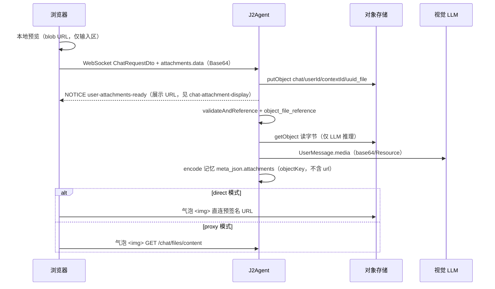

# 聊天图片附件

本文档说明对话页用户图片上传、对象存储引用保护，以及向视觉 LLM 投递图片的实现与排查。

## 1. 功能范围

- 对话输入框支持上传图片，单条消息最多 **4** 张；选图后前端统一 **转为 JPEG**、按最长边 **2048px** 缩放并压缩（目标约 3MB），处理完成前不可发送。
- 服务端仍校验 JPEG/PNG/WebP、单张不超过 **10 MB**。
- 图片在**发送消息时**由服务端写入对象存储（前端仅本地预览，WebSocket 携带 Base64 `data` 字段）；对象键规则为 `chat/{userId}/{contextId}/{UUIDv7}_{文件名}`。
- 仅当前用户可引用自己的对象键；发送消息时新路径还须属于当前 `contextId`。
- 用户消息通过 WebSocket 携带 `attachments`（`ChatAttachmentDto` 列表）；纯图片消息允许文本为空。
- 历史消息在 `chat_context_item.meta_json` 中持久化附件元数据（仅 `objectKey` 等，不存 URL）；展示 URL 由 `j2agent.storage.chat-attachment-display` 配置（见 §2.1）。
- 向 LLM 投递时，后端从对象存储 **读取字节** 构造 Spring AI `Media`（仅此一步经服务器，无法省略）。
- 被聊天引用的对象文件在文件管理页 **不可删除**（`409 Conflict: file is referenced by business data`）；删除会话记忆时会清理引用记录，并在整 context 删除时清扫 OSS 对象与 `object_file` 台账。

依赖 `j2agent.storage.enabled=true` 且对象存储服务可用；未启用时带图对话会报错 `Object storage is required for image input`。

## 2. 对象键规则

| 类型 | 路径示例 | 说明 |
|---|---|---|
| 新路径 | `chat/{userId}/{contextId}/{UUIDv7}_{文件名}` | 发送消息时由服务端上传；同会话同名文件可重复上传（UUID 前缀不同） |
| 旧路径（兼容） | `chat/{userId}/{uploadUuid}/{文件名}` | 历史数据不迁移；预览/历史展示仍可用；发送引用时仍允许旧键 |

工具类：`ChatFileKeys`（前缀生成、`requireOwnedKey` / `requireOwnedKeyForReference`）。

### 2.1 聊天图片展示模式

配置项 `j2agent.storage.chat-attachment-display`（环境变量 `J2AGENT_CHAT_ATTACHMENT_DISPLAY`）：

| 值 | 说明 | 适用场景 |
|---|---|---|
| `proxy`（**默认**） | 返回同源 `/chat/files/content?objectKey=...`，图片经应用服务器转发 | 未配 MinIO 公网地址、或需避免预签名 host 问题 |
| `direct` | 返回 OSS **预签名直链**（24h），浏览器直连 MinIO，省服务器带宽 | 已配 `minio.public-endpoint` 为客户端可达地址 |

**direct 模式示例**（局域网 IP `192.168.3.4`，MinIO 映射端口 `19000`）：

```yaml
j2agent:
  storage:
    chat-attachment-display: direct
    minio:
      endpoint: http://127.0.0.1:19000
      public-endpoint: http://192.168.3.4:19000
```

Docker `.env`：

```bash
J2AGENT_CHAT_ATTACHMENT_DISPLAY=direct
J2AGENT_MINIO_PUBLIC_ENDPOINT=http://192.168.3.4:19000
```

**注意**：不可在前端把预签名 URL 的 `127.0.0.1` 改成局域网 IP（会破坏 SigV4 签名 → `SignatureDoesNotMatch`）。direct 模式必须由后端 `public-endpoint` 签出正确 host。

direct 模式下若 OSS 直链仍失败，前端 `img` 错误时会自动降级为 `proxy` 的 content URL。

## 3. 数据模型

### 3.1 `ChatAttachmentDto`

OpenAPI 定义见 `j2agent-model/src/main/resources/openapi-model.yaml`：

| 字段 | 说明 |
|---|---|
| `objectKey` | 对象存储键；历史消息与预览使用。新发图片可省略，由服务端上传后回填 |
| `name` | 原始文件名（展示名，不含 UUID 前缀） |
| `contentType` | MIME 类型 |
| `size` | 字节大小 |
| `url` | 展示用 URL（由 `chat-attachment-display` 决定：OSS 预签名直链或 content 代理）；不写入持久化 meta_json |
| `data` | Base64 编码的图片字节，**仅 WebSocket 发送时使用**，服务端上传 OSS 后不持久化 |

`MessageDto.attachments` 仅用户消息使用。

### 3.2 `object_file_reference`

迁移脚本：`sql/migration/mysql/*/V0_2__object_storage_file_management.sql`（含 `object_file_reference`）。

| 字段 | 说明 |
|---|---|
| `file_id` | 关联 `object_file.id` |
| `business_type` | 固定 `CHAT_MESSAGE` |
| `business_id` | `{contextId}:{agentId}:{messageIndex}` |
| `owner_id` | 用户 ID |

发送带图消息时 `ChatAttachmentService#validateAndReference` 写入引用；`CompositeKeyChatMemoryRepository#deleteByConversationId` 删除记忆时清理引用并删除无其他引用的孤儿文件。

## 4. REST API

路径前缀 `/v1/rest/j2agent/chat/files`，需登录。

| 方法 | 路径 | 说明 |
|---|---|---|
| `POST` | `/chat/files?context-id=` | （兼容）直接上传图片（multipart `file`），返回 `ChatAttachmentDto`；主流程已改为发送时服务端上传 |
| `GET` | `/chat/files/preview?objectKey=` | 按 `chat-attachment-display` 返回展示 URL（与历史/NOTICE 一致） |
| `GET` | `/chat/files/content?objectKey=` | PROXY 模式展示地址；亦作 DIRECT 模式失败时的降级 |

校验规则（`ChatFileController`）：

- 缺少 `context-id` → `400`
- `context-id` 不属于当前用户 → `403`
- 空文件 → `400`
- 超过 10 MB → `413`
- 非 JPEG/PNG/WebP → `415`
- `objectKey` 不属于当前用户 → `403`
- 发送消息引用时，新路径 `objectKey` 不属于当前 `contextId` → `403`（旧路径除外）

## 5. 处理流程



前端直接使用后端下发的 `attachment.url`；DIRECT 模式加载失败时降级 `/chat/files/content`。

后端：`ChatAttachmentUrlResolver` 按 `chat-attachment-display` 生成展示 URL；`GET /context` 与 WS NOTICE 均经此解析。

后端核心类：

- `ChatFileController` — 上传与预览
- `ChatFileKeys` — 对象键规则与归属校验
- `ChatAttachmentService` — 校验、引用、`toMedia`
- `ChatAttachmentCleanupService` — 删除记忆时的孤儿文件与前缀清扫
- `ChatService` — 提取最新用户消息附件
- `AiAgent#stream` — 将 `Media` 挂到 `UserMessage`
- `ChatMemoryMessageCodec` — 附件元数据编解码；回放时再 `toMedia`
- `Translator.translateToChatContextDto` — 历史 API 将 `UserMessage.metadata.attachments` 映射为 `MessageDto.attachments`，并补齐 stable content URL

### 历史消息展示

`GET /context` 返回前由 `ChatAttachmentUrlResolver` 为每条消息的附件填充 OSS 预签名直链。持久化仅存 `objectKey`；发送成功后 WS `user-attachments-ready` 同样下发预签名 URL，实时气泡与历史展示一致。

## 6. 删除对话时的 OSS 清理

删除历史对话（sidebar，`DELETE /context`，不传 `agent-id`）时：

1. 对每个 agent 行调用 `deleteByConversationId`：删除 `object_file_reference` 后，对无其他引用的 `file_id` 调用 `ObjectFileManagementService#delete`（OSS + `object_file`）。
2. 当该 `contextId` 下已无 `chat_context_record` 行时，额外按前缀 `chat/{userId}/{contextId}/` 清扫 `object_file` 与 OSS 对象，覆盖「已上传未发送、无 reference」的孤儿文件。

仅删除某一 agent 行（传 `agent-id`）时只做步骤 1，不做前缀清扫（同 context 下 OSS 目录共享，其他 agent 可能仍引用）。

旧路径 `chat/{userId}/{uploadUuid}/` 不参与前缀清扫；无 reference 的旧上传仍可能残留（可接受，或后续离线任务处理）。

## 7. 与文件管理的关系

聊天图片占用默认 Bucket（`j2agent.storage.bucket`），**不会**出现在 `/#/files` 虚拟目录树中（前缀 `chat/` 与管理员文件管理 UI 分离），但对象与 `object_file` 台账仍由同一套对象存储服务维护。

删除保护：`ObjectFileManagementService#delete` 在删除前检查 `ObjectFileReferenceService#isReferenced`。

## 8. 验收建议

1. 确认已执行 `V0_2__object_storage_file_management` 迁移（含 `object_file_reference`），`j2agent.storage.enabled=true`。
2. 新建会话选择 2 张图并发送 → OSS 中对象均在 `chat/{userId}/{同一contextId}/` 下（发送后才出现，非选择时）。
3. 同会话两次发送 `a.png` → 两个不同对象键，均成功。
4. 切换历史会话后发送图片 → 落入对应 `contextId` 目录。
5. 旧会话已存图片（旧路径）历史气泡仍可展示。
6. 将 A 会话上传的图片 objectKey 填到 B 会话发送 → 后端拒绝（403）。
7. 删除单条历史对话 → 该 context 下 OSS 对象与 `object_file` 记录被清理。
8. 选择图片但未发送即删除对话 → 前缀清扫不会误删（发送前无 OSS 对象）；发送后删除对话仍会清扫。
9. 对话页上传 PNG/JPEG，发送「描述这张图片」类问题，视觉模型应正常回复。
10. 刷新页面后历史气泡仍能展示图片（`` 直连 OSS 预签名 URL）。

## 9. 常见问题

### 9.1 `InvalidParameter: The image format is illegal and cannot be opened`

**典型原因**

| 原因 | 说明 |
|---|---|
| 预签名 URL 不可达 | 旧实现将 MinIO 预签名 URL（如 `http://127.0.0.1:19000/...`）传给 DashScope 等云端 API，模型侧无法下载，返回 HTML/错误体，表现为「格式非法」。**当前实现已改为从 OSS 读字节投递。** |
| 文件本身损坏 | 上传中断或内容非真实图片。 |
| MIME 与内容不符 | 浏览器上报 `Content-Type` 与实际字节不一致（少见）。 |
| 不支持的格式 | 仅允许 JPEG/PNG/WebP；HEIC 等会被前端 `accept` 拦截，但若绕过上传仍会失败。 |

**排查步骤**

1. 确认部署版本已包含 `ChatAttachmentService#toMedia` 的字节读取逻辑（非 URL）。
2. 在对象存储控制台下载该 `chat/...` 对象，本地能否正常打开。
3. 检查 `object_file.content_type` 是否为 `image/jpeg`、`image/png` 或 `image/webp`。
4. 确认 LLM 配置为支持视觉的模型（如 Qwen-VL 系列）。
5. 若仍失败，查看后端日志中该 `request_id` 对应的对象键与大小。

### 9.2 `Object storage is required for image input`

`j2agent.storage.enabled=false` 或未配置对象存储 Bean。启用存储并重启。

### 9.3 `image is not ready` / `invalid chat image`

附件 `objectKey` 对应台账非 `READY`，或类型/大小/Base64 校验失败。重新选择图片并发送。

### 9.4 历史图片无法显示 / SignatureDoesNotMatch

- **proxy 模式（默认）**：展示走 `/chat/files/content?objectKey=...`，只需应用服务器可达，不依赖 MinIO 预签名。
- **direct 模式**：需配置 `minio.public-endpoint` 为浏览器可达地址；**禁止**在前端改写预签名 URL 的 host（会导致 `SignatureDoesNotMatch`）。
- DIRECT 模式 OSS 加载失败时，前端会自动降级为 content 代理。
- 对象已被误删则无法恢复展示。

### 9.4.1 iOS 选图后无预览 / 发送失败

- iOS 相册常返回 **空 `file.type` 或 HEIC**；前端已按文件头识别 JPEG/PNG/WebP，HEIC 会提示「仅支持 JPEG、PNG、WebP」。
- 可在 iPhone **设置 → 相机 → 格式** 中选择「兼容性最佳」以默认 JPEG。

### 9.5 文件管理删除返回 409

对象仍被 `object_file_reference` 引用。先删除关联会话记忆，或保留对象直至引用清理。

### 9.6 `image does not belong to current conversation`

发送消息时引用了其他 `contextId` 目录下的新路径对象键。请在本会话内重新发送图片，或使用历史会话中已有的旧路径附件。
