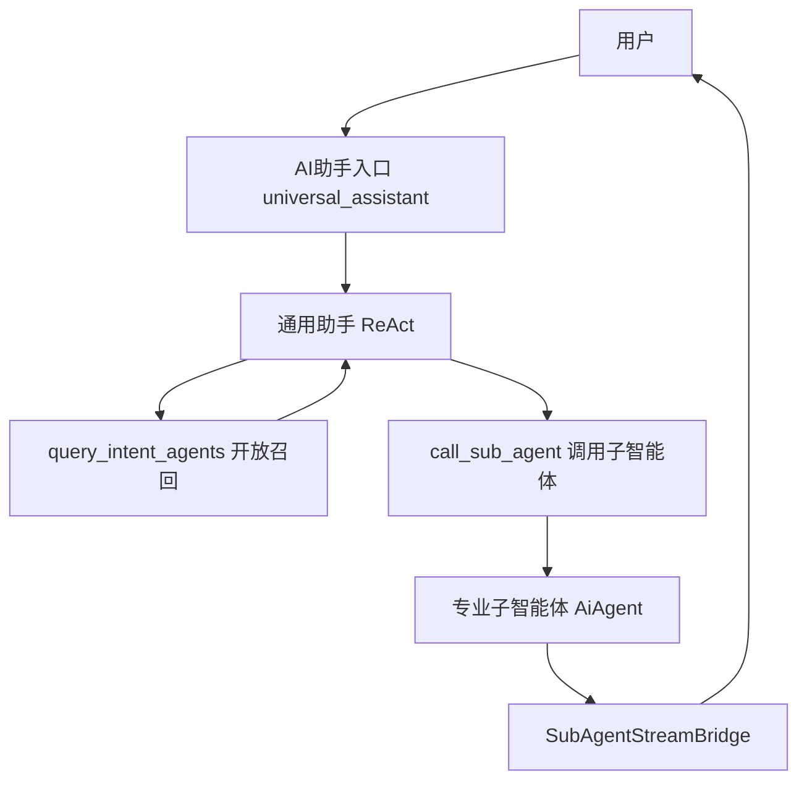
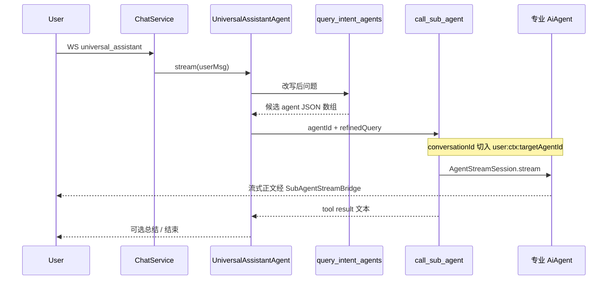
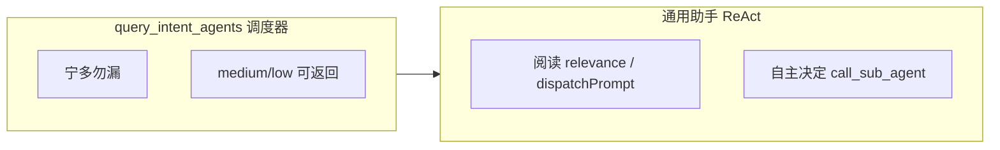
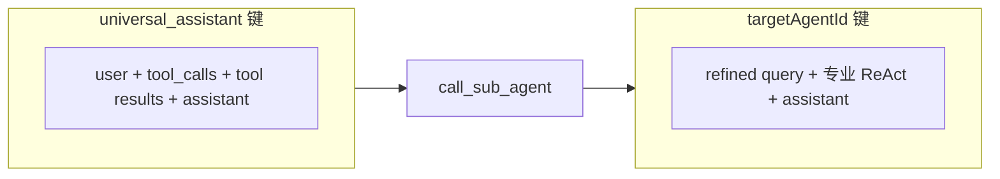

# 平台通用助手（AI 助手）

本文说明平台内置 **`universal_assistant`（AI 助手）** 的架构、入口、调用子智能体与双轨记忆模型。通用助手与插件专业智能体一样走 **`AiAgent` + WebSocket + ChatMemory`**。

## 1. 定位

| 项 | 说明 |
|----|------|
| **agentId** | `universal_assistant`（常量见 `UniversalAssistantConstants`） |
| **展示名** | AI助手 |
| **实现** | 平台内置 `UniversalAssistantAgent extends AiAgent`（`@Component`，非插件 JAR） |
| **入口** | 前端 `/chat/assistant?agent-id=universal_assistant`（汉堡菜单 / 首页「AI助手」） |
| **专业智能体列表** | **不出现在** `GET /agents` 卡片页；`AgentRouter.listRegisteredAgents()` 已过滤 |

用户从「AI助手」进入后，由通用助手 ReAct 循环自主决定是否调用工具；复杂问题通过 **`query_intent_agents`** 查候选，再 **`call_sub_agent`** 调用子智能体。

## 2. 端到端架构

与插件 Agent 的差异：

- **同一套** `ChatService` → `AiAgent.stream` 链路。
- 意图识别与调用子智能体是 **LLM 可调用的 `@Tool`**，不是服务端硬编码 `if/else` 路由。
- 调用子智能体时子 Agent 使用 **完整专业记忆**（`subAgentCallRun=false`），详见 [子智能体调用与记忆](子智能体调用与记忆.md)。

## 3. 单轮时序

## 4. 开放召回策略

- **调度器**：开放召回，职责重叠时允许多项并列（含 `medium`/`low`）；不在工具内做唯一判决。
- **通用助手**：阅读候选后自主决定是否调用子智能体；`medium` 且需专业能力时**可以**调用，不必等待 `high`。

## 5. 双轨记忆

- **通用助手会话键**：`userId:contextId:universal_assistant`。
- **子智能体调用期间**：读写 `userId:contextId:<targetAgentId>` 完整记忆。
- 详见 [Agent 记忆机制](../agent记忆机制/README.md) 与 [子智能体调用与记忆 §记忆模型](子智能体调用与记忆.md#3-记忆模型)。

## 6. 平台工具

| 工具名 | 类 | 作用 |
|--------|-----|------|
| `query_intent_agents` | `UniversalIntentQueryTool` | 根据改写后问题，LLM 同步返回候选专业 Agent 列表（JSON 数组） |
| `call_sub_agent` | `UniversalSubAgentCallTool` | 调用目标子智能体，流式执行并回传结果给 ReAct 循环 |

System Prompt：`j2agent/j2agent-server/src/main/resources/prompts/universal-assistant-system.md`。

工具参数、返回值格式、记忆键切换见 [子智能体调用与记忆](子智能体调用与记忆.md)。

## 7. 与专业智能体的关系

- **可调用子智能体列表**：`AgentRouter.listCallableSubAgents()` = 全部已注册 `AiAgent` **减去** `universal_assistant`。
- **列表展示**：`listRegisteredAgents()` 同样排除通用助手；用户从「智能体」页选卡进入的是插件 Agent，与 AI 助手入口分离。
- **同一 contextId**：子智能体调用写入的专业记忆键为 `userId:contextId:<targetAgentId>`，用户之后从「智能体」直进同一 Agent 时可见调用期间的对话。

## 8. 前端轨迹

- WebSocket 与事件协议与专业 Agent **完全一致**（`AgentUiEventEnvelope`），见 [Agent-UI 交互机制](../agent-ui交互机制/README.md)。
- 空会话时展示 **热门问题**（`prompts/universal-assistant-qa-template.json` + `isQaTemplateEnabled()`），经 `GET /qa-template?agent-id=universal_assistant` 随机抽取。
- 调用子智能体在轨迹中展示为 **「调用子智能体 {名称}」**：`dispatcher.ts` 将 `call_sub_agent` 的 `arguments.agentId` 映射为展示名。
- 子 Agent 流式输出经 `SubAgentStreamBridge` 写入父回合 `streamedContent`，用户实时看到专业 Agent 正文。

## 9. 源码索引

| 主题 | 路径 |
|------|------|
| 通用助手 Agent | `.../agent/builtin/UniversalAssistantAgent.java` |
| 意图查询工具 | `.../agent/builtin/UniversalIntentQueryTool.java` |
| 调用子智能体工具 | `.../agent/builtin/UniversalSubAgentCallTool.java` |
| 流式桥接 | `.../agent/builtin/SubAgentStreamBridge.java` |
| 工具回合上下文 | `.../agent/builtin/SubAgentCallTurnContextHolder.java` |
| 常量 | `.../universal/UniversalAssistantConstants.java` |
| 聊天入口 | `.../service/llm/ChatService.java`（`SubAgentStreamBridge.bind`） |
| 路由过滤 | `.../agent/core/AgentRouter.java` |
| 工具 UI 事件 | `.../tool/AgentUiToolEventInterceptor.java` |
| 前端轨迹映射 | `j2agent-ui/.../stream/dispatcher.ts` |

## 10. 相关文档

- [子智能体调用与记忆](子智能体调用与记忆.md) — 工具契约、记忆双轨、桥接实现
- [Agent 记忆机制](../agent记忆机制/README.md)
- [插件 Agent 接入与界面](../插件Agent接入与界面/README.md)
- [Agent-UI 交互机制](../agent-ui交互机制/README.md)
