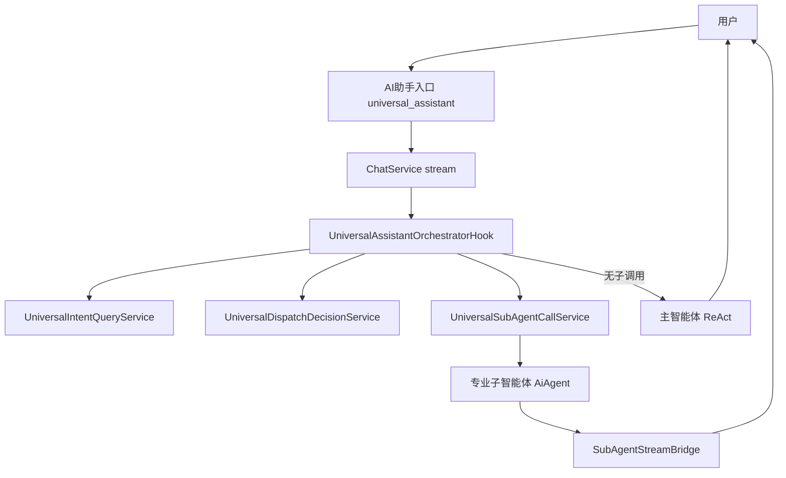
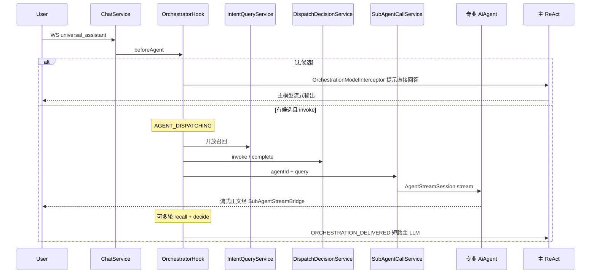
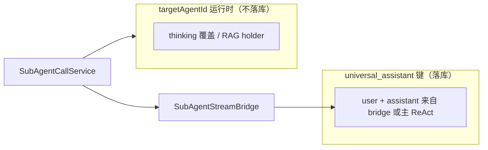

# 平台通用助手（AI 助手）

本文说明平台内置 **`universal_assistant`（AI 助手）** 的架构、入口、编排 Hook 与子智能体调用。通用助手与插件专业智能体一样走 **`AiAgent` + WebSocket + ChatMemory`**。

## 1. 定位

| 项 | 说明 |
|----|------|
| **agentId** | `universal_assistant`（常量见 `UniversalAssistantConstants`） |
| **展示名** | AI助手 |
| **实现** | 平台内置 `UniversalAssistantAgent extends AiAgent`（`@Component`，非插件 JAR） |
| **入口** | 前端 `/chat/assistant?agent-id=universal_assistant`（汉堡菜单 / 首页「AI助手」） |
| **专业智能体列表** | **不出现在** `GET /agents` 卡片页；`AgentRouter.listRegisteredAgents()` 已过滤 |

用户从「AI助手」进入后，每回合在 ReAct 图内由 **`UniversalAssistantOrchestratorHook`** 自动完成开放召回、调度决策与子智能体调用；**无** LLM 工具。有子调用时子智能体流式输出即终答；无匹配时主智能体 ReAct 直接回答。

## 2. 端到端架构

与插件 Agent 的差异：

- **同一套** `ChatService` → `AiAgent.stream` 链路。
- 编排（召回 + 决策 + 调用）在 Hook **`beforeAgent`** 内完成，**不是** `@Tool`。
- 子 Agent 使用 **无状态委派**（`subAgentCallRun=true`），聊天记录留在 universal 键；子智能体仅处理当轮提炼问题。

## 3. 单轮时序

## 4. 开放召回与决策

- **召回**（`UniversalIntentQueryService`）：宁多勿漏；完全无关时返回 `[]`，走主 ReAct。
- **决策**（`UniversalDispatchDecisionService`）：在候选与已执行 Trace 上输出 `invoke` 或 `complete`；同轮同一 `agentId` 不重复调用。
- **终答路径**：至少一次子调用后 → 子智能体流式输出即用户可见答复；主模型**不**二次汇总。

## 5. 记忆与落库

- **通用助手会话键**：`userId:contextId:universal_assistant`；用户可见对话均落此键。
- **编排 Trace**：仅供给调度 LLM，**不**写入 universal ChatMemory。
- **编排委派**（`subAgentCallRun=true`）：子智能体 ReAct **不读写**专业 Agent 的 ChatMemory；流式正文经 `SubAgentStreamBridge` → `persistStreamedAssistant` 写入 universal 键。
- **直接访问专业 Agent**：另起会话键 `userId:contextId:<targetAgentId>`，走常规 Advisor 落库。

详见 [子智能体调用与记忆](子智能体调用与记忆.md)。

## 6. 平台能力

| 能力 | 类 | 作用 |
|------|-----|------|
| 统一编排 Hook | `UniversalAssistantOrchestratorHook` | beforeAgent：召回、决策、子调用、UI 事件 |
| 开放召回 | `UniversalIntentQueryService` | 结合图内 messages + Trace 返回候选 JSON |
| 调度决策 | `UniversalDispatchDecisionService` | 同步 LLM 输出 invoke / complete |
| 子智能体调用 | `UniversalSubAgentCallService` | 流式调用专业 Agent，桥接父回合 |
| 主模型短路 | `OrchestrationModelInterceptor` | `ORCHESTRATION_DELIVERED` 时跳过主 LLM |

System Prompt：`j2agent/j2agent-server/src/main/resources/prompts/universal-assistant-system.md`。

## 7. 与专业智能体的关系

- **可调用子智能体列表**：`AgentRouter.listCallableSubAgents()` = 全部已注册 `AiAgent` **减去** `universal_assistant`。
- **同一 contextId**：编排委派**不**写入 `userId:contextId:<targetAgentId>`；仅用户直接进入该专业 Agent 时才会在该键下积累历史。

## 8. 前端轨迹

- 编排阶段展示 **`AGENT_DISPATCHING`（智能体调度器决策中）**（有候选且进入调度循环时）。
- 子智能体调用在轨迹中展示为 **「调用子智能体 {名称}」**（`toolName=call_sub_agent`，Hook 模拟工具事件）。
- 子 Agent 流式输出经 `SubAgentStreamBridge` 写入父回合 `streamedContent`。

## 9. 源码索引

| 主题 | 路径 |
|------|------|
| 通用助手 Agent | `.../agent/builtin/UniversalAssistantAgent.java` |
| 编排 Hook | `.../agent/builtin/UniversalAssistantOrchestratorHook.java` |
| 意图召回 | `.../agent/builtin/UniversalIntentQueryService.java` |
| 调度决策 | `.../agent/builtin/UniversalDispatchDecisionService.java` |
| 子智能体调用 | `.../agent/builtin/UniversalSubAgentCallService.java` |
| 流式桥接 | `.../agent/builtin/SubAgentStreamBridge.java` |
| 聊天入口 | `.../service/llm/ChatService.java` |

## 10. 相关文档

- [子智能体调用与记忆](子智能体调用与记忆.md)
- [Agent 记忆机制](../agent记忆机制/README.md)
- [Agent-UI 交互机制](../agent-ui交互机制/README.md)
