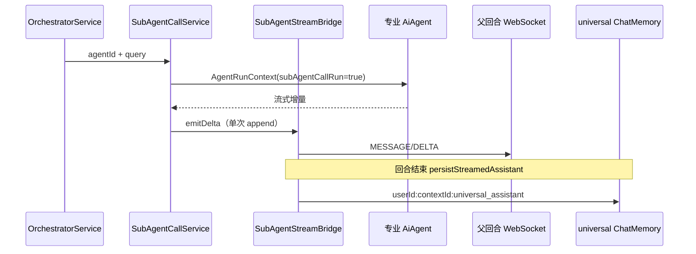
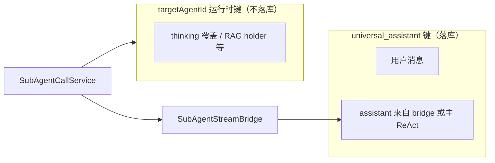

# 通用助手：子智能体调用与记忆

本文专题说明 `universal_assistant` 的**编排服务**、子智能体调用、会话键、流式桥接与记忆落库行为。

## 0. 术语对照

| 中文 | 英文（代码 / API） | 说明 |
|------|-------------------|------|
| 编排服务 | `UniversalAssistantOrchestratorService` | `ChatService` 前置：`orchestrate()` 返回 `CONTINUE` / `ORCHESTRATED` |
| 开放召回 | `UniversalIntentQueryService` | 调度 LLM；无匹配返回 `[]` → `CONTINUE` |
| 编排决策 | `UniversalOrchestrationDecisionService` | 输出 `invoke` / `complete` |
| 子智能体调用 | `UniversalSubAgentCallService` | 无 `@Tool`；编排服务直接调用 |
| 子智能体无状态调用标记 | `subAgentCallRun` | 编排委派为 `true`，Advisor 跳过子智能体记忆读写 |
| 流式桥接 | `SubAgentStreamBridge` | 父回合 WebSocket 与 `streamedContent` |
| 轨迹工具名 | `call_sub_agent` | 子智能体调用轨迹事件名 |

## 1. 编排服务（`UniversalAssistantOrchestratorService`）

### 1.1 职责

在 **`ChatService` 调用 `UniversalAssistantAgent.stream()` 之前**自动完成：

1. 开放召回（`buildRoutingQuery` + `queryIntentAgents`）
2. 无候选 → 返回 **`CONTINUE`**，由通用助手标准 ReAct + `loadSystemPrompt()` 回答
3. 有候选 → `AGENT_ORCHESTRATING` + 决策 LLM + 可选子调用；每次子调用后重新召回
4. 至少一次子调用完成 → 返回 **`ORCHESTRATED`**，**不启动**通用助手主 ReAct

**不产生 LLM tool_calls**；编排 Trace 仅供给调度 LLM，不注入主模型 system prompt。

```mermaid
flowchart TB
  CS[ChatService] --> Orch[OrchestratorService.orchestrate]
  Orch --> Recall[IntentQueryService]
  Recall -->|[]| Continue[CONTINUE 主 ReAct]
  Recall -->|有候选| Loop[决策 + SubAgentCallService]
  Loop -->|已 invoke| Orchestrated[ORCHESTRATED 跳过主 ReAct]
  Loop -->|未 invoke| Continue
```

### 1.2 路由输入

| 组成部分 | 说明 |
|------|------|
| 本轮 user 消息 | `OrchestrationRequest.userMessage` + 附件 metadata |
| 会话记忆 | `ChatMemory` 中 universal 键历史（经 `buildRoutingQuery`） |
| 编排 Trace | 本回合已执行子调用摘要（agentId、query、result） |

由 `buildRoutingQuery(memory, conversationId, messages, orchestrationTrace)` 拼接。

### 1.3 出参（候选 JSON 数组）

与开放召回策略一致；`[]` 时跳过编排循环并返回 `CONTINUE`。详见 `UniversalIntentQueryService` 内 system prompt。

## 2. 子智能体调用（`UniversalSubAgentCallService`）

### 2.1 职责

将提炼后的 `query` 交给目标专业 `AiAgent`，以 **无状态委派**（`subAgentCallRun=true`）运行当轮 ReAct；流式结果经 `SubAgentStreamBridge` 写入**父回合** `streamedContent`，最终落 **universal 会话键**。

### 2.2 执行流程



1. `specialistConversationId = userId:contextId:targetAgentId` 仅用于**运行时**（如 `ThinkingOverrideRegistry`、`TurnRagSourceRegistry.shareHolder`），**不**写入专业 Agent 的 ChatMemory。
2. `AgentStreamSession.stream` 订阅流式 chunk；有 bridge 时**仅** `bridge.emitDelta` → `ChatTurnLifecycle.emitAnswerDelta` 累加。
3. 回合结束由父 `ChatService#persistStreamedAssistant` 写入 universal 键。
4. `ORCHESTRATED` 时终答来自 bridge flush，**不经**通用助手主 ReAct 二次生成。

## 3. 记忆模型



| 场景 | 会话键 | 是否落 ChatMemory |
|------|--------|-------------------|
| 用户在 AI 助手入口对话 | `userId:contextId:universal_assistant` | 是：user + assistant |
| 编排委派子智能体 | 同上（assistant 经 bridge） | 是（仅 universal 键） |
| 子智能体 ReAct 内部轮次 | `userId:contextId:targetAgentId` | **否**（`subAgentCallRun=true`，Advisor 跳过读写） |
| 用户**直接**进入专业 Agent 聊天 | `userId:contextId:targetAgentId` | 是：完整 user/assistant |

- **有子调用**：universal 键写入用户消息（`ChatTurnLifecycle.persistTurnUserMessage`）+ `streamedContent` flush 的 assistant。
- **无子调用（CONTINUE）**：universal 键由主 ReAct Advisor 写入 user/assistant；**SystemMessage** 来自 `loadSystemPrompt()`，预落库路径下 Advisor 从 `instructions` 保留 system（记忆库不落 system）。
- **编排 Trace**：仅供给调度 LLM，**不**写入 universal ChatMemory。

### 3.1 System Prompt 与记忆 Advisor

通用助手回合会 **预落库用户消息**（`userMessagePrePersisted=true`）。`ReactCompatibleMessageChatMemoryAdvisor` 在拼 prompt 时以 memory 为主，但必须 **从图内 `instructions` 前置保留 `SystemMessage`**，否则 ReactAgent 注入的 `loadSystemPrompt()` 会丢失。

## 4. SubAgentStreamBridge

- `ChatService` 在 `universal_assistant` 回合开始 `bind(turnId, Target)`，结束 / 失败 / 断连时 `unbind`。
- `emitDelta` 委托 `ChatTurnLifecycle.emitAnswerDelta`：单次 append 到 `streamedContent` / `streamedReasoning`，并推送 WebSocket `MESSAGE/DELTA`。
- WebSocket 关闭或用户中断时，`ChatTurnCancellationRegistry` 按 `turnId` 协作式取消。

## 5. 源码索引

| 类 | 路径 |
|----|------|
| `UniversalAssistantOrchestratorService` | `.../agent/builtin/UniversalAssistantOrchestratorService.java` |
| `UniversalIntentQueryService` | `.../agent/builtin/UniversalIntentQueryService.java` |
| `UniversalOrchestrationDecisionService` | `.../agent/builtin/UniversalOrchestrationDecisionService.java` |
| `UniversalSubAgentCallService` | `.../agent/builtin/UniversalSubAgentCallService.java` |
| `SubAgentStreamBridge` | `.../agent/builtin/SubAgentStreamBridge.java` |
| `UniversalAssistantAgent` | `.../agent/builtin/UniversalAssistantAgent.java` |
| 记忆 Advisor | `.../advisor/ReactCompatibleMessageChatMemoryAdvisor.java` |
| 单测 | `UniversalAssistantOrchestratorServiceTest`、`UniversalIntentQueryServiceTest`、`UniversalSubAgentCallServiceTest`、`ReactCompatibleMessageChatMemoryAdvisorSubAgentCallTest` |

## 6. 相关文档

- [平台通用助手 README](README.md)
- [Agent 记忆机制](../agent记忆机制/README.md)
- [Agent-UI 交互机制](../agent-ui交互机制/README.md)
