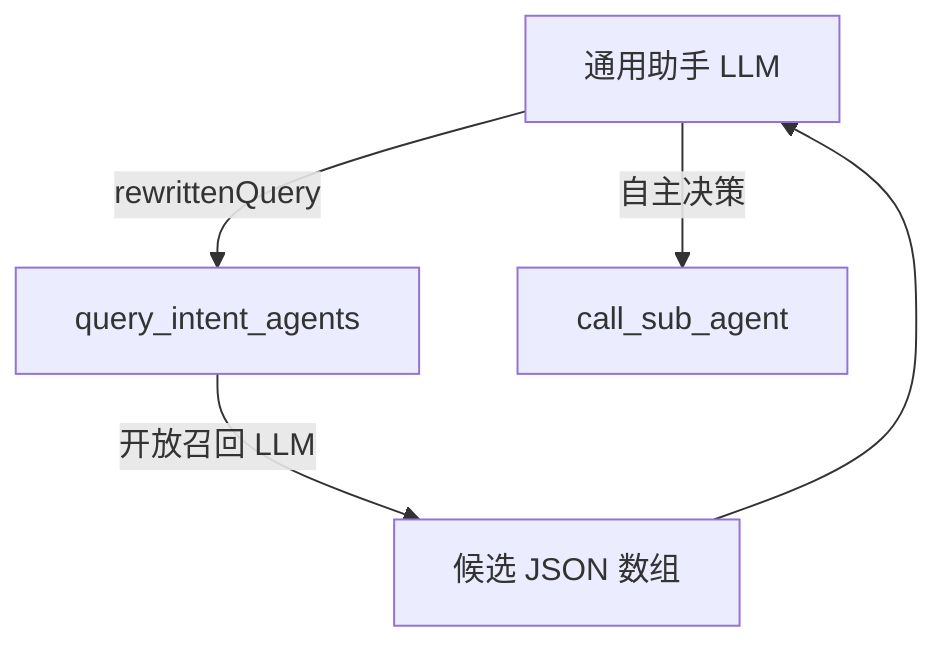
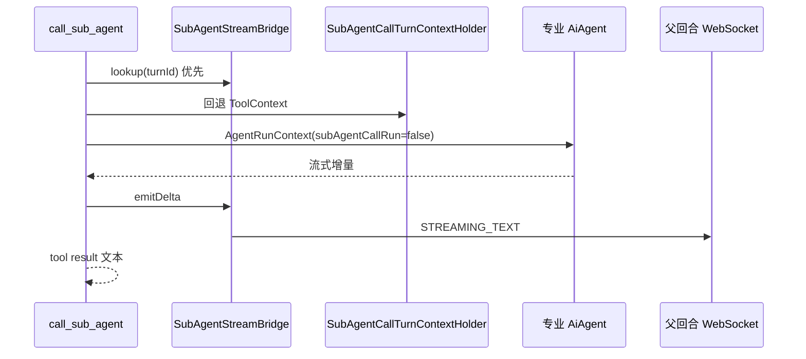
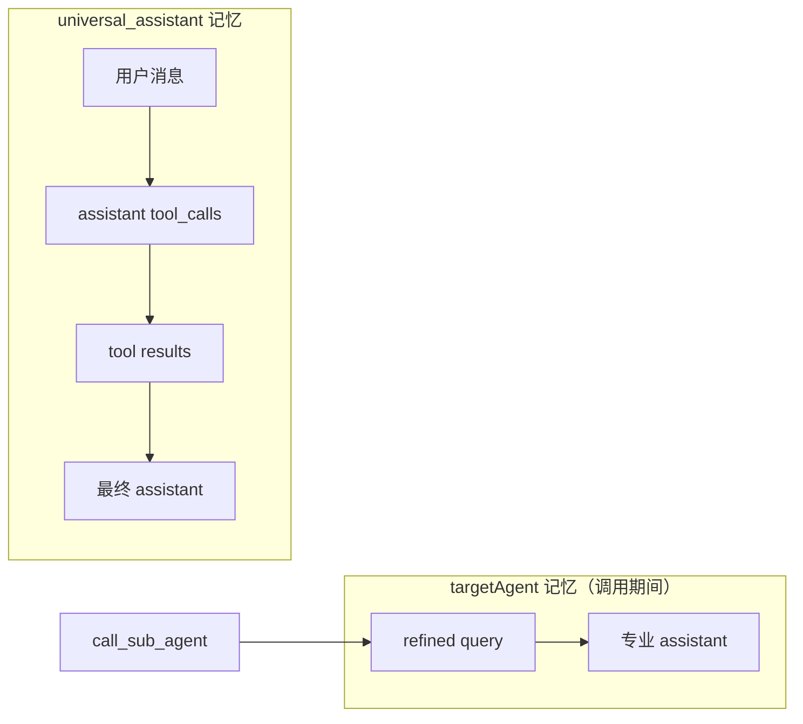

# 通用助手：子智能体调用与记忆

本文专题说明 `universal_assistant` 的两个平台工具、调用子智能体时的 **会话键切换**、流式桥接与记忆落库行为。

## 0. 术语对照

| 中文 | 英文（代码 / API） | 说明 |
|------|-------------------|------|
| 调用子智能体 | `call_sub_agent` | `@Tool` 主名；LLM 与轨迹展示 |
| 子智能体无状态调用标记 | `subAgentCallRun` | `AgentRunContext` 字段；`false` 时读写专业会话键 |
| 可调用子智能体列表 | `listCallableSubAgents()` | `AgentRouter` 方法 |
| 流式桥接 | `SubAgentStreamBridge` | 父回合 WS 与 `streamedContent` |
| 工具回合上下文 | `SubAgentCallTurnContextHolder` | `RunnableConfig.context` → ThreadLocal |

## 1. 工具一：`query_intent_agents`

### 1.1 职责

由通用助手 LLM **改写**用户问题后调用；服务端用 `LlmSyncService` 对候选专业 Agent 做**开放召回**式意图匹配，返回 JSON 供通用助手**自行**决定是否调用子智能体、调用谁。

调度器策略：**宁多勿漏**——职责重叠时允许多项并列（含 `medium`/`low`）；最终消歧由通用助手 ReAct 完成，不在此工具内做唯一判决。

**不在此工具内执行子智能体调用**。



### 1.2 入参

| 参数 | 说明 |
|------|------|
| `rewrittenQuery` | 面向路由、信息完整的用户问题（由通用助手 LLM 改写） |

### 1.3 出参（JSON 数组）

每项字段：

```json
{
  "agentId": "j2agent-qa-assistant",
  "name": "J2Agent 文档问答助手",
  "dispatchPrompt": "J2Agent 文档 Wiki；grep + RAG…（内部调度提示词，供通用助手参考）",
  "relevance": "high",
  "reason": "用户需要网管侧设备占比统计"
}
```

| 字段 | 说明 |
|------|------|
| `agentId` | 必须来自 `AgentRouter.listCallableSubAgents()` |
| `dispatchPrompt` | 服务端从 `resolveDispatchPrompt()` 回填，供通用助手 ReAct 参考（不展示到 UI） |
| `relevance` | `high` \| `medium` \| `low`；调度器从宽标注，通用助手可对 `medium` 调用子智能体 |
| 无匹配 | `[]`（仅当与全部 Agent 完全无关，如纯寒暄） |

最多 5 项；未知 `agentId` 会在服务端过滤掉。日志（INFO）可查看路由 LLM 原始 JSON 与清洗后结果。

### 1.4 实现要点

- 候选源：`listCallableSubAgents()`（已排除 `universal_assistant`）。
- 候选块字段：`agentId`、`name`、`dispatchPrompt`（取自 `AiAgent.resolveDispatchPrompt()`）。
- 路由 system prompt：**开放召回**（多候选、relevance 从宽、Wiki 类问题弱匹配也尽量返回）。
- 实现类：`UniversalIntentQueryTool`。
- 不读写 `ChatMemory`；无会话键依赖。

## 2. 工具二：`call_sub_agent`

### 2.1 职责

将提炼后的 `query` 交给目标专业 `AiAgent`，以 **该 Agent 的 conversationId** 运行完整 ReAct（含记忆读写），流式结果回传通用助手 ReAct 作为 tool result。

### 2.2 入参

| 参数 | 说明 |
|------|------|
| `agentId` | 目标子智能体，须在可调用列表中 |
| `query` | 传给子智能体的提炼问题 |

### 2.3 执行流程



1. **解析回合上下文**（`contextId`、`turnId`、`userId`、父 `conversationId`、`ToolEventEmitter`）  
   - 优先 `SubAgentStreamBridge`（`ChatService` 在 universal 回合开始时 `bind`）  
   - 其次 `SubAgentCallTurnContextHolder`（`AgentUiToolEventInterceptor` 从 `RunnableConfig.context` 注入 ThreadLocal）  
   - 再次 `ToolContext`（Spring AI 未必带全键，不可单独依赖）

2. **校验** `agentId` ∈ `listCallableSubAgents()`。

3. **上下文切入**：
   ```
   specialistConversationId = userId:contextId:targetAgentId
   AgentRunContext(..., subAgentCallRun=false)
   ```

4. **流式执行**：`AgentStreamSession.stream` 在 `Schedulers.boundedElastic()` 上 `blockLast`，避免在父回合 Reactor 线程嵌套阻塞。

5. **流式桥接**：增量写入父回合 `streamedContent`，并经 `SubAgentStreamBridge.emitDelta` 推 WebSocket。

6. **RAG 展示**：`TurnRagSourceRegistry.shareHolder(specialistId, universalId)`，调用期间 RAG `srcFile` PATCH 落到 universal 回合。

7. **回传**：完整文本（截断至 `ToolEventEmitter.MAX_TOOL_RESULT_LENGTH`）作为 tool result。

8. **清理**：`ThinkingOverrideRegistry.unbind`、`TurnRagSourceRegistry.unshareHolder`。

## 3. 记忆模型



### 3.1 通用助手多轮

- 会话键：`userId:contextId:universal_assistant`。
- `ReactCompatibleMessageChatMemoryAdvisor` 在 `before()` 合并历史（含工具调用轨迹），窗口见 [对话记忆](../agent记忆机制/对话记忆.md)。
- REST 历史：`getHistoryContext?agent-id=universal_assistant` 读全量库表行。

### 3.2 跨入口续聊

- 子智能体调用使用专业键 `userId:contextId:j2agent-qa-assistant` 等；子 Agent 自己的 Advisor 加载 **专业历史**。
- 用户从「智能体」页直进同一 `contextId` + `agentId` 时，可见调用写入的问答。
- 通用助手追问「刚才那个」时，通用键侧可见 tool trace；若再次调用，专业键侧可见上一轮内容。

### 3.3 不落库行为

- 调用子智能体 **不会**把专业 Agent 回复只写在 universal 键而跳过专业键；专业 `assistant` 由子 Agent 正常 Advisor / 流式落库写入专业键。
- universal 键侧：tool result 文本进入 ReAct 记忆；最终面向用户的汇总由通用助手 `assistant` 消息落库。

## 4. SubAgentStreamBridge

`ChatService` 在 `resolvedAgentId == universal_assistant` 时，于单轮开始 `bind(turnId, Target)`，结束 / 失败 / 断连时 `unbind`。

`Target` 持有：

- WebSocket 回调、`contextId`、`turnId`、`userId`、父 `conversationId`
- `ToolEventEmitter`、`streamedContent` / `streamedReasoning`、父 `stateMachine` / `turnLock`

`call_sub_agent` 的 `doOnNext` 时调用 `emitDelta`，在 `CALLING_TOOL` 状态下也可切入 `STREAMING_TEXT` 推送子 Agent 正文。

## 5. SubAgentCallTurnContextHolder

`@Tool` 方法的 `ToolContext` **不一定**包含 `RunnableConfig.context()` 中的回合键。  
`AgentUiToolEventInterceptor` 在每次工具调用前：

```text
SubAgentCallTurnContextHolder.bind(request)  // 拷贝 RunnableConfig.context
try { handler.call(...) }
finally { SubAgentCallTurnContextHolder.clear() }
```

`AgentToolContextSupport.contextMap` 优先读 Holder，再回退 `ToolContext`。

## 6. 源码索引

| 类 | 路径 |
|----|------|
| `UniversalIntentQueryTool` | `.../agent/builtin/UniversalIntentQueryTool.java` |
| `UniversalSubAgentCallTool` | `.../agent/builtin/UniversalSubAgentCallTool.java` |
| `SubAgentStreamBridge` | `.../agent/builtin/SubAgentStreamBridge.java` |
| `SubAgentCallTurnContextHolder` | `.../agent/builtin/SubAgentCallTurnContextHolder.java` |
| `AgentToolContextSupport` | `.../agent/builtin/AgentToolContextSupport.java` |
| `ChatService` bind/unbind | `.../service/llm/ChatService.java` |
| 单测 | `.../test/.../UniversalIntentQueryToolTest.java`、`UniversalSubAgentCallToolTest.java` |
