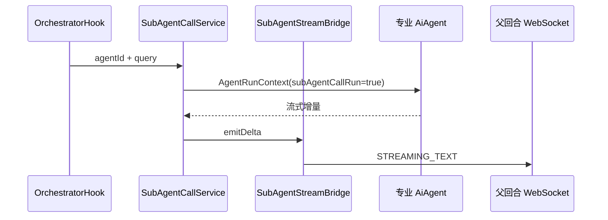
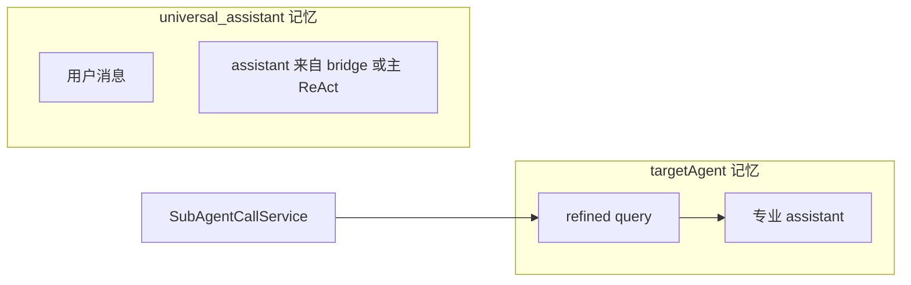

# 通用助手：子智能体调用与记忆

本文专题说明 `universal_assistant` 的**编排 Hook**、子智能体调用、会话键切换、流式桥接与记忆落库行为。

## 0. 术语对照

| 中文 | 英文（代码 / API） | 说明 |
|------|-------------------|------|
| 统一编排 Hook | `UniversalAssistantOrchestratorHook` | `beforeAgent`：召回 + 决策 + 调用 |
| 开放召回 | `UniversalIntentQueryService` | 调度 LLM；无匹配返回 `[]` |
| 调度决策 | `UniversalDispatchDecisionService` | 输出 `invoke` / `complete` |
| 子智能体调用 | `UniversalSubAgentCallService` | 无 `@Tool`；Hook 直接调用 |
| 子智能体无状态调用标记 | `subAgentCallRun` | 编排委派为 `true`，跳过子智能体记忆读写 |
| 流式桥接 | `SubAgentStreamBridge` | 父回合 WS 与 `streamedContent` |
| 轨迹工具名 | `call_sub_agent` | Hook 模拟工具事件，历史兼容 |

## 1. 编排 Hook（`UniversalAssistantOrchestratorHook`）

### 1.1 职责

在通用助手 ReAct **首轮模型调用前**（`beforeAgent`）自动完成：

1. 开放召回（`buildRoutingQueryFromMessages` + `queryIntentAgents`）
2. 无候选 → 快速路径，主 ReAct 直接回答
3. 有候选 → `AGENT_SCHEDULING` + 决策 LLM + 可选子调用；每次子调用后重新召回
4. 至少一次子调用且决策 `complete` → `ORCHESTRATION_DELIVERED`，主 LLM 短路

**不产生 LLM tool_calls**；编排 Trace 仅供给调度 LLM，不注入主模型 system prompt。

```mermaid
flowchart TB
  Hook[OrchestratorHook.beforeAgent] --> Recall[IntentQueryService]
  Recall -->|[]| Main[主 ReAct]
  Recall -->|有候选| Loop[决策 + SubAgentCallService]
  Loop -->|已 invoke| Delivered[跳过主 ReAct]
  Loop -->|未 invoke| Main
```

### 1.2 路由输入

| 组成部分 | 说明 |
|------|------|
| 图内 messages | `OverAllState` 中 user/assistant 可见文本 |
| 编排 Trace | 本回合已执行子调用摘要（agentId、query、result） |
| 本轮问题 | messages 中最后一条 user 文本 |

由 `buildRoutingQueryFromMessages(messages, orchestrationTrace)` 拼接。

### 1.3 出参（候选 JSON 数组）

与开放召回策略一致；`[]` 时跳过调度循环。详见 `UniversalIntentQueryService` 内 system prompt。

## 2. 子智能体调用（`UniversalSubAgentCallService`）

### 2.1 职责

将提炼后的 `query` 交给目标专业 `AiAgent`，以 **该 Agent 的 conversationId** 运行完整 ReAct，流式结果经 `SubAgentStreamBridge` 写入父回合。

### 2.2 执行流程



1. `specialistConversationId = userId:contextId:targetAgentId`
2. `AgentStreamSession.stream` 在 `boundedElastic` 上 `blockLast`
3. RAG：`TurnRagSourceRegistry.shareHolder`
4. 有子调用时终答来自 bridge flush，**不经**主 ReAct 二次生成

## 3. 记忆模型



- **有子调用**：universal 键写入用户消息（Hook 在 `ORCHESTRATION_DELIVERED` 时补落库）+ `streamedContent` flush 的 assistant。
- **无子调用**：universal 键由主 ReAct Advisor 写入 user/assistant。
- **专业 Agent 键**：编排委派不写入（`subAgentCallRun=true`）。

## 4. SubAgentStreamBridge

`ChatService` 在 `universal_assistant` 回合开始 `bind(turnId, Target)`，结束 / 失败 / 断连时 `unbind`（同时 `UniversalOrchestrationRunHolder.unbind`）。

## 5. 源码索引

| 类 | 路径 |
|----|------|
| `UniversalAssistantOrchestratorHook` | `.../agent/builtin/UniversalAssistantOrchestratorHook.java` |
| `UniversalIntentQueryService` | `.../agent/builtin/UniversalIntentQueryService.java` |
| `UniversalDispatchDecisionService` | `.../agent/builtin/UniversalDispatchDecisionService.java` |
| `UniversalSubAgentCallService` | `.../agent/builtin/UniversalSubAgentCallService.java` |
| `OrchestrationModelInterceptor` | `.../agent/builtin/OrchestrationModelInterceptor.java` |
| `SubAgentStreamBridge` | `.../agent/builtin/SubAgentStreamBridge.java` |
| 单测 | `UniversalIntentQueryServiceTest`、`UniversalSubAgentCallServiceTest`、`UniversalOrchestratorHookTest` |
